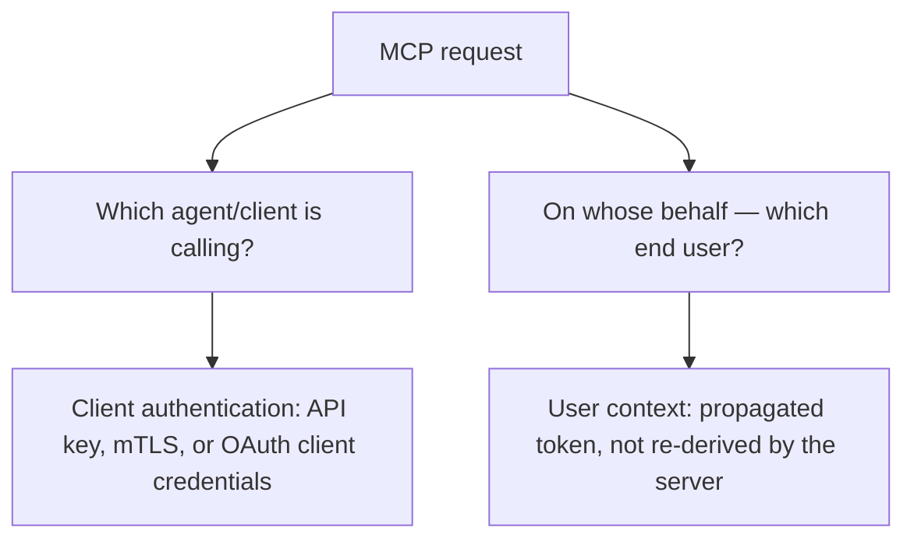

Most MCP getting-started examples run a server locally, trusted implicitly because it's on the same machine as the client — no authentication story needed. The moment an MCP server is deployed centrally, serving multiple agents or multiple users, that implicit trust disappears, and the server needs a real answer to "who is calling, and what are they allowed to do."

## Two Distinct Identities to Authenticate



These are genuinely separate questions. A single agent client might serve many end users — the MCP server needs to authenticate the client connection itself *and* receive verified context about which end user's request this is, so the tools it exposes can apply that user's actual permissions, not the calling agent's blanket access.

## A Practical Pattern: OAuth Token Passthrough

```python
class MCPServerAuth:
    def authenticate_request(self, headers: dict) -> dict:
        client_token = headers.get("Authorization", "").replace("Bearer ", "")
        claims = verify_jwt(client_token, expected_issuer=TRUSTED_ISSUER)
        return {
            "client_id": claims["client_id"],       # which agent/service is calling
            "user_id": claims.get("sub"),            # on whose behalf, if applicable
            "scopes": claims.get("scopes", []),      # what this token is authorized for
        }

def handle_tool_call(tool_name: str, args: dict, auth_context: dict):
    if not has_required_scope(tool_name, auth_context["scopes"]):
        return {"error": "insufficient_scope", "required": get_required_scope(tool_name)}
    return execute_tool(tool_name, args, user_id=auth_context["user_id"])
```

Passing a verified, scoped token through from the original request rather than having the MCP server maintain its own separate credential store keeps the permission model consistent with whatever system already governs the end user's actual access — the MCP server enforces the same permissions the rest of the system already has, rather than becoming a second, potentially inconsistent source of truth for authorization.

## Don't Let the Model Choose the Scope

A subtle risk: if the agent (the LLM) has any influence over which credentials or scope get used for a given tool call, a successful prompt injection could manipulate it into requesting a broader scope than the legitimate task needs. Scope should be determined by the *user's* actual permissions and the *specific tool's* declared minimum requirement, resolved deterministically in code — never by the model's own request or reasoning.

## Rotate and Scope Credentials Tightly

Long-lived, broad-scope API keys for MCP servers are a standing risk — if compromised, the blast radius is whatever that key can access, for as long as it remains valid. Short-lived, narrowly-scoped tokens (the same principle as the least-privilege access control covered elsewhere on this blog) limit the damage a compromised credential can do, at the cost of more infrastructure for issuing and refreshing them.

## Key Takeaways

1. **Client authentication and end-user context are distinct concerns** — an MCP server needs both, not just one
2. **Passing a verified, scoped token through from the original request keeps permissions consistent** with the system's existing authorization source of truth
3. **Never let the model influence which scope or credential gets used for a tool call** — resolve that deterministically in code, immune to prompt injection
4. **Short-lived, narrowly-scoped credentials limit blast radius** if compromised, at the cost of more token-issuance infrastructure

---

*Part of the [Agent Infrastructure series](/tags/agent-infra-series/) — the plumbing layer underneath production agentic systems.*
