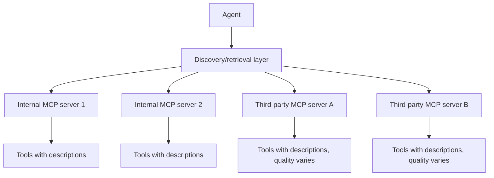

The earlier post on [skill discovery at scale](/posts/skill-discovery-at-scale/) covered retrieval-based tool selection within a single, centrally-managed skill registry. MCP introduces a new wrinkle: tools live across many independently-operated servers — internal ones your team runs, and increasingly, third-party MCP servers your organization has connected to. Discovery now needs to work across a federation, not a single registry you fully control.

## The Federation Problem



Internal servers, you control tool description quality directly — the same discipline from the agent-skills posts earlier in this blog applies. Third-party servers are a different situation: description quality is whatever that server's maintainers wrote, and it's outside your control, which means retrieval accuracy for third-party tools is only as good as descriptions you didn't author and can't unilaterally fix.

## A Local Description Override Layer

```python
class ToolDescriptionOverride:
    """Improve retrieval for third-party tools without modifying the upstream server."""
    def __init__(self, overrides: dict[str, str]):
        self.overrides = overrides  # tool_id -> improved description, maintained locally

    def get_effective_description(self, tool_id: str, original_description: str) -> str:
        return self.overrides.get(tool_id, original_description)
```

This is a pragmatic workaround, not a permanent fix — maintaining local overrides for third-party tool descriptions is its own ongoing effort, and it needs to be revisited whenever the upstream server updates its tools, or the override can drift out of sync with what the tool actually does now.

## Aggregating Discovery Across Servers

```python
def federated_tool_retrieval(user_request: str, mcp_servers: list, top_k: int = 10) -> list[dict]:
    all_candidates = []
    for server in mcp_servers:
        tools = server.list_tools()  # MCP's standard tool listing
        for tool in tools:
            effective_desc = description_overrides.get_effective_description(tool.id, tool.description)
            all_candidates.append({"tool": tool, "server": server, "embedding": embed(effective_desc)})

    query_embedding = embed(user_request)
    scored = [(c, cosine_similarity(query_embedding, c["embedding"])) for c in all_candidates]
    return [c for c, score in sorted(scored, key=lambda x: x[1], reverse=True)[:top_k]]
```

The retrieval logic itself is the same pattern as single-registry discovery — the change is aggregating candidates across multiple sources before ranking, treating server boundaries as invisible to the retrieval step even though they're very real operational boundaries underneath.

## Trust and Vetting Belong Upstream of Discovery

Not every third-party MCP server should be discoverable by every agent, regardless of how good its tool descriptions are — an unvetted server is a supply-chain risk (covered in more depth later on this blog), and discovery should only ever surface tools from servers that have passed whatever vetting process your organization requires. Filter the candidate server list before running retrieval, not after — an untrusted tool ranking highly in retrieval and getting invoked is a worse outcome than it simply never being a candidate.

## Key Takeaways

1. **Federated discovery across many MCP servers is a different problem than single-registry discovery** — description quality is no longer fully within your control
2. **A local description-override layer improves retrieval for third-party tools without needing upstream changes**, at the cost of ongoing maintenance
3. **Aggregate candidates across servers before ranking** — the retrieval logic itself doesn't need to change, just its input scope
4. **Filter to vetted, trusted servers before discovery runs**, not after — this is a security boundary, not just a relevance one

---

*Part of the [Agent Infrastructure series](/tags/agent-infra-series/) — the plumbing layer underneath production agentic systems.*
