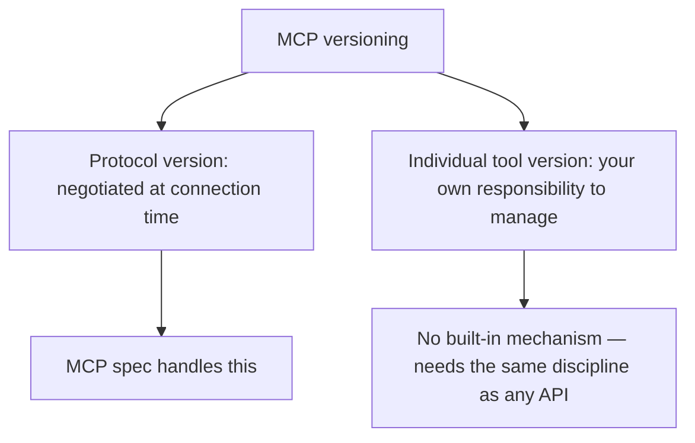

The [skill versioning post](/posts/skill-versioning-without-breaking-callers/) earlier in this blog covered the core discipline: breaking changes get a new version, registered alongside the old one, with a deprecation window before removal. MCP tools need the same discipline, with a meaningfully harder version of the "which callers are still on the old version" problem — an internal skill registry usually has visibility into every caller; an MCP server, especially one exposed beyond a single team, often doesn't know who's calling it at all.

## MCP's Protocol-Level Versioning vs Tool-Level Versioning



MCP's protocol version negotiation handles compatibility at the connection/capability level. It says nothing about whether *your specific tool's* schema or behavior has changed in a way that breaks a client that was built against the old version — that's on you to manage, the same way any API versioning is on you regardless of what transport protocol carries it.

## Making Tool Versions Explicit

```python
@server.tool()
def search_inventory_v2(query: str, filters: dict, max_results: int = 10) -> dict:
    """v2: 'filters' replaces the deprecated 'category' string param from v1.
    v1 (search_inventory) remains available, deprecated, through 2026-Q4."""
    ...

@server.tool()
def search_inventory(query: str, category: str = None, max_results: int = 10) -> dict:
    """DEPRECATED: use search_inventory_v2. Will be removed 2026-Q4.
    Kept for backward compatibility with existing callers."""
    logger.warning("Deprecated tool search_inventory called")
    return search_inventory_v2(query, filters={"category": category} if category else {}, max_results=max_results)
```

Registering the old tool as a thin wrapper around the new one, rather than deleting it, keeps existing callers working through the deprecation window while directing new usage toward the current version — the same pattern as any API deprecation, applied at the MCP tool-registration level.

## When You Genuinely Can't Know Who's Calling

For an MCP server exposed to external or loosely-tracked consumers, the call-volume monitoring from the skill deprecation post is harder to apply directly — you may not have per-caller visibility to know if removing a deprecated tool is actually safe. In this situation, the deprecation window needs to be longer and more conservative by default, communicated clearly and publicly (changelog, server metadata, documentation) well ahead of removal, since you can't rely on measuring the same fine-grained signal an internal registry would give you.

```python
TOOL_LIFECYCLE = {
    "search_inventory": {
        "status": "deprecated",
        "deprecated_since": "2026-06-01",
        "removal_planned": "2026-12-01",  # longer window given uncertain caller visibility
        "replacement": "search_inventory_v2",
    }
}
```

## Key Takeaways

1. **MCP's protocol version negotiation doesn't cover your individual tools' schema/behavior versioning** — that's your own responsibility
2. **Keep deprecated tools available as thin wrappers around the new version**, not deleted, through a defined deprecation window
3. **External or loosely-tracked MCP consumers mean you often can't measure actual call volume the way an internal registry could**
4. **Default to a longer, clearly-communicated deprecation window when caller visibility is limited**, rather than relying on usage data you don't have

---

*Part of the [Agent Infrastructure series](/tags/agent-infra-series/) — the plumbing layer underneath production agentic systems.*
