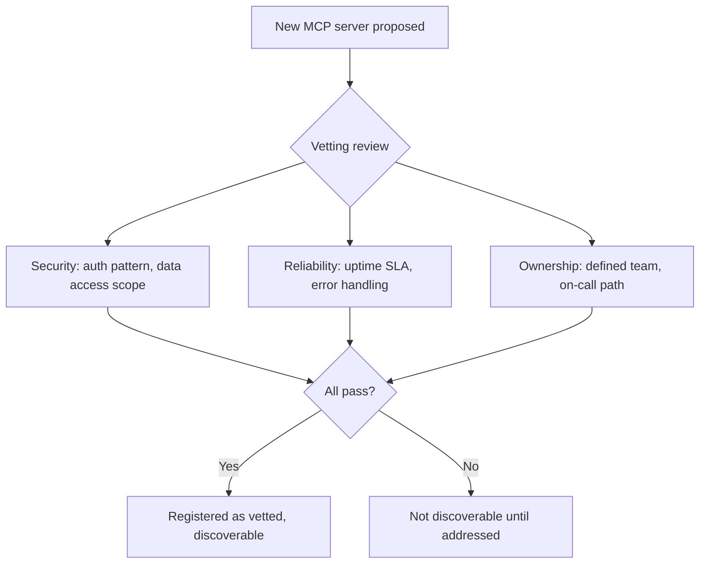

Past a handful of internal MCP servers — one team's data API, another's internal search, a third's workflow automation tool — the basic questions ("what servers exist," "who owns this one," "has it been security-reviewed," "is it still maintained") become unanswerable without a central registry. This is the MCP-specific instance of the platform-team scope discussed earlier in this blog: shared infrastructure that individual product teams shouldn't each solve independently.

## What the Registry Needs to Track

```python
@dataclass
class MCPServerEntry:
    name: str
    endpoint: str
    owning_team: str
    vetting_status: str  # "vetted" | "pending_review" | "deprecated"
    auth_pattern: str    # references the auth patterns from the earlier post
    tool_count: int
    last_health_check: datetime
    documentation_url: str
```

This is the metadata layer the [federated tool discovery post](/posts/tool-discovery-scale-mcp-servers/) assumed existed — the registry is what discovery actually queries to know which servers are candidates for a given agent, filtered by vetting status before any retrieval happens.

## Vetting as a Gate, Not a Formality



An unvetted server shouldn't be discoverable by agents outside its owning team's own explicit configuration, regardless of how useful its tools might be — the registry is the enforcement point for this, since discovery (from the earlier federated discovery post) filters against exactly this vetting status before ranking anything.

## Health Monitoring Belongs in the Registry, Not Just in Each Server

A registry that only tracks static metadata (name, owner, endpoint) misses the operational question that matters most in practice: is this server actually up and responding correctly right now? Centralized health checks, run against every registered server on a schedule, let the registry itself flag a degraded server — useful both for routing agents away from a failing server automatically and for giving the owning team visibility they might not otherwise have.

```python
def registry_health_check(entry: MCPServerEntry) -> dict:
    try:
        response = ping_mcp_server(entry.endpoint, timeout=5)
        return {"healthy": response.ok, "latency_ms": response.latency_ms}
    except TimeoutError:
        return {"healthy": False, "error": "timeout"}
```

## Ownership Needs to Be a Real, Enforced Field

A registry entry with no clearly accountable owning team is exactly the kind of orphaned infrastructure that becomes a long-term liability — nobody maintains it, nobody responds when it breaks, and nobody notices when it should be deprecated. Require an owning team at registration time, and periodically audit for servers whose owning team no longer exists or has moved on, flagging them for re-assignment or deprecation rather than letting them silently persist unowned.

## Key Takeaways

1. **A central registry answers "what servers exist, who owns them, are they vetted"** — unanswerable past a handful of servers without one
2. **Vetting status should gate discoverability directly**, enforced by the registry that discovery actually queries
3. **Centralized health monitoring catches degraded servers**, both for automatic routing and for owner visibility
4. **Enforce a real, accountable owning team at registration**, and audit periodically for orphaned entries

---

*Part of the [Agent Infrastructure series](/tags/agent-infra-series/) — the plumbing layer underneath production agentic systems.*
