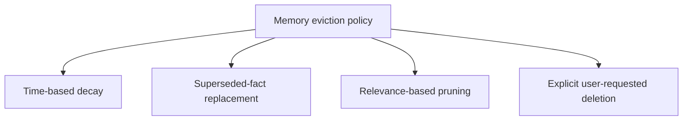
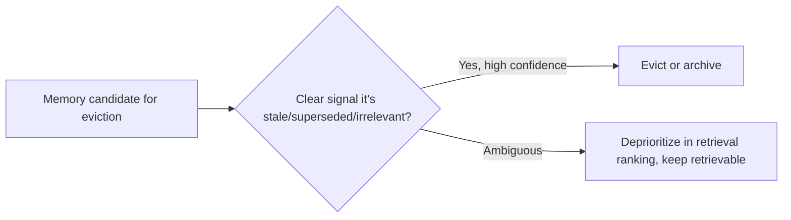

The instinct to build agent memory as an ever-growing, never-pruned store treats forgetting as a limitation to engineer around rather than a necessary function memory systems need by design. A memory store that retains every interaction indefinitely accumulates stale facts, superseded preferences, and resolved issues that compete for retrieval ranking against current, relevant information — degrading recall quality over time in the same way an unpruned RAG corpus does, for the same underlying reason.

## Eviction Policies, by Category



**Time-based decay** — not everything ages the same way. A user's stated preference ("I prefer email over SMS") is durable until explicitly changed; a fact about an in-progress task ("currently debugging the payment timeout issue") has a natural expiry once that task resolves. A single global TTL treats these identically and gets both wrong.

**Superseded-fact replacement** — when a new fact contradicts an old one (a user's address changes), the old fact should be replaced or explicitly marked superseded, not retained alongside the new one as an equally-weighted, contradictory memory:

```python
def write_memory(new_fact: dict, existing_memories: list[dict]):
    conflicting = find_conflicting_memory(new_fact, existing_memories)
    if conflicting:
        conflicting["status"] = "superseded"
        conflicting["superseded_by"] = new_fact["id"]
        conflicting["superseded_at"] = time.time()
    memory_store.write(new_fact)
```

**Relevance-based pruning** — memories that are never retrieved over a long window are candidates for archival or removal, the same "unused skill" audit logic from earlier in this blog applied to memory instead of tools.

**Explicit deletion** — a user request to delete specific information needs a real, verifiable delete, not a soft "marked inactive but still technically present and potentially retrievable" state, which matters for both trust and, in many jurisdictions, actual compliance obligations.

## The Risk of Over-Aggressive Eviction

The opposite failure — evicting something that was actually still relevant — degrades the agent's usefulness in a way that's harder to notice than the "memory grew stale" failure, because a missing memory doesn't announce itself the way a wrong, outdated one does; the agent just seems to have "forgotten" something a user reasonably expected it to remember. Tune eviction conservatively for anything without a clear expiry signal, and bias toward archival (retrievable but deprioritized) over hard deletion where the distinction matters and storage cost allows it.



## Key Takeaways

1. **Unpruned agent memory degrades retrieval quality over time**, the same failure mode as an unpruned RAG corpus and for the same reason
2. **Different categories of memory need different eviction logic** — a single global TTL treats durable preferences and task-scoped facts identically and gets both wrong
3. **Superseded facts should be explicitly replaced, not retained alongside contradicting new information**
4. **Bias toward conservative eviction (archive, deprioritize) over hard deletion for ambiguous cases** — the failure mode of forgetting something relevant is harder to notice than stale memory accumulating

---

*Part of the [Agent Infrastructure series](/tags/agent-infra-series/) — the plumbing layer underneath production agentic systems.*
