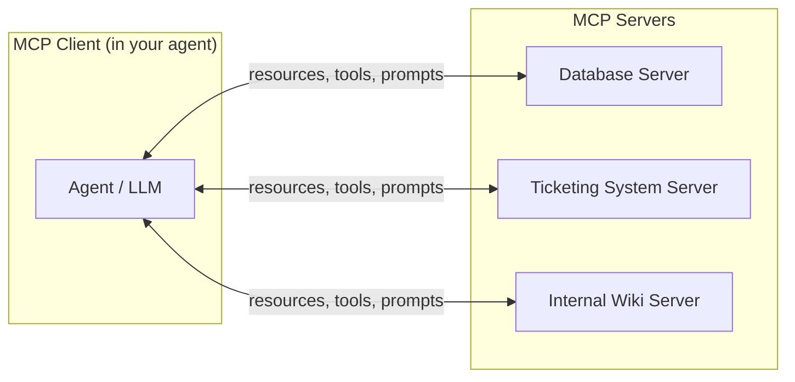

Every agent needs to call tools and read data, and before the Model Context Protocol (MCP), that meant writing a custom integration for every combination of agent framework and data source — an N×M integration problem that never actually got smaller as either side of that equation grew. MCP standardizes the connection instead: one protocol, implemented once per tool and once per agent client, and any client can talk to any server. Adoption has followed accordingly — monthly SDK downloads went from roughly 2 million at its late-2024 launch to about 97 million by early 2026, and it's since moved to the Linux Foundation's Agentic AI Foundation with Anthropic, OpenAI, Google, Microsoft, AWS, Salesforce, and Snowflake all backing it. This post covers how it actually works and what running it at real enterprise scale looks like today.

## The Core Architecture



An MCP server exposes three kinds of primitives to any client that connects to it:

- **Resources** — readable data (a file, a database row, a document) the model can pull into context
- **Tools** — callable functions with defined input/output schemas the model can invoke
- **Prompts** — reusable prompt templates the server can offer clients, parameterized for a specific task

The client — your agent's runtime — discovers what a server offers at connection time and exposes those capabilities to the model as part of its available tools, without either side needing to know anything about the other's internal implementation.

## A Minimal Server

```python
from mcp.server import Server
from mcp.types import Tool, TextContent

app = Server("ticketing-system")

@app.list_tools()
async def list_tools() -> list[Tool]:
    return [
        Tool(
            name="get_ticket",
            description="Fetch a support ticket by ID, including status and history.",
            inputSchema={
                "type": "object",
                "properties": {"ticket_id": {"type": "string"}},
                "required": ["ticket_id"],
            },
        )
    ]

@app.call_tool()
async def call_tool(name: str, arguments: dict) -> list[TextContent]:
    if name == "get_ticket":
        ticket = await ticketing_db.get(arguments["ticket_id"])
        if ticket is None:
            return [TextContent(type="text", text=f"ERROR: No ticket found for {arguments['ticket_id']}")]
        return [TextContent(type="text", text=json.dumps(ticket.to_dict()))]
    raise ValueError(f"Unknown tool: {name}")
```

Any MCP-compatible agent client — Claude Code, an internal LangGraph agent with an MCP client adapter, a Copilot extension — can connect to this server and immediately get `get_ticket` as an available tool, with no custom integration code written on the agent side.

## Where Enterprise Adoption Actually Stands

The adoption numbers are genuinely large — recent surveys put roughly 78% of enterprise AI teams as having MCP-backed agents in some stage of production, and close to 30% of Fortune 500 companies running MCP servers internally. But a closer read shows a gap between *experimentation* and *production maturity*: broader industry surveys put teams in full production closer to 40%, and only 11–14% of MCP pilots specifically make it past the pilot stage into durable production use. The reasons are consistent across reports, and they're not really about the protocol itself:

- **Identity and authentication** — MCP's early spec left a lot of "how does the server know who's calling, and with what permissions" to the implementer, and enterprises with real access-control requirements have had to build that layer themselves
- **Auditability** — knowing which agent called which tool with which arguments, after the fact, isn't something the base protocol gives you for free
- **Tool overexposure** — connecting an agent to a server that exposes 40 tools when it needs 3 bloats the model's tool-selection context and increases the chance of a wrong call
- **Vendor lock-in concerns** — ironic given MCP's whole premise, but enterprises are wary of building critical workflows against a single vendor's MCP server implementation without a fallback

## Governance Patterns That Actually Work

**Scope servers per agent context, not per team.** The instinct is to stand up one MCP server per internal system and let every agent connect to everything. In practice, treat server exposure the same way you'd treat API key scoping — an agent handling customer support shouldn't see the same tool surface as one handling infrastructure changes, even if both could technically reach the same underlying server.

```python
AGENT_MCP_SCOPES = {
    "customer_support_agent": ["ticketing-system", "knowledge-base"],
    "internal_ops_agent": ["infra-metrics", "deployment-system"],
}

def get_mcp_servers_for_agent(agent_name: str) -> list[str]:
    return AGENT_MCP_SCOPES.get(agent_name, [])
```

**Log every tool call at the gateway, not the server.** If you're running multiple MCP servers, put a thin proxy in front of them that logs every call — tool name, arguments, calling agent, timestamp — centrally, rather than relying on each server implementation to log consistently on its own.

**Treat tool descriptions as a spec, not documentation.** The same discipline from [agent skill design](/posts/agent-skill-design-patterns/) applies directly to MCP tool descriptions — a vague description is exactly what causes a model to reach for the wrong tool in a crowded server.

## Key Takeaways

1. **MCP solves the N×M integration problem** — one protocol implementation per tool and per agent client, rather than a custom bridge for every combination
2. **Adoption numbers are large but production maturity lags** — most of the gap is governance (identity, auditability, scoping), not the protocol itself
3. **Scope server access per agent context**, not per team — an agent's tool surface should match what it actually needs, not everything available
4. **Log at a central gateway**, not per-server, if you're running more than a couple of MCP servers
5. **Tool descriptions are a spec** — the same clarity discipline that applies to any agent skill applies here

MCP solves how an agent talks to tools and data. It has nothing to say about how one agent talks to *another* agent — that's a different protocol, covered in [the next post in this series](/posts/a2a-multi-agent-mesh-interoperability/). Before that, though, there's the question of what an agent remembers between MCP calls and sessions entirely — [production-grade agent memory](/posts/building-production-grade-agent-memory/).

---

*Part of the [Agent Infrastructure series](/tags/agent-infra-series/) — the plumbing layer underneath production agentic systems.*
