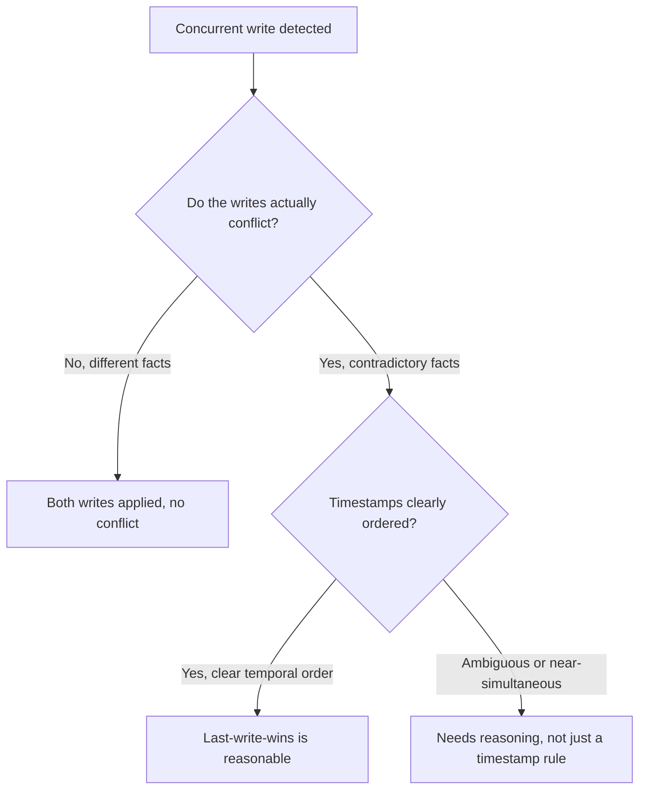

A single user interacting with an agent system through multiple concurrent sessions — a mobile app and a web app open simultaneously, or multiple specialized agents in a multi-agent system each capable of writing to shared user memory — creates the same concurrent-write problem any shared mutable store has, with an added wrinkle: resolving the conflict sometimes benefits from another LLM call reasoning about which write should win, not just a mechanical last-write-wins rule.

## When Last-Write-Wins Is Fine, and When It Isn't



Most concurrent writes to different facts don't actually conflict and need no special handling. Genuine conflicts — two sessions both updating the same fact to different values within a short window — are where a mechanical rule can produce a wrong outcome a reasoning step could avoid.

## A Reasoning-Assisted Conflict Resolution Step

```python
def resolve_memory_conflict(existing_fact: dict, new_fact: dict) -> dict:
    if new_fact["timestamp"] - existing_fact["timestamp"] > CLEAR_ORDERING_THRESHOLD_SEC:
        return new_fact  # clearly newer, simple case

    # Near-simultaneous or ambiguous — reason about which should win
    resolution = llm.invoke(f"""Two conflicting facts were recorded nearly
simultaneously:
A: {existing_fact['content']} (source: {existing_fact['source_session']})
B: {new_fact['content']} (source: {new_fact['source_session']})
Which is more likely to be the user's actual current intent, and why?
If genuinely ambiguous, recommend flagging for user confirmation rather
than guessing.""")
    return apply_resolution(resolution, existing_fact, new_fact)
```

This is a real cost — an extra LLM call specifically for the ambiguous-conflict case — and it's reserved for exactly that case, not run on every write, which keeps the added cost proportional to how rarely genuine near-simultaneous conflicts actually occur in practice.

## When to Flag for User Confirmation Instead of Auto-Resolving

For high-stakes facts (anything affecting a consequential decision downstream), auto-resolving an ambiguous conflict — even with a reasoning step — is riskier than surfacing it back to the user directly: "You mentioned two different preferences for X around the same time — which is correct?" This connects to the escalation design patterns covered earlier in this blog: policy-based escalation (stakes-based, not confidence-based) should govern whether a memory conflict gets auto-resolved or surfaced, the same principle applied to memory writes instead of agent actions.

```python
MEMORY_CONFLICT_POLICY = {
    "high_stakes_categories": {"budget_authority", "legal_consent", "payment_method"},
}

def should_auto_resolve(fact_category: str) -> bool:
    return fact_category not in MEMORY_CONFLICT_POLICY["high_stakes_categories"]
```

## Concurrent Reads During an Unresolved Conflict

While a conflict is pending resolution (whether reasoning-based or awaiting user confirmation), a read against that fact needs to return something sensible rather than an error or an arbitrarily-chosen one of the two conflicting values — surfacing the ambiguity itself (both values, with a flag) to whatever's consuming the read, so the agent can reason about the uncertainty rather than silently acting on a potentially-wrong resolved value.

## Key Takeaways

1. **Most concurrent memory writes don't actually conflict** — special handling is needed only for genuinely contradictory near-simultaneous writes
2. **A reasoning step can resolve ambiguous conflicts better than a mechanical last-write-wins rule**, reserved for the rare cases that need it
3. **High-stakes fact categories should escalate to user confirmation rather than auto-resolve**, the same stakes-based logic as agent action escalation
4. **Reads during an unresolved conflict should surface the ambiguity, not silently pick one value** — let the agent reason about the uncertainty explicitly

---

*Part of the [Agent Infrastructure series](/tags/agent-infra-series/) — the plumbing layer underneath production agentic systems.*
