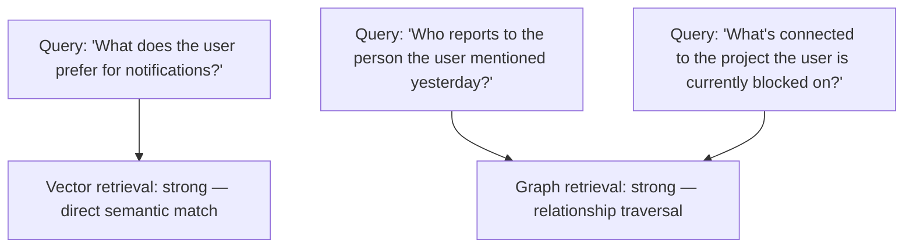
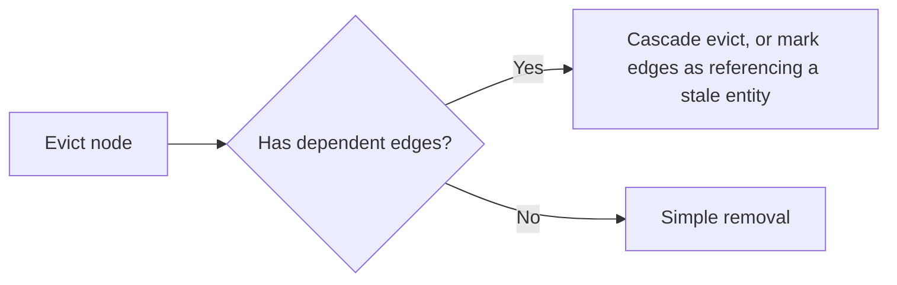

Storing agent memory as embedded facts in a vector store, retrieved by semantic similarity, is the default approach — and it has a specific, structural blind spot: it's weak on questions that require traversing *relationships* between facts rather than finding facts individually similar to a query. Graph-based memory, storing facts as nodes and relationships as edges, is strong exactly where vector retrieval is weak, and weak on the free-text semantic matching vector retrieval handles natively.

## The Query Types Where Each Wins



A vector store answers "what facts are similar to this query" well. It structurally cannot answer "what is connected to this entity, two hops away" without either enumerating and re-embedding relationship information as text (lossy and expensive) or simply not supporting that class of query at all. A graph database answers relationship-traversal queries natively and requires much more deliberate design to handle "find things semantically similar to this free-text description," which isn't what graph traversal is built for.

## A Combined Approach

```python
def hybrid_memory_retrieval(query: str, entity_context: dict = None) -> dict:
    semantic_results = vector_memory.search(query, top_k=5)

    graph_results = []
    if entity_context and requires_relationship_traversal(query):
        graph_results = graph_memory.traverse(
            start_entity=entity_context["primary_entity"],
            max_hops=2,
            relevant_relationship_types=infer_relevant_relationships(query),
        )

    return {"semantic": semantic_results, "relational": graph_results}
```

`requires_relationship_traversal` is doing real work here — determining whether a given query is asking a semantic-similarity question or a relationship-traversal question, since running both retrieval paths unconditionally on every query adds cost and complexity for queries that only needed one.

## The Practical Cost of Running Both

Maintaining two memory backends, plus the logic to route between them, is real infrastructure investment beyond a single vector store. This is worth it specifically for domains where relationship structure is genuinely central to what the agent needs to reason about — an agent handling organizational or project-management context, where "who reports to whom" and "what depends on what" are core to correct behavior, benefits meaningfully. An agent whose memory is mostly independent facts about individual user preferences gets much less benefit from the added graph complexity.

## Graphs Also Change How Eviction Works

The eviction policies from earlier in this blog assumed roughly independent memory entries. In a graph, evicting a node can orphan or invalidate edges that referenced it — eviction needs to be relationship-aware, either cascading to dependent edges or explicitly deciding to preserve a now-dangling reference with a clear "this entity is no longer tracked" marker rather than leaving a silently broken edge.



## Key Takeaways

1. **Vector and graph memory fail on genuinely different query types** — semantic similarity vs. relationship traversal — not just different implementations of the same retrieval
2. **A combined approach routes queries to the right backend**, rather than forcing every query through one retrieval method poorly suited to some of them
3. **The added infrastructure cost is worth it specifically when relationship structure is central to the domain**, not as a default for every agent memory system
4. **Eviction in a graph needs to be relationship-aware** — removing a node can orphan edges that referenced it, unlike independent vector entries

---

*Part of the [Agent Infrastructure series](/tags/agent-infra-series/) — the plumbing layer underneath production agentic systems.*
