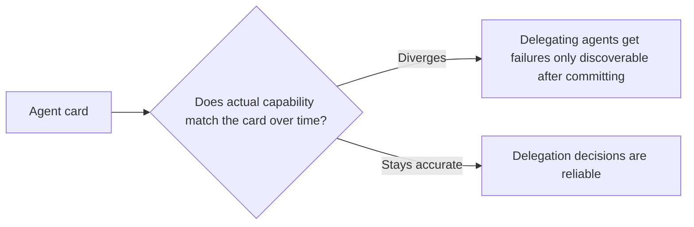

An A2A (Agent2Agent) agent card — the machine-readable description of what an agent can do, exposed for other agents to discover and evaluate before delegating a task to it — functions the same way a tool description does for a single-agent tool call: another agent's decision to delegate is only as good as the card's accuracy. An overstated or vague card causes a specific, costly failure pattern: a delegating agent commits to a delegation based on the card, only to discover mid-task that the target agent can't actually do what was implied.

## What Makes a Card Trustworthy vs Merely Present

```yaml
# Weak: technically complete, practically unreliable
name: "DataAnalysisAgent"
description: "Analyzes data and provides insights"
capabilities: ["data analysis"]

# Strong: specific enough to support a real delegation decision
name: "DataAnalysisAgent"
description: >
  Performs statistical analysis on tabular data (CSV, up to 100k rows).
  Does NOT handle unstructured text analysis or real-time streaming data.
capabilities:
  - id: "descriptive_stats"
    description: "Mean, median, std dev, distributions for numeric columns"
  - id: "correlation_analysis"
    description: "Pairwise correlation for up to 50 numeric columns"
limits:
  max_input_size_mb: 50
  typical_latency_seconds: 5-30
  requires_synchronous_response: false
```

The explicit "does NOT handle" line and the numeric limits are what make this card actually useful for a delegation decision — the weak version's vague "data analysis" gives a delegating agent no way to know, before committing, whether this specific task is actually within scope.

## Cards Need the Same Accuracy Discipline as a Spec



This is the same drift problem covered for specs earlier in this blog, applied to an agent card instead of a feature spec — a card accurate at publication time and never revisited as the underlying agent's actual capabilities change becomes exactly as misleading as a drifted spec, with the added cost that the "consumer" misled by it is another autonomous system making delegation decisions without a human in the loop to catch the mismatch before it causes a failure.

## Version the Card, Not Just the Agent

An agent's capabilities changing over time (a new capability added, an old one deprecated, a limit adjusted) should be reflected in a versioned card, with the same deprecation discipline as any other interface change covered elsewhere in this series — a delegating agent that cached an older card version needs a way to detect it's stale, not silently delegate against outdated capability claims.

```python
@dataclass
class AgentCard:
    version: str
    capabilities: list[dict]
    last_updated: datetime
    card_ttl_seconds: int = 3600  # delegating agents should re-fetch after this

def is_card_stale(cached_card: AgentCard) -> bool:
    return (datetime.now() - cached_card.last_updated).total_seconds() > cached_card.card_ttl_seconds
```

## Report Actual Failures Back Into Card Accuracy

When a delegated task fails specifically because the target agent couldn't do what its card implied, that's a direct signal the card needs correction — closing this loop (failure report → card review → card update) is what keeps a card's accuracy from silently eroding the same way any other undermaintained interface description does.

## Key Takeaways

1. **An agent card is only as useful as its accuracy** — a delegating agent's commitment decision depends entirely on it being trustworthy
2. **Explicit limits and "does NOT handle" statements make a card actually useful for delegation decisions**, not just descriptively present
3. **Cards drift the same way specs do**, with a higher cost since the consumer is an autonomous system, not a human who might catch the mismatch
4. **Version cards with a TTL, and feed delegation failures back into card accuracy review** — closing the loop is what prevents silent erosion

---

*Part of the [Agent Infrastructure series](/tags/agent-infra-series/) — the plumbing layer underneath production agentic systems.*
