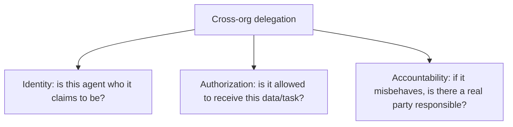

An agent delegating to another agent within the same team, or even the same company, operates under implicit trust — both are presumably subject to the same security review, the same incident response process, the same accountability chain if something goes wrong. A2A interoperability's actual promise — an agent from one organization delegating to an agent from a completely different one — has none of that implicit trust available, and needs an explicit answer to "why should I trust what this agent tells me, and what it does with what I send it."

## What Cross-Organization Trust Actually Requires



**Identity** is a solvable, mostly-standard problem — cryptographic signing of agent cards and messages, verified against a trust anchor (a certificate authority, a registered identity provider), the same primitives that already secure most cross-organization API integrations.

**Authorization** is more agent-specific: not just "is this a legitimate agent" but "is this specific agent, for this specific task, authorized to receive the specific data this delegation would expose it to" — a legitimate, verified agent from a partner organization still shouldn't receive data outside the scope of whatever agreement governs the relationship.

**Accountability** is the part organizations most often skip in early A2A integrations: a real, named responsible party on the other side, reachable if the delegated agent behaves unexpectedly, with terms (a contract, an SLA, a liability agreement) that predate any actual delegation happening in production.

## A Practical Trust Boundary Pattern

```python
def evaluate_cross_org_delegation(target_agent_card: dict, task: dict, trust_registry: dict) -> dict:
    if target_agent_card["org_id"] not in trust_registry:
        return {"allowed": False, "reason": "unverified organization"}

    agreement = trust_registry[target_agent_card["org_id"]]
    if not signature_valid(target_agent_card, agreement["trusted_signing_key"]):
        return {"allowed": False, "reason": "signature verification failed"}

    if task["data_sensitivity"] > agreement["max_authorized_sensitivity"]:
        return {"allowed": False, "reason": "task exceeds authorized data sensitivity for this partner"}

    return {"allowed": True, "audit_context": agreement["agreement_id"]}
```

The `trust_registry`, populated ahead of time through an actual business/legal agreement with each partner organization, is what turns "trust" from an implicit assumption into an explicit, auditable decision — no cross-org delegation happens without a pre-established, named agreement backing it.

## Don't Let the Delegating Agent Decide Trust on Its Own

The same principle from the [MCP auth patterns post](/posts/auth-patterns-mcp-servers-production/) applies here — trust and authorization decisions for cross-org delegation need to be resolved deterministically against a registry, never left to the delegating agent's own reasoning about whether a target agent "seems trustworthy" based on its card content, which a sufficiently well-crafted malicious card could manipulate.

## Key Takeaways

1. **Cross-organization A2A delegation has none of the implicit trust that within-org delegation has** — it needs an explicit answer
2. **Identity, authorization, and accountability are distinct requirements** — solving one doesn't solve the others
3. **A pre-established trust registry, backed by real business/legal agreements, turns trust into an explicit, auditable decision**
4. **Never let the delegating agent decide trust based on its own reasoning about a target's card** — resolve it deterministically against the registry

---

*Part of the [Agent Infrastructure series](/tags/agent-infra-series/) — the plumbing layer underneath production agentic systems.*
