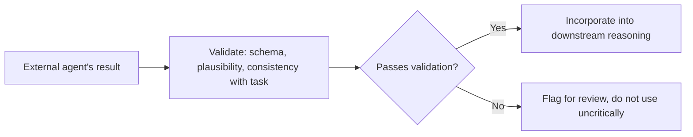

The previous post covered establishing trust before a cross-organization delegation happens at all. Once that's solved, the handoff itself — the actual task delegation, execution, and result return — has its own set of failure modes that only show up in practice, not in the trust-establishment design, worth naming explicitly because they're easy to miss until they cause a real incident.

## Context Loss Across the Boundary

An agent delegating a task typically has rich context about *why* the task matters, what's already been tried, and what a good outcome looks like — context that doesn't automatically transfer to an external agent unless explicitly packaged into the delegation. A minimal task description ("summarize this document") loses everything the delegating agent actually knew about the situation, producing a technically-correct-but-contextually-useless result.

```python
def package_delegation_context(task: str, internal_context: dict) -> dict:
    return {
        "task": task,
        "context": {
            "purpose": internal_context.get("why_this_task_matters"),
            "prior_attempts": internal_context.get("what_was_already_tried"),
            "success_criteria": internal_context.get("what_good_looks_like"),
        },
        # Only include context appropriate to share externally —
        # this is itself an authorization decision from the previous post
        "excluded_internal_detail": "not shared across org boundary",
    }
```

## Result Trust: Verifying What Comes Back

A result returned from an external agent deserves more scrutiny than a result from an internal one — not because external agents are inherently less capable, but because there's no shared quality bar or shared incident-response relationship backing the result the way there would be internally. Treat cross-org results the way [the guardrails posts earlier in this blog](/posts/output-guardrails-structured-data/) treat any untrusted output: validated before being incorporated into the delegating agent's own downstream reasoning, not accepted uncritically because it came back with a well-formed response shape.



## Latency and Reliability Expectations Differ

An internal delegation typically has known latency characteristics and a shared incident-response path if something's slow or failing. An external agent's latency and reliability are outside your control and often unknown until observed in practice — a delegating agent's own circuit breakers and timeouts (from the earlier post on [circuit breakers for unreliable tools](/posts/circuit-breakers-agents-unreliable-tools/)) need to be tuned more conservatively for cross-org delegation, where you have far less visibility into what's happening on the other side of a slow or failed response.

## What "Failure" Means Isn't Always Shared

An internal team can agree on what counts as a failed delegation. A cross-org relationship needs this defined explicitly, ideally in the same agreement that established trust — ambiguity about whether a partial or degraded result counts as success or failure becomes a real dispute, not just an engineering edge case, once money or contractual obligations are involved.

## Key Takeaways

1. **Context that's implicit within an organization needs to be explicitly packaged for a cross-org delegation**, or the result comes back technically correct but contextually useless
2. **Validate results from external agents more rigorously than internal ones** — there's no shared quality bar backing them
3. **Tune circuit breakers and timeouts more conservatively for cross-org delegation**, where visibility into the other side is limited
4. **Define what counts as delegation failure explicitly, in the governing agreement** — ambiguity here becomes a business dispute, not just an engineering edge case

---

*Part of the [Agent Infrastructure series](/tags/agent-infra-series/) — the plumbing layer underneath production agentic systems.*
