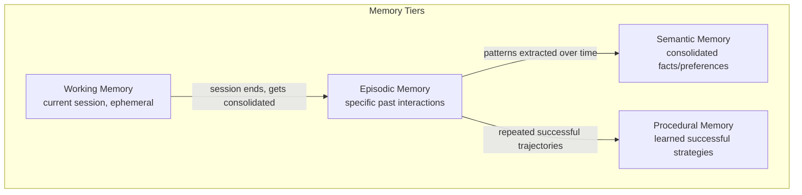

The [context engineering post](/posts/context-engineering-replacing-prompt-engineering/) that opened this series touched on retrieved memory as one of several inputs competing for context budget. This post is the deep dive on that specific piece — because "memory" for an agent has quietly become one of the most active areas of production AI infrastructure, and the naive version of it (stuff more history into the prompt) breaks down fast.

## Why "More Context" Isn't Memory

The instinct when an agent forgets something from three sessions ago is to just retain more conversation history. This doesn't scale for two independent reasons: it runs straight into the context rot problem from the last post, and it conflates *everything that happened* with *what's actually worth remembering* — a genuinely useful memory system has to make that distinction, not defer it to "whatever fits in the window."

## Memory Tiers

Production memory systems split into distinct tiers, each with a different lifetime, write pattern, and retrieval mechanism:



- **Working memory** — the current session's state, gone once the session ends unless explicitly consolidated
- **Episodic memory** — records of specific past interactions ("the user asked about refund policy on March 3rd and I told them X")
- **Semantic memory** — consolidated, durable facts about a user or domain ("this user is on the enterprise plan," "this customer prefers email over chat")
- **Procedural memory** — reusable strategies the agent has learned work well for a given kind of task, independent of any specific user

Treating these as one undifferentiated blob of "memory" is the most common mistake. A fact that should live in semantic memory (durable, low-volume, high-confidence) gets buried in episodic memory (high-volume, session-specific) and never reliably retrieved when it matters.

## Write Policies: Not Everything Gets Remembered

The naive approach writes every turn of every conversation to a vector store and retrieves by similarity at query time. This produces a memory store that grows without bound and degrades in retrieval quality as it fills with low-value entries. A write policy decides what's actually worth persisting:

```python
def evaluate_for_memory_write(turn: dict, llm) -> dict | None:
    """Decide whether this conversation turn contains something worth
    persisting to long-term memory, and if so, what tier it belongs in."""
    verdict = llm.invoke(
        "Does this exchange contain a durable fact, preference, or decision "
        "worth remembering for future sessions? If yes, extract it concisely "
        "and classify it as 'semantic' (a fact/preference) or 'episodic' "
        "(a specific event worth recalling). If no, respond 'SKIP'.\n\n"
        f"User: {turn['user']}\nAgent: {turn['agent']}"
    ).content

    if verdict.strip() == "SKIP":
        return None

    tier, _, content = verdict.partition(":")
    return {"tier": tier.strip().lower(), "content": content.strip(), "source_turn_id": turn["id"]}
```

Running this evaluation at write time — rather than writing everything and hoping retrieval sorts it out later — is what keeps the semantic memory tier small, high-confidence, and actually useful, instead of growing into the same undifferentiated pile the naive approach produces.

## Retrieval: Match the Tier to the Query

Different tiers need different retrieval strategies. Semantic memory (a small number of durable facts) benefits from being loaded in full for a known user rather than similarity-searched — there might only be twenty facts total, and missing one because it scored slightly below a similarity threshold is a worse failure than including all twenty:

```python
def build_memory_context(user_id: str, current_query: str) -> str:
    # Semantic memory: load in full, it's small and high-value
    semantic_facts = semantic_memory_store.get_all(user_id)

    # Episodic memory: similarity search, it's large and query-specific
    relevant_episodes = episodic_memory_store.similarity_search(
        query=current_query, user_id=user_id, k=3
    )

    # Procedural memory: retrieve by task-type match, not semantic similarity
    task_type = classify_task_type(current_query)
    relevant_strategies = procedural_memory_store.get_by_task_type(task_type, k=2)

    return format_memory_context(semantic_facts, relevant_episodes, relevant_strategies)
```

## Consolidation: Compressing Episodic Into Semantic Over Time

Left alone, episodic memory grows forever. Periodically — at session end, or on a scheduled batch job — consolidate patterns from episodic memory into semantic memory, the same way human memory consolidates specific experiences into general knowledge:

```python
def consolidate_episodic_to_semantic(user_id: str, llm):
    recent_episodes = episodic_memory_store.get_recent(user_id, days=30)
    if len(recent_episodes) < MIN_EPISODES_FOR_CONSOLIDATION:
        return

    pattern = llm.invoke(
        "Do these interactions reveal a stable preference or fact about this "
        "user that isn't already captured? If so, state it as a single "
        "durable fact. If not, respond 'NO_PATTERN'.\n\n"
        + "\n".join(e["content"] for e in recent_episodes)
    ).content

    if pattern.strip() != "NO_PATTERN":
        semantic_memory_store.upsert(user_id, pattern)
```

## The Security Problem: Memory Poisoning

Memory that persists across sessions creates an attack surface that ephemeral context doesn't have. A recent security study found over 90% of tested agents vulnerable to memory poisoning — an adversarial input designed to plant a false "fact" into long-term memory that then influences every future session — and, more concerning, a 100% relapse rate when teams tried to fix it by correcting the agent conversationally rather than at the memory layer itself. Correcting an agent mid-conversation doesn't remove the poisoned entry from the store; it just papers over it for one session while the bad write persists underneath.

This deserves its own full treatment, which is exactly what [the September series on scaling AI engineering](/posts/defending-memory-context-poisoning/) covers — but the design implication for the memory system itself is clear even at this stage: every write needs provenance (who/what triggered this write, from which source), and semantic memory writes in particular should require a higher evidence bar than a single ambiguous exchange, precisely because they're the tier that gets loaded in full on every future session.

## Key Takeaways

1. **"More context" is not a memory system** — it conflates everything that happened with what's actually worth remembering
2. **Split memory into tiers with different lifetimes and retrieval strategies** — working, episodic, semantic, procedural — rather than one undifferentiated store
3. **Write policies matter as much as retrieval** — evaluate what's worth persisting at write time, don't write everything and hope retrieval sorts it out
4. **Consolidate episodic into semantic periodically** — durable facts should graduate out of the high-volume tier, not stay buried in it
5. **Persistent memory is a security surface, not just a feature** — every write needs provenance, and semantic writes need a higher evidence bar than a single exchange

Memory and MCP both get an agent access to information from outside the current turn. The next post covers what happens when the "outside" isn't a tool or a data source, but another agent entirely — [A2A and the multi-agent mesh](/posts/a2a-multi-agent-mesh-interoperability/).

---

*Part of the [Agent Infrastructure series](/tags/agent-infra-series/) — the plumbing layer underneath production agentic systems.*
