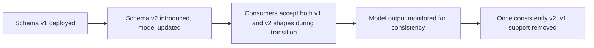

A structured output schema — the shape of a function call's arguments, or a JSON response format an agent produces — has the same versioning needs as any other interface covered in this series, plus one that's specific to structured outputs: the model generating that output has to reliably produce the *current* schema shape, and a poorly-managed transition can produce a model that inconsistently mixes old and new field names across different calls, which is a distinct failure mode from anything a traditional API versioning discussion needs to worry about.

## Additive Changes Are Usually Safe; Renames and Removals Aren't

```python
# Safe: additive, optional field
class OrderResultV1(BaseModel):
    order_id: str
    status: str
    tracking_number: str | None = None  # new, optional — old consumers ignore it

# Unsafe without a transition plan: rename
class OrderResultV2(BaseModel):
    order_id: str
    order_status: str  # renamed from 'status' — breaks any consumer reading the old field name
```

This mirrors ordinary API versioning discipline directly. The distinct wrinkle: the *model* also needs to consistently produce whichever schema is currently expected, and a schema change deployed without updating the few-shot examples or prompt instructions that shaped the model's original output habits can produce inconsistent output — some calls using the old field name out of habit, some using the new one, neither reliably.

## Enforce the Schema, Don't Just Hope the Model Follows It

```python
def generate_structured_output(prompt: str, schema: type[BaseModel]) -> BaseModel:
    response = llm.invoke(prompt, response_format=schema)  # provider-level schema enforcement
    try:
        return schema.model_validate_json(response.content)
    except ValidationError as e:
        # Retry once with the validation error fed back, rather than silently failing
        corrected = llm.invoke(f"{prompt}\n\nPrevious attempt failed validation: {e}\nTry again.")
        return schema.model_validate_json(corrected.content)
```

Modern structured-output modes (JSON schema enforcement at the API level, where available) reduce but don't eliminate this risk — enforcement guarantees the *shape* is valid JSON matching the schema, not that the *values* are semantically what you'd expect during a transition period where the model might still be reasoning in terms of the old schema's concepts even while technically outputting the new field names.

## Migration Period Needs Explicit Dual-Schema Support on the Consumer Side



The consumer-side dual-schema acceptance during transition is the same deprecation-window discipline from the skill and MCP tool versioning posts earlier in this series, applied here — and the "once consistently v2" gate needs actual monitoring of model output distribution, not just a calendar date, since the model's transition to reliably using the new schema is itself something that needs verification, not assumption.

## Test Schema Changes Against Real Prompts, Not Just the Schema Definition

A schema change that validates correctly in isolation can still produce inconsistent model behavior in the actual prompts that use it — testing needs to include running representative real prompts through the updated schema and checking output consistency across many samples, not just confirming the Pydantic model itself is well-formed.

## Key Takeaways

1. **Additive schema changes are usually safe; renames and removals need the same deprecation discipline as any other interface**
2. **A schema change also needs to update whatever shaped the model's original output habits** (few-shot examples, prompt instructions) — the model has to reliably follow the new shape, not just the schema definition being correct
3. **Provider-level schema enforcement guarantees valid shape, not semantic consistency during a transition**
4. **Monitor actual model output distribution during migration**, rather than assuming a calendar deadline means the transition is complete

---

*Part of the [Agent Infrastructure series](/tags/agent-infra-series/) — the plumbing layer underneath production agentic systems.*
