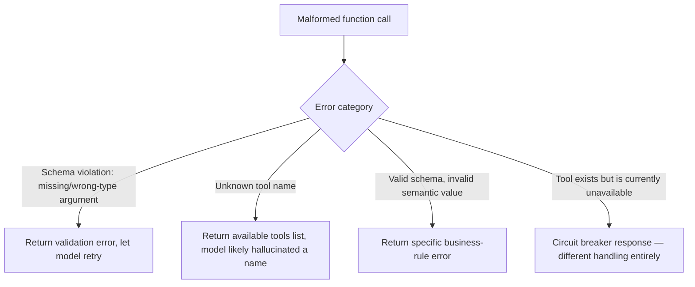

At meaningful production volume, malformed function calls — a missing required argument, a value outside the expected type or range, a call to a tool name that doesn't exist — happen routinely, not as rare edge cases. How the system responds to a malformed call determines whether it's a minor, self-corrected blip in the agent's reasoning or a cascading failure that derails the entire task.

## Categorize the Error Before Deciding How to Respond



Each category needs a different response, and conflating them into one generic "error" response wastes the opportunity to help the model actually recover. A schema violation and a hallucinated tool name are different failures — one is (usually) an easy self-correction if the model sees exactly what it got wrong; the other suggests the model may be confused about what tools are actually available.

## Structuring the Error Response for Model Recovery

```python
def handle_function_call_error(error_type: str, details: dict, available_tools: list[str] = None) -> dict:
    if error_type == "schema_violation":
        return {
            "error": "invalid_arguments",
            "message": f"Missing required argument '{details['missing_field']}'. "
                       f"Expected schema: {details['expected_schema']}",
        }
    if error_type == "unknown_tool":
        return {
            "error": "tool_not_found",
            "message": f"'{details['attempted_name']}' is not an available tool. "
                       f"Available tools: {available_tools}",
        }
    if error_type == "semantic_invalid":
        return {
            "error": "invalid_value",
            "message": details["business_rule_explanation"],  # specific, not generic
        }
```

A generic "an error occurred" response gives the model nothing to correct against, and a capable model will often just retry the same malformed call, or worse, abandon the approach entirely and produce a degraded response to the user rather than the correct tool result it could have gotten with one more, well-informed attempt.

## Cap Retries and Distinguish Retry-Worthy From Terminal Errors

Not every malformed call should trigger a retry loop — a schema violation is usually worth one retry with the corrected information; a tool that's circuit-broken (from the earlier post on [circuit breakers](/posts/circuit-breakers-agents-unreliable-tools/)) shouldn't be retried immediately regardless of how the error is phrased. A retry budget, distinct per error category, prevents an unrecoverable error from becoming an expensive, unbounded retry loop:

```python
RETRY_POLICY = {
    "schema_violation": {"max_retries": 2, "retry_immediately": True},
    "unknown_tool": {"max_retries": 1, "retry_immediately": True},
    "semantic_invalid": {"max_retries": 1, "retry_immediately": True},
    "circuit_open": {"max_retries": 0, "retry_immediately": False},
}
```

## Log Every Malformed Call, Even Successfully Recovered Ones

A malformed call that the model successfully self-corrected on retry still represents a real signal — a tool description that's ambiguous enough to regularly produce malformed calls in the first place is worth fixing at the source, the same closing-the-loop discipline from the skill testing posts earlier in this blog. Tracking recovery-required call rate per tool surfaces exactly which tool descriptions need improvement.

## Key Takeaways

1. **Malformed function calls are routine at production scale**, not rare edge cases — plan for them structurally, not reactively
2. **Categorize the error type and respond specifically** — a generic error message gives the model nothing to correct against
3. **Cap retries per error category, and never retry-immediately on a circuit-broken tool** regardless of the malformed call's specifics
4. **Log recovery-required calls even when self-corrected** — a high rate for a specific tool signals its description needs improvement

---

*Part of the [Agent Infrastructure series](/tags/agent-infra-series/) — the plumbing layer underneath production agentic systems.*
