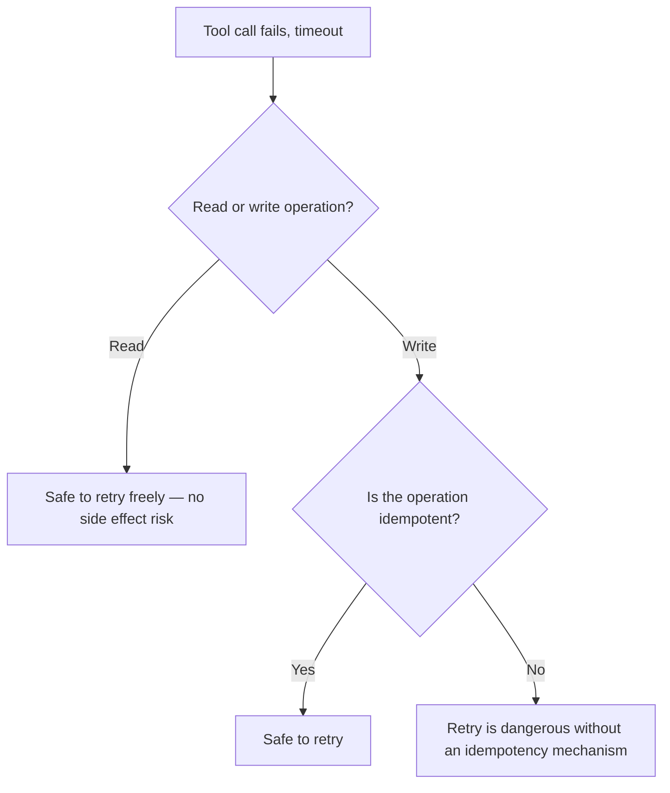

The previous post covered retrying malformed function calls. A related and distinct problem: retrying a tool call that *failed for infrastructure reasons* (timeout, transient network error) after it may have already partially succeeded — a "process refund" call that times out on the response but actually completed server-side, retried by the agent, can process the same refund twice. This is a correctness problem, not just a reliability one, and it needs idempotency, not just retry logic.

## Read Operations vs Write Operations Need Different Defaults



Read operations (a search, a lookup) are naturally safe to retry — no state changes, so a duplicate call just returns the same result again. Write operations (a refund, an order placement, a message send) are exactly where blind retry risk shows up, and it's precisely the category of tool call agentic systems most need to get right, since these are the actions with real, often irreversible, consequences.

## Idempotency Keys, Applied to Agent Tool Calls

```python
@tool("process_refund")
def process_refund(order_id: str, amount: float, idempotency_key: str) -> dict:
    """Process a refund. idempotency_key should be a stable identifier for
    this specific refund request — reuse it on retry, do not generate a new one."""
    existing = idempotency_store.get(idempotency_key)
    if existing:
        return existing  # already processed — return the original result, don't re-execute
    result = execute_refund(order_id, amount)
    idempotency_store.set(idempotency_key, result, ttl=86400)
    return result
```

The critical detail: the idempotency key needs to be generated *once*, at the point the agent first decides to make this call, and reused on any retry of that same logical action — not regenerated fresh on each attempt, which would defeat the entire mechanism. This means the calling code (the agent's tool-invocation wrapper), not the model itself, should typically own key generation and retry logic, since relying on the model to consistently reuse the same key across a retry it's reasoning about is an unnecessary reliability risk on top of an already-solvable infrastructure problem.

```python
def invoke_tool_with_retry(tool_name: str, args: dict, max_retries: int = 3) -> dict:
    idempotency_key = args.get("idempotency_key") or generate_stable_key(tool_name, args)
    for attempt in range(max_retries):
        try:
            return call_tool(tool_name, {**args, "idempotency_key": idempotency_key})
        except TransientError:
            if attempt == max_retries - 1:
                raise
            time.sleep(backoff(attempt))
```

## Not Every Write Operation Can Be Made Idempotent

Some external systems' APIs don't support idempotency keys natively — in that case, the safer default is *not* retrying automatically at all for non-idempotent writes, surfacing the ambiguous outcome ("unknown if this succeeded") to a human or to the escalation path from earlier in this series, rather than guessing and risking a duplicate side effect. A tool description should explicitly flag whether it's safe to retry, so the calling infrastructure doesn't have to guess per-tool:

```python
TOOL_RETRY_SAFETY = {
    "process_refund": "idempotent",       # safe to retry with idempotency key
    "send_notification": "not_idempotent", # external API has no dedup mechanism — do not auto-retry
    "search_inventory": "safe_always",     # read-only
}
```

## Key Takeaways

1. **Retrying a failed write operation without idempotency risks duplicate side effects** — this is a correctness issue, not just a reliability one
2. **Read operations are naturally retry-safe; write operations need explicit idempotency mechanisms**
3. **Generate the idempotency key once, in the calling infrastructure, reused across retries** — don't rely on the model to consistently regenerate the same key
4. **When a tool genuinely can't be made idempotent, don't auto-retry** — surface the ambiguous outcome rather than risking a duplicate action

---

*Part of the [Agent Infrastructure series](/tags/agent-infra-series/) — the plumbing layer underneath production agentic systems.*
