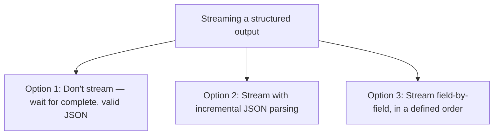

Streaming prose token-by-token is straightforward because a partial sentence is still meaningful to display. A structured JSON output streamed the same naive way — showing raw tokens as they arrive — produces invalid, unparseable JSON at every point except the final token, since `{"status": "appro` isn't valid JSON and can't be parsed or displayed sensibly mid-stream.

## The Options, and Their Tradeoffs



**Don't stream** is the simplest and correct choice when the structured output is small and fast enough that the latency cost of waiting for completion is negligible — many structured outputs (a function call's arguments, a small classification result) fall into this category, and streaming adds complexity for no real UX benefit.

**Incremental JSON parsing**, using a parser tolerant of partial/incomplete JSON, can extract whatever fields have been fully generated so far even while the overall structure is incomplete:

```python
import json_repair  # or similar partial-JSON-tolerant parser

def parse_partial_json_stream(buffer: str) -> dict | None:
    try:
        return json_repair.loads(buffer)  # tolerates incomplete/malformed JSON
    except Exception:
        return None

async def stream_structured_with_incremental_display(prompt: str, schema: type):
    buffer = ""
    last_complete_fields = {}
    async for token in llm.astream(prompt):
        buffer += token
        parsed = parse_partial_json_stream(buffer)
        if parsed:
            new_fields = {k: v for k, v in parsed.items() if k not in last_complete_fields}
            if new_fields:
                yield new_fields  # display fields as they become available
                last_complete_fields.update(new_fields)
```

**Field-by-field streaming** works when the schema and prompt are structured so the model reliably generates fields in a known, fixed order — allowing the consumer to know exactly when a specific field is complete without needing tolerant parsing at all, at the cost of constraining prompt design to enforce that ordering.

## Match the Approach to What's Actually Being Displayed

The right choice depends heavily on the UX being built. A structured output feeding directly into application logic (not shown to a user at all) rarely benefits from streaming — wait for the complete, validated result. A structured output whose fields are progressively revealed in a UI (a form being filled in field by field as the model generates it) benefits genuinely from incremental display, since the perceived responsiveness gain is real and visible to the user.

## Always Validate the Complete Output, Regardless of Streaming Approach

Whichever streaming approach is used, the final, complete output still needs full schema validation before being treated as trustworthy — incremental parsing during the stream is for display purposes, not a substitute for validating the finished structure against the actual schema once generation completes, the same validation discipline from the schema evolution post earlier in this series.

```python
def finalize_streamed_output(buffer: str, schema: type[BaseModel]) -> BaseModel:
    return schema.model_validate_json(buffer)  # full validation on the complete result, always
```

## Key Takeaways

1. **Naive token-by-token streaming produces invalid, unparseable JSON at every point except the end** — structured outputs need a different approach than prose streaming
2. **Skipping streaming entirely is often the right choice** for small, fast structured outputs with no real UX benefit from incremental display
3. **Tolerant incremental JSON parsing or field-ordered streaming both work**, chosen based on how much you can constrain the model's generation order
4. **Always run full schema validation on the complete output**, regardless of streaming approach — incremental parsing is for display, not correctness

---

*Part of the [Agent Infrastructure series](/tags/agent-infra-series/) — the plumbing layer underneath production agentic systems.*
