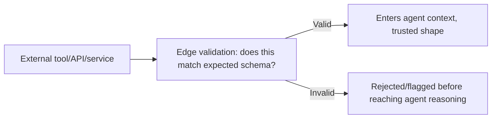

The last several posts covered validating structured *output* from the model. Just as important and much less discussed: validating structured *input* to the agent — tool results, API responses, retrieved documents with structured metadata — at the point they enter the agent's context, rather than trusting that whatever a tool or upstream service returns matches the shape the agent's prompt logic assumes.

## Why This Boundary Matters as Much as Output Validation



An agent's prompt logic — how it's instructed to interpret and act on a tool's result — implicitly assumes that result matches an expected shape. When an upstream API changes its response format, returns a partial result during a degraded state, or simply has a bug, an agent receiving that malformed data without validation will reason about it as if it were well-formed, potentially producing confidently wrong output built on a foundation that was never actually valid.

## Validate at the Boundary, Not Deep in the Reasoning Chain

```python
from pydantic import BaseModel, ValidationError

class InventoryLookupResult(BaseModel):
    item_id: str
    quantity: int
    warehouse_location: str

def call_inventory_tool(item_id: str) -> dict:
    raw_response = inventory_api.lookup(item_id)
    try:
        validated = InventoryLookupResult.model_validate(raw_response)
        return validated.model_dump()
    except ValidationError as e:
        logger.error(f"Inventory API returned unexpected shape: {e}")
        return {
            "error": "upstream_data_invalid",
            "message": "Inventory data is temporarily unavailable in expected format",
        }
```

Validating immediately at the point data enters the system — not several reasoning steps later, after the agent has already incorporated the malformed data into its context — means a schema violation surfaces as a clear, structured error the agent can reason about (and potentially retry or escalate), rather than silently propagating bad data deeper into a chain where the eventual failure is much harder to trace back to its actual source.

## This Applies to Retrieved Content With Structured Metadata Too

RAG pipelines retrieving documents with structured metadata (source, timestamp, access level) benefit from the same discipline — validating that metadata against an expected schema before it's used for anything consequential (an access control decision, a recency-based ranking boost), rather than trusting that every document in the index has correctly-formed metadata indefinitely, especially as ingestion pipelines evolve over time and older documents may have been indexed under a since-changed metadata schema.

## Fail Toward a Clear Error, Not a Silent Best-Effort Guess

The instinct when validation fails is sometimes to attempt a best-effort coercion — force the malformed data into roughly the expected shape and proceed anyway. This trades a visible failure for an invisible one, and invisible failures are strictly worse for debugging and for trust: a clear "this tool's data didn't match the expected format" error is more useful, to both the agent's own reasoning and to whoever eventually debugs an incident, than a silently-coerced value that looks valid but may not accurately represent what the upstream system actually returned.

## Key Takeaways

1. **Input validation at the boundary matters as much as output validation** — an agent reasoning over malformed input produces confidently wrong results built on an invalid foundation
2. **Validate immediately at the point data enters the system**, not several reasoning steps later where the eventual failure is hard to trace back
3. **This applies to retrieved document metadata, not just live tool/API results** — ingestion schema can drift over time too
4. **Fail toward a clear, structured error rather than a silent best-effort coercion** — an invisible failure is strictly worse for both agent reasoning and later debugging

---

*Part of the [Agent Infrastructure series](/tags/agent-infra-series/) — the plumbing layer underneath production agentic systems.*
