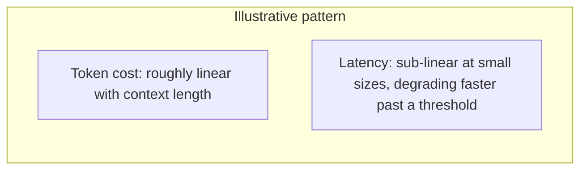
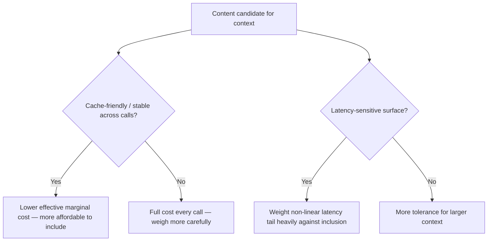

The earlier post on [budgeting a context window](/posts/budgeting-context-window-scarce-resource/) argued context should be treated as a deliberate allocation, not an unconstrained resource. This post supplies what that argument was missing: actual measured cost behavior, because "longer context costs more" undersells how non-linear the real cost curve is once latency, not just token pricing, enters the picture.

## Token Cost Is Roughly Linear; Latency Isn't

```python
def benchmark_latency_by_context_length(context_lengths: list[int], n_samples: int = 20) -> dict:
    results = {}
    for length in context_lengths:
        latencies = []
        for _ in range(n_samples):
            padded_context = generate_context_of_length(length)
            start = time.monotonic()
            llm.invoke(padded_context)
            latencies.append(time.monotonic() - start)
        results[length] = {"p50": statistics.median(latencies), "p95": sorted(latencies)[int(n_samples * 0.95)]}
    return results
```



Token pricing scales close to linearly with input length across most providers, which is what most cost estimation focuses on. Latency, particularly time-to-first-token for very long contexts, often degrades faster than linearly past a certain size — meaning a context budget decision driven purely by token-cost math can still produce a latency regression that token-cost math alone wouldn't have predicted.

## Prompt Caching Changes the Curve, Not Just the Total

Referencing the earlier [prompt caching post](/posts/prompt-caching-strategies-cost/) — for a cached stable prefix, the effective marginal cost of a long, stable context on subsequent calls is much lower than the first call's cost, which means the "is long context worth it" calculation is different for a stable system prompt plus tool definitions (cache-friendly, low marginal cost after the first hit) versus a long, unique-per-call retrieved context (not cache-friendly, full cost every time).

```python
def effective_cost_per_call(base_context_tokens: int, cacheable_tokens: int, cache_discount: float, calls_in_session: int) -> float:
    non_cacheable = base_context_tokens - cacheable_tokens
    first_call_cost = base_context_tokens
    subsequent_call_cost = non_cacheable + cacheable_tokens * (1 - cache_discount)
    return (first_call_cost + subsequent_call_cost * (calls_in_session - 1)) / calls_in_session
```

## The Actual Decision This Should Inform

Given both non-linear latency and cache-dependent effective cost, "should this go in context" isn't answerable from token count alone — it depends on whether the content is cache-friendly (stable across calls) or not, and whether the specific latency budget for this surface can absorb the non-linear tail. A latency-sensitive, real-time surface should weight the latency curve heavily; a background batch-processing agent with a generous latency budget can reasonably tolerate more context for the same token cost, since the latency degradation matters far less there.



## Key Takeaways

1. **Token cost scales roughly linearly with context length; latency often doesn't**, degrading faster past a threshold worth actually measuring for your specific workload
2. **Prompt caching changes the effective cost of stable content dramatically** — the "worth it" calculation differs for cacheable vs. per-call-unique context
3. **The context-inclusion decision should weigh cache-friendliness and the specific surface's latency budget**, not token count in isolation
4. **Measure your own latency curve rather than assuming a general one** — the threshold where degradation accelerates varies by provider and model

---

*Part of the [Agent Infrastructure series](/tags/agent-infra-series/) — the plumbing layer underneath production agentic systems.*
