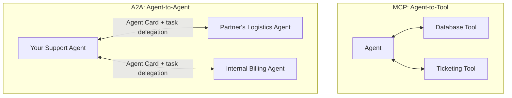

[MCP](/posts/mcp-in-production-enterprise-scale/) standardizes how an agent connects to tools and data sources. It has nothing to say about a genuinely different problem: what happens when your customer-support agent, built on LangGraph, needs to hand off part of a task to a logistics-tracking agent that a partner company built on an entirely different stack? That's the problem **Agent2Agent (A2A)** — originally developed by Google, since contributed to the Linux Foundation — is built to solve, and it's matured fast enough that it's now worth treating as production infrastructure rather than a future concern.

## A Different Layer Than MCP



MCP's model is client-server: an agent is the intelligent party, calling a comparatively dumb tool. A2A's model is peer-to-peer: both sides are agents, each capable of reasoning, each potentially built on a different framework, by a different team, running on different infrastructure — and neither one needs to know anything about the other's internals to collaborate.

## Agent Cards: How Discovery Works

An A2A-compatible agent publishes an **Agent Card** — a metadata document describing what it can do and how to reach it, analogous to how an OpenAPI spec describes a REST API:

```json
{
  "name": "logistics-tracking-agent",
  "description": "Tracks shipment status and provides delivery estimates for orders placed through PartnerCo's fulfillment network.",
  "url": "https://partnerco.example.com/a2a",
  "capabilities": {
    "streaming": true,
    "pushNotifications": true
  },
  "skills": [
    {
      "id": "track-shipment",
      "description": "Given an order ID, returns current shipment status and estimated delivery date.",
      "inputModes": ["text"],
      "outputModes": ["text", "structured"]
    }
  ]
}
```

Your agent reads the card, understands what the logistics agent can do, and delegates a task to it without any custom integration work — the same standardization benefit MCP provides for tools, but for agent-to-agent collaboration instead.

## Task Delegation in Practice

```python
from a2a_client import A2AClient

logistics_agent = A2AClient(agent_card_url="https://partnerco.example.com/a2a/.well-known/agent-card.json")

async def handle_shipment_inquiry(order_id: str, user_question: str) -> str:
    task = await logistics_agent.create_task(
        skill_id="track-shipment",
        input={"order_id": order_id, "question": user_question},
    )

    # A2A supports streaming updates for long-running tasks
    async for update in logistics_agent.stream_task(task.id):
        if update.status == "completed":
            return update.result
        # intermediate progress updates can be surfaced to the user
        # while the partner agent works on the request

    return "Unable to complete the request with the logistics partner."
```

The agent making this call doesn't need to know whether the logistics agent is built on CrewAI, a custom framework, or something entirely proprietary to the partner — the Agent Card and the protocol's task/message schema are the entire contract.

## Where This Shows Up in Production Today

A2A crossed 150 supporting organizations on the Linux Foundation roster in its first year there, with adoption concentrated in a few recurring patterns:

- **Cross-vendor enterprise workflows** — an internal procurement agent negotiating with a supplier's agent, each side built and operated independently
- **Internal multi-team agent boundaries** — even within one company, different teams often build agents on different stacks (one team on LangGraph, another on a custom framework), and A2A gives them a stable integration boundary instead of requiring a shared framework
- **Partner ecosystem integrations** — SaaS platforms exposing an agent-facing interface to their own product, so customers' agents can interact with the platform's agent rather than only its REST API

## A2A vs. MCP: When You Need Which

| Dimension                | MCP                                        | A2A                                              |
| ---------------------------| ---------------------------------------------| ----------------------------------------------------|
| **Relationship**            | Agent → tool/data (client-server)            | Agent ↔ agent (peer-to-peer)                        |
| **What's on the other end** | A function or a data source, not a reasoner  | Another reasoning agent, potentially long-running    |
| **Discovery mechanism**     | Server capability listing                    | Agent Card                                          |
| **Task model**              | Single call, request/response                | Task delegation, can be long-running and stateful    |
| **Typical use**             | Wiring an agent to your internal systems     | Cross-team, cross-vendor, or cross-organization agent collaboration |

Most production systems need both, at different layers of the same architecture — your agent uses MCP to reach its own tools and data, and A2A when the thing it needs to delegate to is itself an autonomous agent rather than a deterministic function.

## Governance Gaps Are Shared With MCP

The same maturity gap noted in the MCP post shows up here too, and for similar reasons: identity and trust between agents that don't share an organizational boundary is still an open problem. If your agent delegates a task to a partner's agent via A2A, you're implicitly trusting that agent's outputs the same way you'd trust a third-party API response — which means the same input validation discipline from [guardrails for LLM agents](/posts/guardrails-for-llm-agents/) applies to whatever comes back across an A2A task, not just to user input.

## Key Takeaways

1. **A2A and MCP solve different problems at different layers** — agent-to-agent collaboration versus agent-to-tool integration
2. **Agent Cards are the discovery mechanism** — the A2A analogue of an OpenAPI spec, letting an agent understand what a peer can do without custom integration
3. **Task delegation supports long-running, stateful interactions**, unlike MCP's single-call model — appropriate for genuinely multi-step collaboration between agents
4. **Cross-vendor and cross-team boundaries are where A2A earns its keep** — it's the integration layer when the other side is an autonomous agent, not a deterministic tool
5. **Trust and validation still apply to what comes back** — treat another agent's A2A response with the same input-validation discipline as any external system's output

Both protocols in this series so far assume the calls that go back and forth actually work reliably. The next post covers what makes that assumption hold — [structured outputs and tool-call contracts](/posts/structured-outputs-tool-call-contracts/).

---

*Part of the [Agent Infrastructure series](/tags/agent-infra-series/) — the plumbing layer underneath production agentic systems.*
