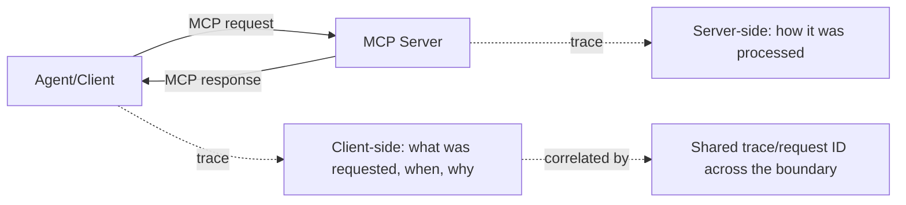

The earlier post on [reading LangSmith traces for multi-agent debugging](/posts/langsmith-traces-multi-agent-debugging/) covered observability within a single agent framework's own execution. An MCP tool call crosses a distinct boundary — a separate server, potentially a separate team or organization, communicating over a defined protocol — and that boundary needs its own tracing discipline layered on top of, not instead of, general agent observability.

## What's Specific to the MCP Boundary



Without a shared trace ID propagated across the MCP boundary, debugging a slow or failed tool call means correlating client-side and server-side logs manually, by timestamp — unreliable and slow, especially once the client and server are operated by different teams with different logging systems entirely.

## Propagating Trace Context Across MCP

```python
def mcp_client_call(tool_name: str, args: dict, trace_context: dict) -> dict:
    request = {
        "tool": tool_name,
        "args": args,
        "_trace": {
            "trace_id": trace_context["trace_id"],
            "parent_span_id": trace_context["current_span_id"],
        },
    }
    response = mcp_transport.send(request)
    return response

# Server side, extracting and continuing the trace
def mcp_server_handle(request: dict):
    trace_id = request.get("_trace", {}).get("trace_id", generate_new_trace_id())
    with start_span(trace_id=trace_id, name=f"mcp_tool:{request['tool']}"):
        return execute_tool(request["tool"], request["args"])
```

This mirrors distributed tracing conventions (W3C Trace Context is a reasonable standard to adopt here) already well-established for microservices — MCP calls are a form of service-to-service call, and there's no reason to reinvent trace propagation for them specifically rather than reusing conventions that already solve this.

## What to Trace Specifically, Beyond Generic Request/Response

- **Which specific server and tool version handled the request** — essential for debugging a regression that traces back to a specific server-side deployment, especially relevant given the versioning discipline from earlier in this series
- **Auth context used** (client ID, not full credentials) — for debugging authorization-related failures without logging sensitive tokens
- **Whether the response came from cache, if the server implements any** — a fast response might be a cache hit, not evidence the underlying operation is genuinely fast
- **Circuit breaker state at call time**, if applicable — a fast failure due to an open circuit looks very different in aggregate latency metrics than a genuine successful fast response, and conflating them in a dashboard misleads whoever's reading it

## For Third-Party MCP Servers, Trace What You Can Control

For an external, third-party MCP server, you can't instrument their side of the trace — but you can still trace comprehensively on your own side: when the call was made, how long it took from your perspective, what was returned, and whether it passed your own edge validation (from the earlier post on validating input at the boundary). This gives you a debuggable picture even without cooperation from the server operator.

## Key Takeaways

1. **MCP calls cross a real boundary that needs its own tracing discipline**, layered on top of general agent framework observability
2. **Propagate a shared trace ID across the client-server boundary**, reusing established distributed tracing conventions rather than reinventing them
3. **Trace server/tool version, auth context, cache status, and circuit breaker state** — not just generic request/response timing
4. **For third-party servers you can't instrument, trace comprehensively on your own side** — a debuggable picture is still possible without their cooperation

---

*Part of the [Agent Infrastructure series](/tags/agent-infra-series/) — the plumbing layer underneath production agentic systems.*
