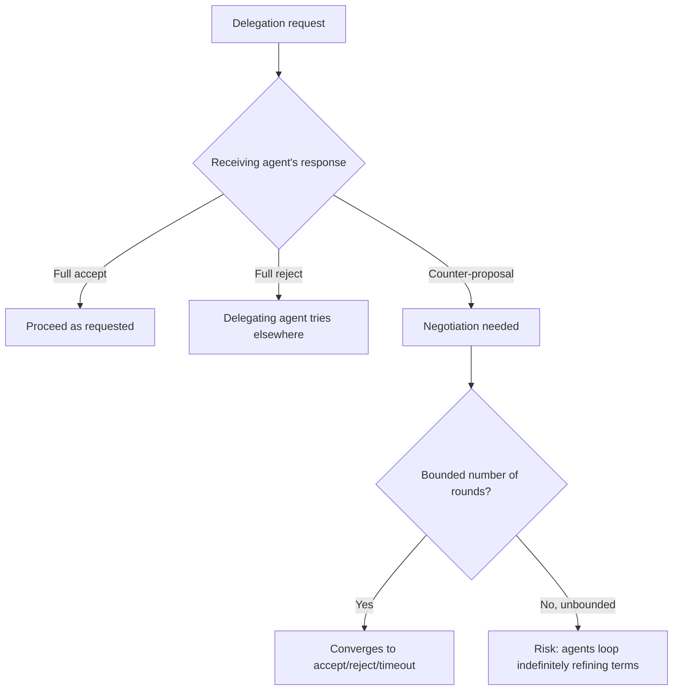

The A2A posts earlier in this series mostly assumed a clean handoff: an agent delegates a well-formed task, the receiving agent either can or can't do it. Real interactions between autonomous agents are often messier — a receiving agent can do *part* of what's asked, or can do it under different terms than requested (a different timeline, a different scope, a different cost), and the interaction needs an actual negotiation protocol, not just an accept/reject binary.

## Why This Needs Structure, Not Free-Form Back-and-Forth



Two agents negotiating in unstructured natural language, with no bound on how many rounds of back-and-forth can occur, risks the same unproductive-loop failure mode covered in the very first post of this blog's Block A — except now happening between two separate autonomous systems, potentially owned by different organizations, where nobody's watching the exchange in real time the way a human might notice a stuck internal agent.

## A Structured Counter-Proposal Format

```python
@dataclass
class DelegationProposal:
    task: dict
    terms: dict  # e.g., {"deadline": ..., "cost_ceiling": ..., "scope": ...}

@dataclass
class CounterProposal:
    original_proposal_id: str
    modified_terms: dict
    reasoning: str  # why the original terms couldn't be met as-is
    round_number: int

MAX_NEGOTIATION_ROUNDS = 3

def negotiate(initial_proposal: DelegationProposal, target_agent) -> dict:
    current = initial_proposal
    for round_num in range(MAX_NEGOTIATION_ROUNDS):
        response = target_agent.evaluate_proposal(current)
        if response.status in ("accept", "reject"):
            return {"outcome": response.status, "final_terms": response.terms}
        current = apply_counter_proposal(current, response.counter_proposal)
    return {"outcome": "negotiation_timeout", "last_terms_offered": current.terms}
```

The hard round cap is what prevents unbounded negotiation loops — after `MAX_NEGOTIATION_ROUNDS`, the exchange resolves to a definite outcome (accept, reject, or timeout) rather than continuing indefinitely, the same structural safeguard as the iteration limits covered for single-agent loops much earlier in this blog, applied to a two-agent exchange instead.

## Terms That Should Never Be Auto-Negotiated

Referencing the escalation design and policy-based triggers covered earlier in this series — certain terms (cost ceiling above a threshold, scope touching sensitive data, anything crossing an organizational trust boundary) shouldn't be autonomously negotiable even within the bounded-rounds structure; a counter-proposal touching one of these should escalate to human review rather than being resolved by the two agents alone, regardless of how reasonable the counter-terms look.

```python
def requires_human_approval(counter_proposal: CounterProposal) -> bool:
    return (
        counter_proposal.modified_terms.get("cost_ceiling", 0) > AUTO_APPROVE_COST_THRESHOLD
        or counter_proposal.modified_terms.get("scope_expansion", False)
    )
```

## Log Negotiation History as Its Own Audit Trail

A negotiated outcome, especially one crossing an organizational boundary, benefits from a complete record of what was proposed and countered at each round — not just the final agreed terms — since a later dispute about what was actually agreed to needs the full exchange, not just the resolved endpoint.

## Key Takeaways

1. **Real cross-agent interactions often need negotiation, not just a clean accept/reject binary** — most A2A discussion undersells this
2. **Unstructured, unbounded negotiation risks the same unproductive-loop failure as single-agent systems**, now between autonomous systems nobody's watching in real time
3. **A hard round cap resolves every negotiation to a definite outcome** — accept, reject, or timeout — rather than continuing indefinitely
4. **High-stakes terms should escalate to human approval rather than being auto-negotiable**, even within the bounded structure

---

*Part of the [Agent Infrastructure series](/tags/agent-infra-series/) — the plumbing layer underneath production agentic systems.*
