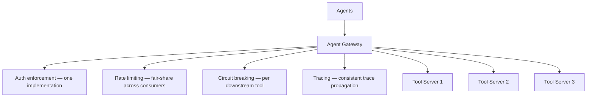
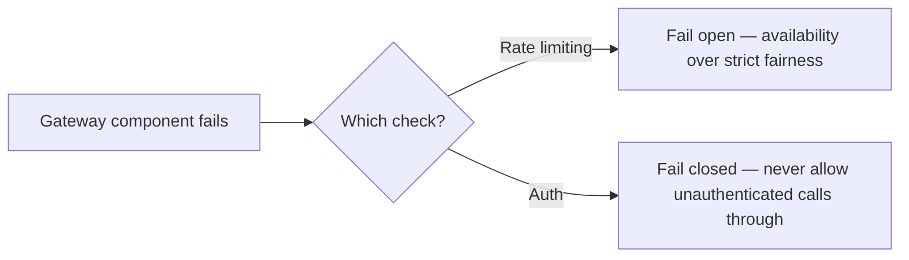

Across this series: auth patterns for MCP servers, rate limiting shared tool servers, circuit breakers for unreliable tools, tracing across the MCP boundary. Implemented independently per tool server, each of these gets built (and maintained, and drifts) slightly differently every time. An agent gateway — a single enforced layer all tool traffic passes through — is where these converge into one consistent implementation instead of N slightly-different ones.

## What the Gateway Centralizes



Each of these concerns individually implemented per-server means N implementations to keep consistent, N places a security fix needs to be applied, and N places observability data might be formatted slightly differently — all real maintenance costs that compound as the number of tool servers grows, which is exactly the trajectory that motivated the platform-team discussion earlier in this blog.

## A Minimal Gateway Implementation

```python
class AgentGateway:
    def __init__(self, auth, rate_limiter, circuit_breakers, tracer):
        self.auth = auth
        self.rate_limiter = rate_limiter
        self.circuit_breakers = circuit_breakers
        self.tracer = tracer

    async def route_tool_call(self, request: dict, caller_context: dict) -> dict:
        auth_result = self.auth.verify(request, caller_context)
        if not auth_result.valid:
            return {"error": "unauthorized", "reason": auth_result.reason}

        if not self.rate_limiter.allow(caller_context["team"]):
            return {"error": "rate_limited", "retry_after": self.rate_limiter.retry_after(caller_context["team"])}

        target_server = self.resolve_server(request["tool"])
        breaker = self.circuit_breakers[target_server.name]

        with self.tracer.start_span(request["tool"], trace_id=caller_context.get("trace_id")):
            try:
                return breaker.call(target_server.invoke, request)
            except CircuitOpenError:
                return {"error": "service_unavailable", "tool": request["tool"]}
```

## Where the Gateway Shouldn't Be a Bottleneck

A single gateway is a natural chokepoint if not designed for it — every tool call in the system routing through one component means that component's own reliability and latency directly bound the whole system's. Standard patterns apply: horizontal scaling of the gateway itself, keeping gateway-layer logic fast (auth/rate-limit checks, not heavyweight processing), and ensuring the gateway's own failure mode is fail-open for genuinely non-critical checks or fail-closed for security-critical ones, deliberately chosen per check rather than defaulted.



## The Gateway Is Also the Natural Enforcement Point for Vetting

The MCP server registry's vetting status from earlier in this series becomes directly enforceable here — the gateway can refuse to route to an unvetted server at all, making vetting a hard technical gate rather than a policy that individual agent implementations are trusted to respect on their own.

## Key Takeaways

1. **A gateway converges auth, rate limiting, circuit breaking, and tracing into one consistent implementation**, rather than N slightly-different per-server ones
2. **This directly reduces the maintenance cost that motivates a platform team in the first place** — one place to fix, not many
3. **Design deliberately for the gateway not becoming a single point of failure** — horizontal scaling, fast checks, and an explicit fail-open/fail-closed decision per check type
4. **The gateway is the natural, hard enforcement point for server vetting**, turning a policy into an actual technical gate

---

*Part of the [Agent Infrastructure series](/tags/agent-infra-series/) — the plumbing layer underneath production agentic systems.*
