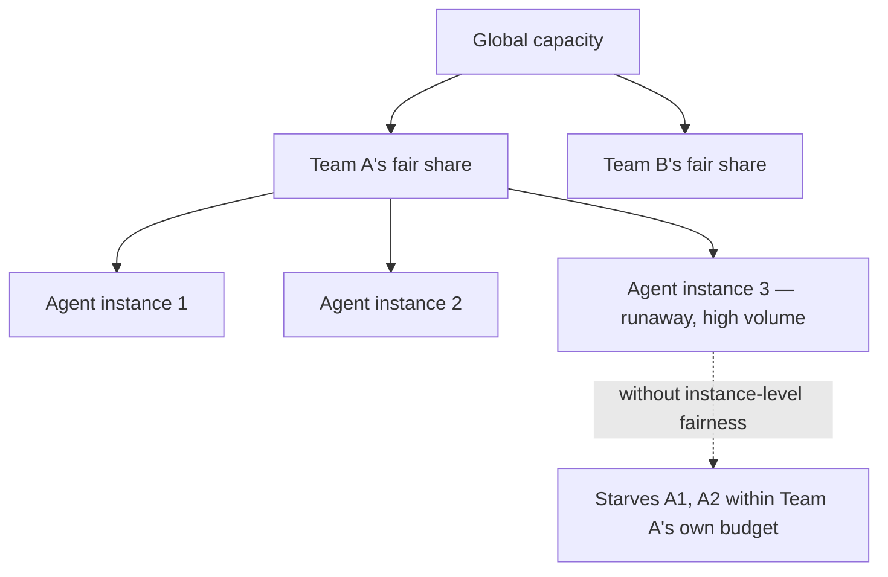

The earlier post on [rate-limiting shared tool servers](/posts/rate-limiting-shared-tool-servers/) covered fair-share allocation across teams. With the agent gateway from the previous post centralizing all tool traffic, a finer-grained fairness question emerges: within a single team's allocated share, multiple individual agents (or multiple instances of the same agent handling concurrent user sessions) compete for that same budget — and team-level fairness alone doesn't prevent one runaway agent instance from starving its teammates' agents.

## Two Layers of Fairness



Team-level fair-share (from the earlier post) prevents Team A from starving Team B. It does nothing to prevent one misbehaving agent instance *within* Team A's own allocation from starving its own teammates — a bug causing one agent instance to loop and hammer a tool repeatedly consumes the team's whole budget, leaving other, well-behaved agent instances on the same team rate-limited by their own teammate's bug.

## Nested Fair-Share Limiting

```python
class NestedFairShareLimiter:
    def __init__(self, team_budgets: dict, instances_per_team: dict):
        self.team_limiters = {team: TokenBucket(budget) for team, budget in team_budgets.items()}
        self.instance_limiters = {
            team: {inst: TokenBucket(budget // len(instances_per_team[team]))
                   for inst in instances_per_team[team]}
            for team, budget in team_budgets.items()
        }

    def allow(self, team: str, instance_id: str) -> bool:
        return (
            self.team_limiters[team].try_consume(1)
            and self.instance_limiters[team][instance_id].try_consume(1)
        )
```

A call needs to pass both the team-level check and the instance-level check within that team — a single runaway instance hits its own, smaller ceiling well before it could consume the entire team budget, while well-behaved instances on the same team remain unaffected.

## This Also Improves Incident Diagnosis

Beyond preventing the starvation itself, instance-level rate-limit tracking gives a much more precise incident signal than team-level tracking alone — "Team A is rate limited" tells an on-call engineer relatively little; "Team A's agent instance handling session pool 4 is hitting its rate limit while sessions 1-3 are normal" points directly at the actual misbehaving component, meaningfully speeding up diagnosis during an active incident.

## Dynamic Rebalancing for Genuinely Uneven Legitimate Load

An even split across instances within a team is a reasonable default and not always the right long-term allocation — some agent instances legitimately handle more concurrent load than others (a batch-processing instance vs. an interactive one). Where load patterns are predictable, weighted allocation within the team's budget (similar to the weighted team-level allocation from the earlier post) can reflect actual need rather than a flat even split.

## Key Takeaways

1. **Team-level fair-share doesn't prevent one agent instance from starving its own teammates within that team's budget**
2. **Nested fair-share limiting — team level, then instance level within it — closes that gap directly**
3. **Instance-level tracking also sharpens incident diagnosis**, pointing at the specific misbehaving component rather than just the team
4. **Where load is predictably uneven across instances, weight the within-team allocation** rather than defaulting to an even split

---

*Part of the [Agent Infrastructure series](/tags/agent-infra-series/) — the plumbing layer underneath production agentic systems.*
