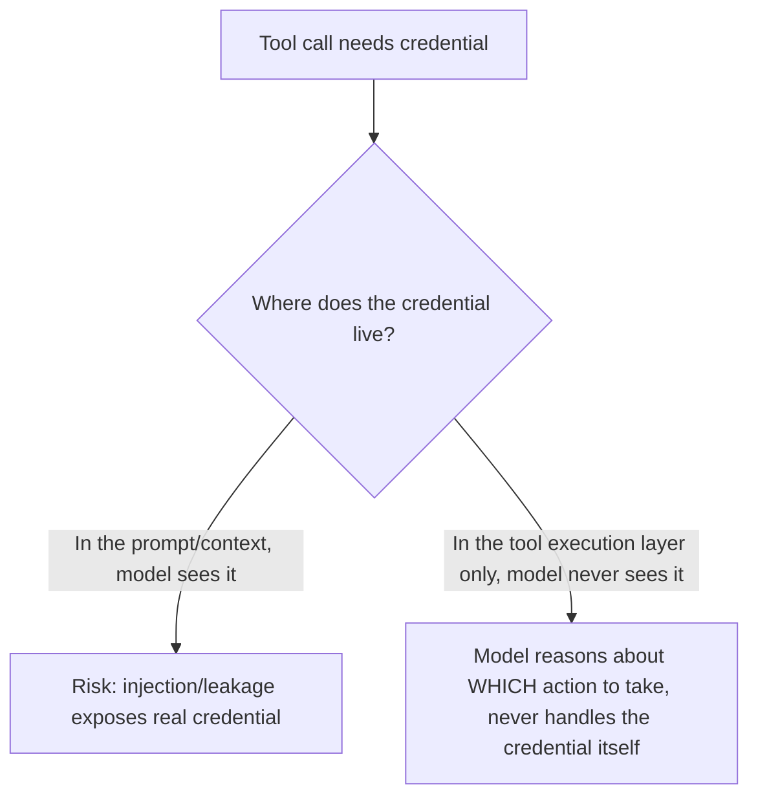

An agent invoking a tool that calls a real external API — a payment processor, a CRM, a third-party service — needs actual credentials somewhere in that call path. The critical architectural decision, easy to get wrong under time pressure: those credentials should never pass through the model's own context or reasoning at any point, only through the deterministic code executing the tool call.

## Why Credentials in Context Are a Real Risk, Not a Theoretical One

If a credential is ever included in a prompt or tool result the model sees — even to "let the model know which account is being used" — it becomes part of the conversation context, subject to the same prompt injection and context-leakage risks as anything else in context. A jailbreak or injection that gets the model to repeat back or act on its full context could expose that credential, and unlike most content in context, a leaked credential has a direct, exploitable consequence outside the conversation entirely.



## The Pattern: Model Decides, Code Executes With Credentials

```python
@tool("charge_customer")
def charge_customer(customer_id: str, amount: float) -> dict:
    """Charge a customer via the payment processor.
    The model provides customer_id and amount — it never sees API credentials."""
    api_key = secrets_manager.get_secret("payment_processor_api_key")  # resolved in code, not model context
    response = payment_client.charge(customer_id, amount, api_key=api_key)
    return {"status": response.status, "transaction_id": response.id}
    # api_key never appears in the return value or anywhere the model can see
```

The model's role is deciding *that* a charge should happen and *what* the parameters should be — `customer_id` and `amount` are legitimately part of its reasoning. The credential itself is resolved from a secrets manager entirely within the tool's execution code, never passed to or returned from the model.

## Short-Lived, Scoped Credentials Over Long-Lived Broad Ones

The same principle from the MCP auth patterns post applies here directly — credentials an agent's tools use should be as narrowly scoped and short-lived as the actual task requires, fetched just-in-time from a secrets manager rather than loaded once and cached indefinitely in the tool execution environment:

```python
def get_scoped_credential(action: str, resource_id: str) -> str:
    return secrets_manager.get_scoped_token(
        action=action,
        resource=resource_id,
        ttl_seconds=300,  # short-lived, minimizes blast radius if leaked from the execution environment itself
    )
```

## Audit Every Credential Use, Tied to the Triggering Agent Action

Even with credentials never entering model context, the tool execution layer itself should log every credential use — which credential, for what action, triggered by which agent session — so a security review can trace any consequential action back to the specific agent decision that triggered it, without needing the credential itself to appear anywhere in that trail.

```python
def log_credential_use(secret_name: str, action: str, agent_session_id: str):
    audit_log.record(secret_accessed=secret_name, action=action, session_id=agent_session_id, timestamp=time.time())
    # Never log the actual secret value
```

## Key Takeaways

1. **Real credentials should never pass through the model's context or reasoning** — only through the deterministic tool execution code
2. **The model decides what action to take and with what parameters; the code resolves and applies the actual credential**
3. **Use short-lived, narrowly-scoped credentials fetched just-in-time**, not long-lived broad ones cached indefinitely
4. **Audit every credential use tied to the triggering agent action**, without ever logging the credential value itself

---

*Part of the [Agent Infrastructure series](/tags/agent-infra-series/) — the plumbing layer underneath production agentic systems.*
