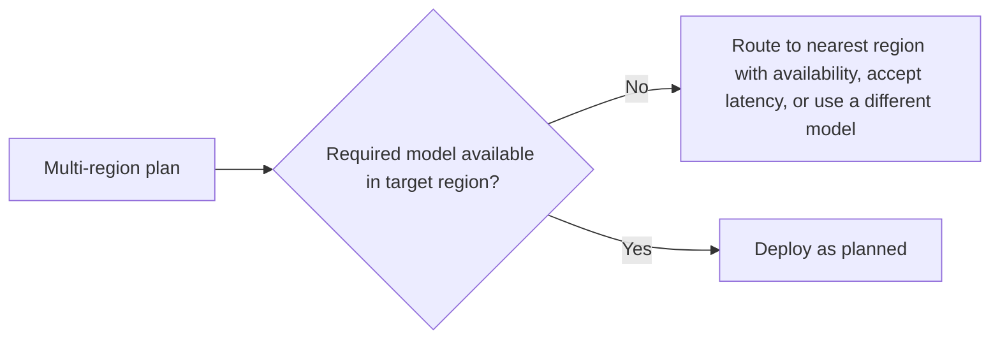

Multi-region deployment for a traditional stateless web service is a comparatively well-understood problem — replicate the service, route by geography, keep a shared database consistent. An agentic system adds state that doesn't replicate the same way: vector indexes, agent memory, and dependency on LLM provider regional availability, each of which needs its own specific multi-region design rather than inheriting the traditional playbook unchanged.

## What Needs Region-Aware Design, Specifically

```mermaid
flowchart TD
    A[Multi-region agentic system] --> B[Vector index: replicate or single-region + accept latency?]
    A --> C[Agent memory: which region is authoritative for a given user?]
    A --> D[LLM provider availability: does every region support the model you need?]
    A --> E[Checkpointer (LangGraph): regional consistency for durable state]
```

**Vector index replication** is expensive — a large index replicated across regions multiplies storage cost and needs a sync strategy accepting some staleness, or an active-active setup complex enough to be worth avoiding unless retrieval latency genuinely can't tolerate a cross-region round trip. Many systems reasonably choose a single-region index and accept the added latency for users in other regions, rather than the full cost of replication.

**Agent memory regional authority** needs a clear answer to "if a user's session moves between regions, which region's memory store is authoritative" — without one, the write-conflict problem from earlier in this series gets worse, since concurrent writes might now originate from genuinely different regions with real network latency between them, not just concurrent sessions within one region.

```python
def resolve_memory_region(user_id: str, region_affinity: dict) -> str:
    # Route consistently to the user's home region rather than
    # wherever their current request happens to land, to avoid
    # cross-region write conflicts on their own memory store
    return region_affinity.get(user_id, DEFAULT_REGION)
```

## LLM Provider Regional Availability Is a Real Constraint

Not every model is available in every region, and data residency requirements sometimes mandate a specific region's endpoint regardless of where the rest of the infrastructure lives. This needs to be checked explicitly as part of multi-region planning, not assumed — a region deployed without verifying the required model is actually available there discovers the gap in production, not in planning.



## Checkpointer Consistency Across Regions

For a LangGraph-based agent (from earlier in this series) deployed multi-region, the checkpointer backend needs its own regional consistency story — a durable execution paused mid-graph in one region needs to resume correctly even if the resuming request lands in a different region, which argues for a checkpointer backend with real multi-region replication support, not a single-region database that becomes a hidden single point of failure for an otherwise multi-region system.

## Start With What Actually Needs to Be Multi-Region

Not every component needs multi-region symmetry — a latency-sensitive interactive surface benefits most from regional deployment; a background batch-processing agent may reasonably run single-region regardless of where its users are, since its latency budget already tolerates it. Apply multi-region cost and complexity where the latency actually matters, not uniformly across the whole system by default.

## Key Takeaways

1. **Vector indexes, agent memory, and checkpointers don't replicate the same way stateless services do** — each needs its own multi-region design
2. **Route users consistently to a home region for memory** to avoid cross-region write conflicts, rather than routing by wherever a request happens to land
3. **Verify required model availability per region explicitly** — data residency and provider regional support are real constraints, not assumptions
4. **Apply multi-region complexity only where latency genuinely demands it**, not uniformly across every component by default

---

*Part of the [Agent Infrastructure series](/tags/agent-infra-series/) — the plumbing layer underneath production agentic systems.*
