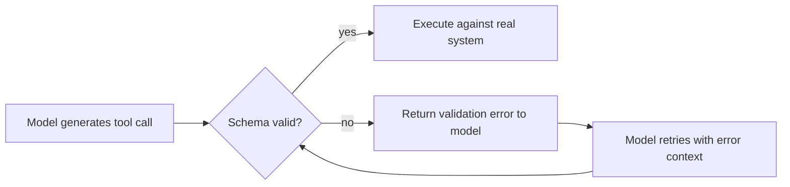

This series has covered how an agent gets context ([context engineering](/posts/context-engineering-replacing-prompt-engineering/)), how it reaches tools and data ([MCP](/posts/mcp-in-production-enterprise-scale/)), how it remembers things ([agent memory](/posts/building-production-grade-agent-memory/)), and how it collaborates with other agents ([A2A](/posts/a2a-multi-agent-mesh-interoperability/)). Every one of those depends on a more basic assumption: that the calls flowing across those channels actually conform to the shape the receiving side expects. This closing post is about the layer that makes that assumption hold — structured outputs and tool-call contracts.

## Why This Is Its Own Problem

An LLM produces text. Tool calling and structured output APIs constrain that text into something parseable as a schema, but "constrained by the API" and "actually valid for your downstream system" are not the same guarantee. Malformed arguments, subtly wrong types, and hallucinated fields that don't exist in the schema all still happen — less often than with pure free-text generation, but often enough that treating the model's output as a trusted, pre-validated payload is a mistake every team makes at least once before fixing it.



## Schema Validation Isn't Optional Middleware

Treat every tool-call argument set the same way you'd treat a request body hitting a public API — validate before it touches anything real:

```python
from pydantic import BaseModel, ValidationError, field_validator

class IssueRefundArgs(BaseModel):
    order_id: str
    amount: float
    reason: str

    @field_validator("amount")
    @classmethod
    def amount_positive(cls, v):
        if v <= 0:
            raise ValueError("amount must be positive")
        return v

def execute_tool_call(tool_name: str, raw_args: dict) -> dict:
    schema = TOOL_SCHEMAS.get(tool_name)
    try:
        validated = schema.model_validate(raw_args)
    except ValidationError as e:
        return {
            "error": True,
            "message": f"Invalid arguments for {tool_name}: {e}. Correct the arguments and retry.",
        }
    return run_tool(tool_name, validated.model_dump())
```

The error message matters as much as the validation itself — it needs to give the model enough to correct itself on retry, not just report that something failed. "amount must be positive" lets the model fix its own mistake; "ValidationError" does not.

## Retry With the Error, Not a Blind Retry

A blind retry — calling the exact same tool with the exact same malformed arguments — just reproduces the same failure. Feed the validation error back into the model's context so the retry is actually informed:

```python
def call_with_validated_retry(tool_name: str, initial_args: dict, llm, max_retries: int = 2) -> dict:
    args = initial_args
    for attempt in range(max_retries + 1):
        result = execute_tool_call(tool_name, args)
        if not result.get("error"):
            return result

        if attempt == max_retries:
            return {"error": True, "message": f"Failed after {max_retries} retries: {result['message']}"}

        correction = llm.invoke(
            f"Your call to {tool_name} failed validation: {result['message']}\n"
            f"Original arguments: {args}\n"
            "Provide corrected arguments as JSON matching the tool's schema."
        ).content
        args = json.loads(correction)

    return {"error": True, "message": "Unreachable"}
```

## Contract Tests at the Agent-Tool Boundary

The same discipline you'd apply to a public API's consumer contract applies directly to the boundary between an agent and its tools — write tests that pin down the schema both sides agree on, and run them independently of any specific model or prompt:

```python
def test_issue_refund_rejects_negative_amount():
    result = execute_tool_call("issue_refund", {"order_id": "ord_123", "amount": -50, "reason": "test"})
    assert result["error"] is True
    assert "positive" in result["message"]

def test_issue_refund_accepts_valid_args():
    result = execute_tool_call("issue_refund", {"order_id": "ord_123", "amount": 25.00, "reason": "damaged item"})
    assert result["error"] is False

def test_get_ticket_schema_matches_mcp_server_declaration():
    # Contract test: the schema the agent validates against must match
    # what the MCP server actually declares, or a server-side schema
    # change silently breaks the agent without either side noticing.
    declared_schema = mcp_client.get_tool_schema("get_ticket")
    assert declared_schema == TOOL_SCHEMAS["get_ticket"].model_json_schema()
```

That last test matters more than it looks — in an MCP-based system, the tool schema lives on the server, and nothing stops it from changing independently of the agent's own validation logic. A contract test that catches drift between the two is the difference between a schema change failing loudly in CI and failing silently in production three weeks later.

## Structured Output for Final Responses, Not Just Tool Calls

The same reliability problem applies to an agent's final output when a downstream system consumes it programmatically — a support agent whose output feeds a ticketing system needs its response structured and validated exactly like a tool call would be:

```python
class TicketResolution(BaseModel):
    resolution_summary: str
    category: str
    requires_escalation: bool
    confidence: float

def get_validated_resolution(raw_output: str, llm, max_retries: int = 2) -> TicketResolution:
    for attempt in range(max_retries + 1):
        try:
            return TicketResolution.model_validate_json(raw_output)
        except ValidationError as e:
            if attempt == max_retries:
                raise
            raw_output = llm.invoke(
                f"This output failed schema validation: {e}\nOriginal: {raw_output}\n"
                "Regenerate as valid JSON matching the required schema."
            ).content
```

## Key Takeaways

1. **Constrained generation is not the same as validated output** — schema validation at the boundary is a separate, necessary step, not a redundant one
2. **Retry with the specific error, not blindly** — an informed retry gives the model what it needs to self-correct; a blind retry just reproduces the same failure
3. **Contract-test the agent-tool boundary independently of any model or prompt** — these tests should catch a schema mismatch regardless of which LLM is calling the tool
4. **Watch for drift between server-declared and agent-validated schemas** in MCP-based systems specifically — nothing keeps them in sync automatically
5. **Apply the same validation discipline to final agent outputs** that feed downstream systems, not just to intermediate tool calls

That closes the infrastructure arc — context, protocols to tools, memory, protocols to other agents, and the contracts that keep all of it reliable. The next series turns to what it takes to run this infrastructure responsibly at organizational scale: security, cost, and platform maturity, starting with [the OWASP Agentic AI Top 10](/posts/owasp-agentic-ai-top-10-field-guide/).

---

*Part of the [Agent Infrastructure series](/tags/agent-infra-series/) — the plumbing layer underneath production agentic systems.*
