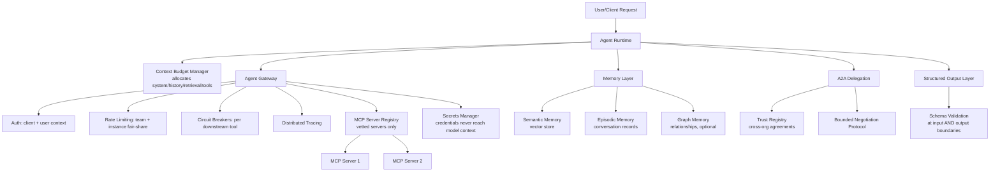

This month covered context budgeting, MCP auth and discovery and versioning, agent memory (eviction, episodic/semantic, conflict resolution, vector vs graph), A2A trust and negotiation, structured output reliability, and the agent gateway that converges much of it into one enforced layer. Closing it out by assembling the pieces into a single reference architecture, since each post examined one piece in isolation and the full picture is more than the sum of its parts.

## The Assembled Architecture

## Why This Assembly Matters More Than Any Single Piece

Building each piece in isolation — an MCP server here, a memory store there, an A2A integration added later — without an assembled architecture in mind tends to produce inconsistent implementations of the same underlying concerns (auth, rate limiting, tracing) scattered across each piece, exactly the maintenance cost the gateway post argued against. Designing toward this assembled picture from the start, even if pieces are built incrementally, keeps those cross-cutting concerns centralized rather than reimplemented per component.

## The Pieces That Compound

A few connections worth calling out explicitly, since they don't show up when reading any single post in isolation:

- **The gateway's vetting enforcement** (from the MCP registry and gateway posts) is what makes the trust registry for A2A meaningful in practice — both are the same underlying pattern (a central, enforced trust boundary) applied to two different kinds of external dependency.
- **Context budgeting and prompt caching** interact directly with memory retrieval — semantic memory facts retrieved per-request are exactly the kind of per-call-unique content that doesn't benefit from caching, while the system prompt and tool definitions do, which should shape where each lives in the assembled context.
- **Circuit breakers, rate limiting, and secrets management** all converge at the gateway specifically because they're all deterministic, code-level concerns that should never depend on model reasoning — a consistent theme across this entire month: keep the model responsible for deciding *what* to do, and keep infrastructure responsible for *how* it's done safely.

## What This Series Doesn't Cover, on Purpose

This architecture is infrastructure — the plumbing that makes agents reliable, safe, and interoperable. It doesn't cover security defense specifically (guardrails, red-teaming, injection defense were covered in earlier series on this blog) or cost/scaling discipline at an organizational level, which is exactly where this blog's next series picks up.

## Key Takeaways

1. **Building infrastructure pieces in isolation reproduces the same cross-cutting concerns inconsistently across each one**
2. **A gateway-centered architecture converges auth, rate limiting, circuit breaking, and secrets into one enforced layer**
3. **Context budgeting, caching, and memory retrieval interact directly** — design them together, not as independent decisions
4. **The consistent principle throughout: the model decides what to do; infrastructure enforces how it's done safely**, deterministically, outside the model's own reasoning

---

*Part of the [Agent Infrastructure series](/tags/agent-infra-series/) — the plumbing layer underneath production agentic systems.*
