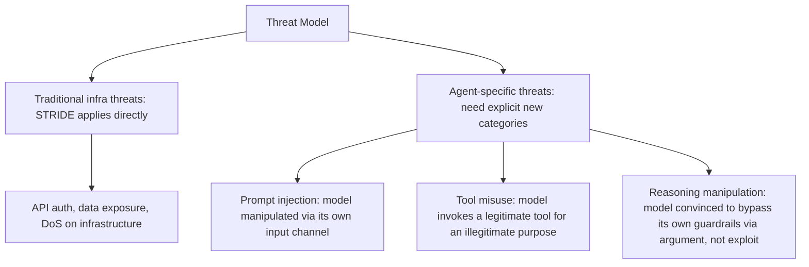
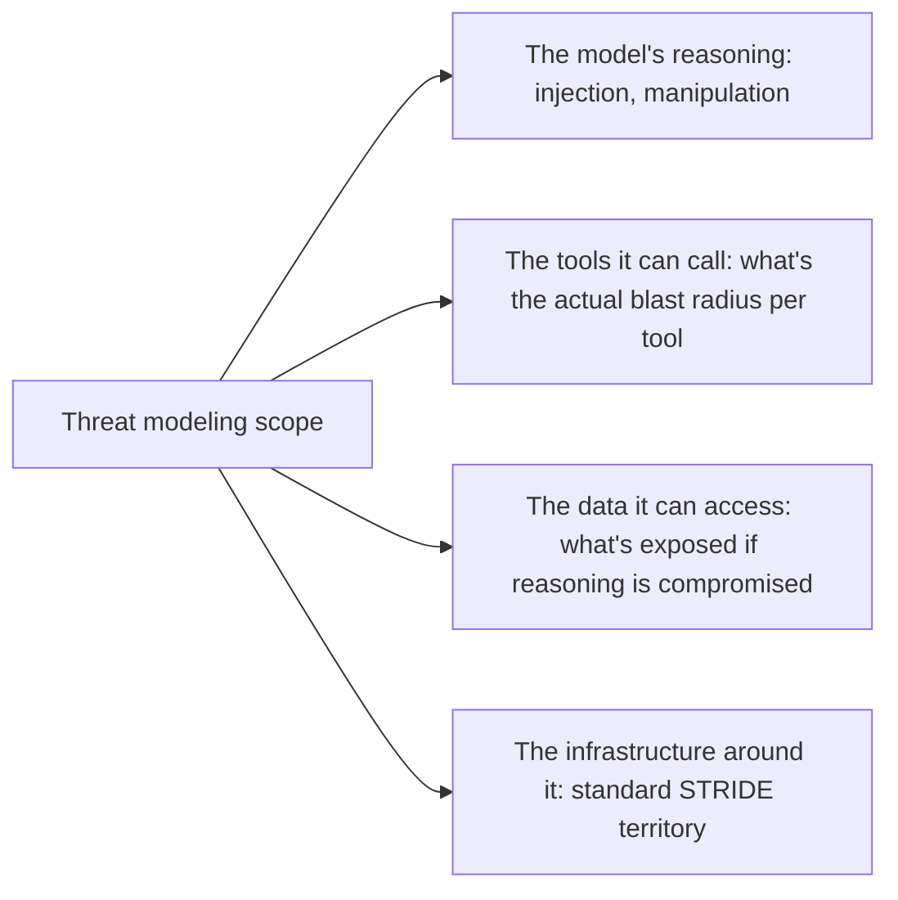

Standard threat modeling — STRIDE (Spoofing, Tampering, Repudiation, Information disclosure, Denial of service, Elevation of privilege) or similar frameworks — mostly transfers directly to an agentic system's traditional infrastructure: the API layer, the database, the auth system. What it doesn't natively cover is a category of threat specific to a system whose core component reasons and takes action rather than deterministically processing requests, and that category needs its own explicit place in the threat model.

## Where STRIDE Transfers Cleanly, and Where It Doesn't



The agent-specific categories don't map cleanly onto any single STRIDE category because they exploit the model's *reasoning process* itself, not a traditional software vulnerability — there's no buffer overflow or SQL injection equivalent being exploited, just persuasive or adversarial input that changes what the model decides to do.

## A Threat Model Worksheet Extended for Agentic Systems

```markdown
## Threat: Indirect prompt injection via retrieved document
**Attack vector**: Malicious instructions embedded in a document the RAG
pipeline retrieves and includes in context, treated by the model as
part of its instructions rather than untrusted content.
**Impact**: Model could be manipulated into actions beyond its intended
scope, using tools/permissions the legitimate user has access to.
**Existing mitigation**: Input classification layer, output guardrails
(see guardrails series).
**Residual risk**: Novel injection techniques not covered by current
classifiers. Mitigated by defense-in-depth (multiple independent layers).
**Owner**: [team], **Review cadence**: quarterly + on model changes
```

Every threat model entry needs a residual risk statement explicitly, not just a mitigation — because as covered in the earlier guardrails posts, no single-layer defense against these threats is complete, and pretending a mitigation eliminates the risk rather than reduces it produces false confidence in the threat model itself.

## Threat Model Around the Full System, Not Just the Model



A threat model that only covers "can the model be tricked" and stops there misses the more actionable question: given that some manipulation will eventually get through despite defenses, what can it actually *do*? This is where the sandboxing, policy-based escalation, and kill-switch posts from earlier in this blog become part of the threat model's actual mitigation story — bounding impact, not just trying to prevent every manipulation attempt from succeeding.

## Run This Before Launch, Not as a Retrofit

Threat modeling that happens after a system is already in production tends to rationalize existing design decisions rather than genuinely questioning them. Doing this before launch, alongside the constitution and spec-writing process from earlier series on this blog, means threat-derived requirements ("this tool needs sandboxing," "this action needs policy-based escalation") become part of the spec from the start rather than retrofitted findings.

## Key Takeaways

1. **Traditional STRIDE-based threat modeling transfers to infrastructure but misses threats specific to a reasoning, acting model**
2. **Prompt injection, tool misuse, and reasoning manipulation need their own explicit threat categories**, since they don't map to traditional vulnerability classes
3. **State residual risk explicitly for every mitigation** — no single-layer defense against these threats is complete
4. **Threat model the full system's blast radius, not just "can the model be tricked"** — bounding impact matters as much as preventing manipulation

---

*Part of the [Scaling AI Engineering series](/tags/scaling-ai-series/) — running agentic systems responsibly once they're past the prototype stage.*
