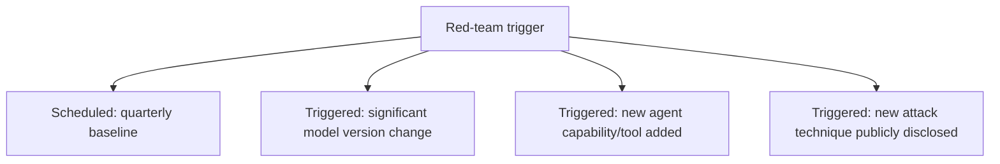
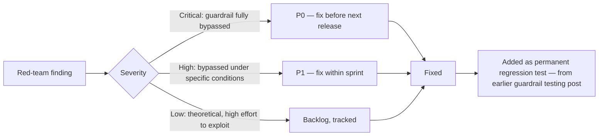

The earlier post on [red-teaming your own guardrails](/posts/red-teaming-your-own-guardrails/) covered how to structure the exercise. Running it once, well, is necessary and insufficient — scaling red-teaming into an organizational practice raises different questions: how often, who's actually responsible for running it, and critically, how findings turn into prioritized engineering work rather than a report that gets filed and periodically re-discovered during an actual incident.

## Cadence Tied to Change, Not Just Calendar



A purely calendar-based cadence (quarterly, say) misses gaps introduced between scheduled runs — a new tool with expanded capability shipped mid-quarter deserves its own targeted red-team pass before it reaches significant production traffic, not a wait until the next scheduled exercise. Both cadences matter: scheduled runs catch drift and provide a baseline; triggered runs catch newly introduced risk close to when it's introduced.

## Who Runs It: The Case for Rotating Ownership

A team red-teaming its own system indefinitely develops blind spots specific to that team's own mental model, as the earlier guardrails post noted. A practical middle ground between "always internal" (cheap, but limited) and "always external" (more effective, but expensive and slow to arrange) is rotating: internal red-teaming for routine, scheduled exercises, with a periodic external or cross-team review (someone unfamiliar with this system's specific design) as a check against the internal team's own accumulated blind spots.

```python
RED_TEAM_SCHEDULE = {
    "Q1": {"type": "internal", "team": "platform-security"},
    "Q2": {"type": "internal", "team": "platform-security"},
    "Q3": {"type": "external", "vendor": "TBD — budget for annual external review"},
    "Q4": {"type": "internal", "team": "platform-security"},
}
```

## Findings Need a Real Triage and Prioritization Process



Without an explicit severity-to-priority mapping, findings compete for attention against ordinary feature work with no consistent framework for which should win, and security findings without a forcing function tend to lose that competition more often than they should. Treating a P0 finding with the same urgency as a production incident — because a bypassable guardrail *is* effectively a live vulnerability — is what keeps red-teaming findings from silently stalling in a backlog.

## Track the Trend, Not Just the Count

The number of findings per red-team cycle isn't meaningful in isolation — a thorough, more aggressive red-team pass legitimately finds more issues than a shallow one, so a rising count can mean either a genuinely worsening security posture or genuinely more rigorous testing. What's meaningful is time-to-fix trending down and the rate of *repeat* findings (the same category of gap recurring across cycles) trending toward zero — that's the signal the fix-and-regression-test loop from the earlier guardrails post is actually working.

## Key Takeaways

1. **Combine scheduled and change-triggered red-teaming** — a purely calendar-based cadence misses risk introduced between scheduled runs
2. **Rotate between internal (routine, cheap) and external (periodic, blind-spot-checking) red-teaming**
3. **Give findings an explicit severity-to-priority mapping** — without one, security findings lose the competition against ordinary feature work
4. **Track time-to-fix and repeat-finding rate over time**, not raw finding count, which is confounded by how aggressively each cycle actually tested

---

*Part of the [Scaling AI Engineering series](/tags/scaling-ai-series/) — running agentic systems responsibly once they're past the prototype stage.*
