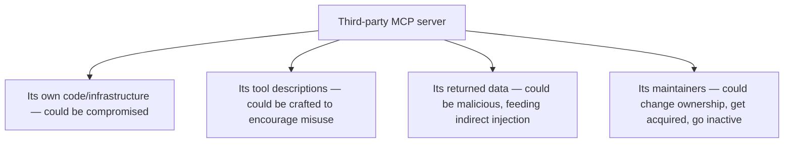

Adding a third-party MCP server to an agent's available tools is, structurally, the same kind of decision as adding a new dependency to a codebase — you're trusting code (or in this case, a service) you don't control, that could change behavior, get compromised, or turn out to have been malicious from the start. It often doesn't get evaluated with that rigor, because connecting to an MCP server feels more like configuration than a dependency addition, and configuration changes rarely go through the same review as a `package.json` update.

## Where the Trust Actually Extends To



Every one of these is a real supply-chain risk with a direct analog in traditional software dependency risk (a compromised package, a malicious maintainer update, an abandoned project with unpatched vulnerabilities) — the agent-specific addition is that a compromised MCP server's returned data is also a direct indirect-prompt-injection vector into your agent's reasoning, connecting this post directly to the previous one.

## A Vetting Checklist Before Connecting a New Server

```markdown
## Third-Party MCP Server Vetting
- [ ] Maintainer/organization identity verified — not anonymous
- [ ] Server's data handling reviewed: what does it log, retain, or
      transmit elsewhere about the calls you make to it?
- [ ] Tool descriptions reviewed for scope creep or ambiguity that
      could encourage over-invocation
- [ ] Auth pattern reviewed (from the MCP auth post) — least privilege,
      short-lived credentials where the server supports it
- [ ] Registered in the internal MCP registry with vetting status
      explicitly tracked, not just informally trusted
- [ ] Update/change monitoring: how will you know if this server's
      behavior changes materially after initial vetting?
```

The last item is the one most often skipped — vetting happens once, at connection time, and then the server is trusted indefinitely with no process for noticing if its behavior, ownership, or tool set changes materially afterward, which is exactly the supply-chain attack pattern (a trusted dependency compromised or maliciously updated after initial adoption) that traditional software supply-chain security has spent years learning to guard against.

## Ongoing Monitoring, Not Just Initial Vetting

```python
def monitor_mcp_server_drift(server_id: str, baseline_snapshot: dict) -> list[str]:
    current = fetch_server_metadata(server_id)  # tool list, descriptions, ownership info
    changes = []
    if current["tool_list"] != baseline_snapshot["tool_list"]:
        changes.append("Tool list changed since last vetting — review new/modified tools")
    if current["owner_org"] != baseline_snapshot["owner_org"]:
        changes.append("Ownership changed — re-vet trust relationship")
    return changes
```

Running this kind of drift check periodically against every vetted server in the registry closes the same gap that ongoing vulnerability scanning closes for traditional software dependencies — initial vetting is necessary and not sufficient, since the risk profile of a dependency can change well after it was first approved.

## Prefer Fewer, Well-Vetted Servers Over Many Loosely-Vetted Ones

The same principle as minimizing traditional dependency surface area applies directly — every additional third-party MCP server is additional attack surface and additional ongoing monitoring burden, and the decision to add one should weigh that cost explicitly against the specific capability it provides, rather than adding servers opportunistically because a useful-looking one exists.

## Key Takeaways

1. **Connecting a third-party MCP server is a supply-chain trust decision**, structurally equivalent to adding an external code dependency
2. **A compromised or malicious server is also a direct indirect-injection vector**, connecting supply-chain risk directly to prompt injection defense
3. **Vetting needs to include ongoing drift monitoring**, not just a one-time check at connection — trust profiles change after initial adoption
4. **Weigh each additional third-party server's capability against its added attack surface and monitoring burden explicitly**

---

*Part of the [Scaling AI Engineering series](/tags/scaling-ai-series/) — running agentic systems responsibly once they're past the prototype stage.*
