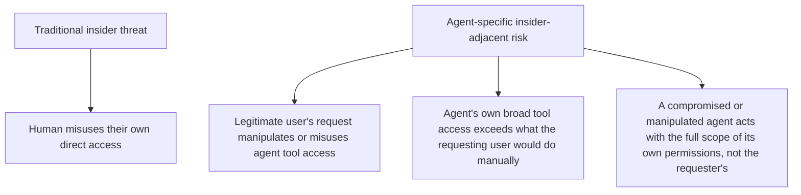
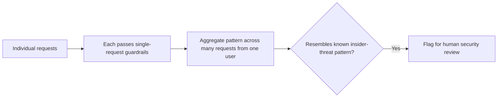

Traditional insider-threat modeling focuses on a human with legitimate credentials misusing them, or a careless human causing harm without malicious intent. Agentic systems add a genuinely new surface: an *agent*, acting nominally on behalf of a legitimate user, with tool access that can exceed what that user would directly do themselves, and reasoning that can be manipulated in ways a direct human actor's actions cannot be.

## Where This Differs From Traditional Insider Threat



The middle category is the one most organizations haven't fully modeled: a legitimate user, with entirely legitimate access, phrasing a request in a way that gets an agent to take an action the user is authorized to request but wouldn't have manually executed with the same ease or speed — a "death by a thousand small legitimate requests" pattern that's much harder to distinguish from normal usage than a traditional insider-threat signature.

## Why Agent Tool Scope Deserves Its Own Review

An agent's tool access is often provisioned more broadly than any single user's direct access, because the agent serves *many* users across many tasks — a support agent with tools spanning refunds, account modifications, and communication, provisioned broadly enough to serve any support scenario, has a combined blast radius larger than any individual support representative's own direct system access typically would. This is a reasonable design tradeoff for capability, and it means the agent itself is a meaningfully attractive target for social-engineering-style manipulation, distinct from targeting any specific user's credentials.

```python
def audit_agent_tool_scope_vs_typical_user(agent_tools: list[str], typical_human_role_permissions: set[str]) -> dict:
    agent_scope = set(agent_tools)
    excess = agent_scope - typical_human_role_permissions
    return {
        "agent_tool_scope": agent_scope,
        "exceeds_typical_human_access": excess,
        "review_needed": len(excess) > 0,
    }
```

## Behavioral Monitoring for Aggregate Patterns

The [jailbreak defense post](/posts/jailbreak-defense-patterns/) covered behavioral monitoring across many requests as a layer for catching a single user's systematic probing. The insider-threat-adjacent version of this looks for a different pattern: an unusually high rate of high-value or sensitive actions requested through the agent by a specific user, or a specific pattern of requests that individually look legitimate but collectively resemble data exfiltration or systematic policy circumvention — a signal that wouldn't trip any single-request guardrail but is visible in aggregate.



## The Escalation and Audit Infrastructure Already Covers Part of This

This connects directly to the escalation design patterns and audit logging covered earlier in this blog — policy-based escalation for high-value or sensitive actions, and comprehensive audit trails tied to the requesting user, are exactly the controls that make this class of risk investigable after the fact, and in some cases preventable via a human-in-the-loop gate before the fact.

## Key Takeaways

1. **Agentic systems add an insider-threat surface traditional modeling doesn't cover** — legitimate access used through an agent to reach beyond what direct manual action would easily accomplish
2. **Agent tool scope is often provisioned broader than any individual user's direct access**, making the agent itself an attractive manipulation target
3. **Behavioral monitoring needs an aggregate, cross-request view**, since individually legitimate requests can form a concerning pattern invisible to single-request guardrails
4. **Existing escalation and audit infrastructure from earlier in this blog covers much of the mitigation** — this is a case for applying those controls deliberately to this specific threat category, not building new ones

---

*Part of the [Scaling AI Engineering series](/tags/scaling-ai-series/) — running agentic systems responsibly once they're past the prototype stage.*
