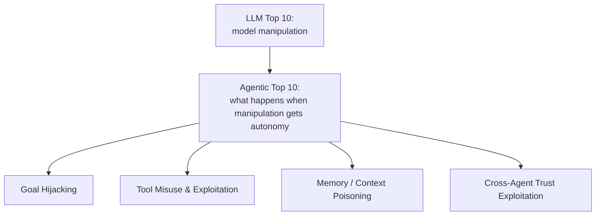

The [Agent Infrastructure series](/tags/agent-infra-series/) covered how agents get context, reach tools, remember things, and talk to each other. This series turns to what it takes to run all of that responsibly at organizational scale — starting with security, because a system that's newly capable of autonomous, multi-step, tool-using action has a threat model that a single-turn chatbot simply doesn't.

## Why Agentic Threats Are a Different Category

OWASP maintains two separate taxonomies now, and the distinction between them is the whole point: the **Top 10 for LLM Applications** is about how a model gets manipulated — prompt injection, insecure output handling, sensitive information disclosure. The newer **Top 10 for Agentic Applications** is about what happens once that manipulation is given autonomy — the ability to call tools, delegate to other agents, and take multi-step action without a human confirming each one. The June [guardrails post](/posts/guardrails-for-llm-agents/) on this blog covered the input/output/action layering that defends against the first category. This post covers the risks specific to the second.



## Goal Hijacking

An agent given a legitimate high-level goal ("resolve this customer's billing dispute") can be steered, through content it encounters mid-task, into pursuing a different goal than the one it was actually given — without ever receiving an instruction that looks like an override. A poisoned document in a knowledge base, a manipulated field in a ticket the agent reads, or a crafted response from a tool it calls can all shift what the agent decides to optimize for next, several steps removed from the original request.

```python
def detect_goal_drift(original_goal: str, current_plan: str, llm) -> bool:
    """Periodically check whether the agent's current plan still serves
    the original goal, independent of whatever justification the agent
    itself generated for the plan."""
    verdict = llm.invoke(
        f"Original goal: {original_goal}\n\nCurrent plan: {current_plan}\n\n"
        "Does the current plan still directly serve the original goal, or has "
        "it drifted toward a different objective? Answer DRIFTED or ALIGNED."
    ).content
    return "DRIFTED" in verdict
```

Running this check as an independent, periodic audit — not as part of the agent's own reasoning trace, which is exactly what could be compromised — is what makes it a real defense rather than a formality the same manipulation could talk its way past.

## Tool Misuse and Exploitation

This is where an agent's own tool access becomes the attack surface. A tool that's safe when called with expected arguments in an expected sequence can be misused when an agent — manipulated or simply reasoning its way into an edge case — calls it with arguments or in a sequence nobody designed for. The [structured outputs and tool-call contracts post](/posts/structured-outputs-tool-call-contracts/) covers the reliability side of this; the security side is the same validation logic applied with an adversarial mindset:

```python
def validate_tool_call_sequence(call_history: list[dict], new_call: dict, policy: dict) -> str | None:
    """Some misuse only shows up as a pattern across calls, not in any single call."""
    rule = policy.get(new_call["tool"], {})

    if "max_calls_per_session" in rule:
        prior_calls = [c for c in call_history if c["tool"] == new_call["tool"]]
        if len(prior_calls) >= rule["max_calls_per_session"]:
            return f"ERROR: {new_call['tool']} exceeds max calls per session ({rule['max_calls_per_session']})"

    if rule.get("requires_preceding_tool") and rule["requires_preceding_tool"] not in [c["tool"] for c in call_history]:
        return f"ERROR: {new_call['tool']} requires {rule['requires_preceding_tool']} to have run first"

    return None
```

A single `delete_record` call might be entirely legitimate; twelve `delete_record` calls in one session, each individually valid, is the pattern a per-call validator misses and a sequence-level check catches.

## Memory and Context Poisoning

This one gets its own full post [next in this series](/posts/defending-memory-context-poisoning/), because it deserves it — a recent security study found over 90% of tested agents vulnerable to having false information planted in persistent memory, with a 100% relapse rate when teams tried to fix it through conversation rather than at the memory layer. The [production agent memory post](/posts/building-production-grade-agent-memory/) covered the architecture; the security implications of that architecture are substantial enough to warrant their own deep dive.

## Cross-Agent Trust Exploitation

Once agents delegate work to other agents — the [A2A pattern](/posts/a2a-multi-agent-mesh-interoperability/) from the infrastructure series — a new trust boundary opens up. An agent receiving a task from another agent has historically had less scrutiny applied to that input than input coming directly from a human user, on the assumption that another agent is a "trusted" caller. That assumption is exactly the exploit: a compromised or manipulated upstream agent's output flows into a downstream agent's context with less validation than user input would get, and the downstream agent has no way to distinguish a legitimate delegation from a poisoned one without explicit provenance tracking.

```python
def validate_inbound_agent_task(task: dict, trusted_agent_registry: dict) -> str | None:
    sender = task.get("sender_agent_id")
    if sender not in trusted_agent_registry:
        return f"ERROR: Task from unregistered agent {sender} rejected pending manual review"

    # Even from a registered agent, apply the same input guardrails as user input
    injection_check = check_input_injection(task.get("payload", ""))
    if injection_check["blocked"]:
        return f"ERROR: Inbound task from {sender} flagged: {injection_check['reason']}"

    return None
```

The core fix is simple to state and easy to skip under deadline pressure: treat every inbound A2A task with the same input-validation discipline as user input, never as an implicitly trusted internal call just because the sender happens to be another agent rather than a person.

## The Progressive Breach Model

What makes agentic risks compound in a way LLM-only risks don't is that they chain — a single successful goal hijack becomes more dangerous specifically because the agent has tool access and can act on the hijacked goal, and a tool misuse becomes more dangerous specifically because the agent might delegate the exploit onward to another agent via A2A before anyone notices. Each layer amplifies the one before it, which is why single-point defenses (input validation alone, or output validation alone) consistently under-perform layered ones in practice.

## Key Takeaways

1. **Agentic risk is a different category from LLM risk** — it's about what happens once model manipulation gets autonomy, tool access, and the ability to delegate
2. **Audit goal alignment independently of the agent's own reasoning trace** — a compromised trace will justify its own drift convincingly
3. **Validate tool-call sequences, not just individual calls** — some misuse only shows up as a pattern across a session
4. **Never implicitly trust inbound A2A tasks** — apply the same input guardrails to another agent's delegation that you'd apply to user input
5. **These risks compound** — a layered defense across goal tracking, tool validation, memory integrity, and cross-agent trust outperforms any single-point check

Memory poisoning is significant enough to warrant its own full treatment — [next up](/posts/defending-memory-context-poisoning/).

---

*Part of the [Scaling AI Engineering series](/tags/scaling-ai-series/) — running agentic systems responsibly once they're past the prototype stage.*
