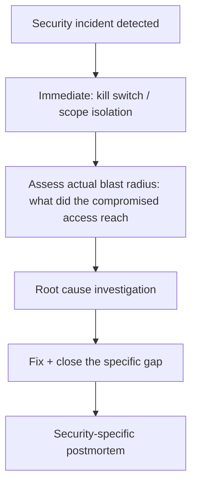

The [earlier on-call runbook post](/posts/on-call-runbook-agent-incidents/) covered triaging quality regressions — the common case where something's wrong but not actively dangerous. A security breach — a successful prompt injection that caused real harm, a compromised third-party MCP server, exploitation of the insider-threat-adjacent access pattern from the previous post — needs a distinct response path, because the priorities are different: containment first, root-cause analysis second, in an order that's the reverse of how a quality regression is normally triaged.

## The First Response Priority: Contain, Then Investigate



The [kill switch post](/posts/kill-switches-agent-emergency-stop/) from earlier in this blog is the concrete mechanism for the "contain" step — for a security incident specifically, activating containment before fully understanding root cause is the correct call, even though it means acting on incomplete information; the cost of continued exposure while investigating almost always exceeds the cost of a possibly-premature containment action.

## Assessing Blast Radius Specifically for Agent Security Incidents

```python
def assess_agent_security_blast_radius(incident: dict) -> dict:
    return {
        "compromised_access_scope": get_tool_permissions(incident["affected_agent_instance"]),
        "actions_taken_during_incident_window": query_audit_log(
            agent_instance=incident["affected_agent_instance"],
            time_range=incident["window"],
        ),
        "data_potentially_exposed": identify_accessed_resources(incident),
        "affected_users": identify_downstream_affected_parties(incident),
    }
```

This is exactly where the credential audit logging (from the secrets management post) and general action audit trails (from the escalation and compliance posts) earlier in this blog become directly operational — a security incident's containment and scoping speed depends entirely on whether this audit trail already exists, not on building it during the incident itself.

## Security Postmortems Need Different Sections Than Quality Postmortems

The earlier postmortem template asked "was this in the eval set." A security incident's equivalent questions are different:

```markdown
## Security Incident Postmortem: [Title]
### Attack Vector
[Which specific threat category from the threat model — injection,
supply chain, insider-threat-adjacent — and how it was actually executed]

### Which Layer(s) of Defense Were Bypassed
[Reference the layered defense model — which layers caught it, which
didn't, and why]

### Blast Radius (Actual, Not Just Potential)
[What was actually accessed/affected, confirmed via audit trail]

### Threat Model Update
[ ] Was this attack vector already in the threat model?
[ ] If not, add it — this is a threat model gap, not just an incident
[ ] Update mitigation and residual risk assessment accordingly
```

## Notification and Disclosure Obligations Are Often Time-Bound

Unlike a quality regression, a security incident involving user data may trigger actual legal notification obligations with defined deadlines (breach notification laws vary by jurisdiction). This needs to be a known, pre-established part of the response process — who determines whether notification is triggered, and by when — rather than a question raised for the first time during an active incident when time pressure makes careful legal judgment harder.

## Key Takeaways

1. **Security incidents need containment prioritized over full root-cause understanding** — activate the kill switch before you fully understand what happened
2. **Blast radius assessment depends entirely on audit trail infrastructure existing before the incident**, not built during it
3. **Security postmortems need to update the threat model explicitly**, not just fix the immediate issue — a new attack vector is a threat model gap
4. **Know your notification/disclosure obligations and decision path before an incident**, not during one, given the time pressure legal deadlines can create

---

*Part of the [Scaling AI Engineering series](/tags/scaling-ai-series/) — running agentic systems responsibly once they're past the prototype stage.*
