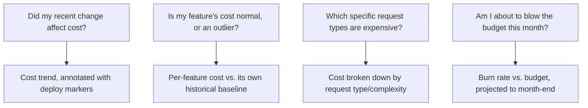
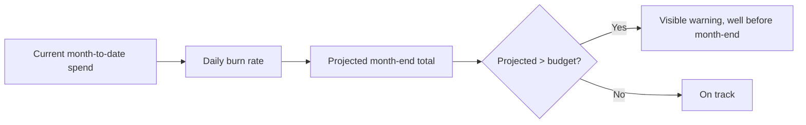

The cost-attribution infrastructure from the [attributing LLM cost to teams](/posts/attributing-llm-cost-to-teams/) post earlier in this blog gives you the underlying data. A dashboard built from that data and left generic — a big number, a line chart — gets checked once at launch and then ignored, because it doesn't answer the specific question an engineer actually has when they think to look at it. Designing around those specific questions is what makes a dashboard something people actually return to.

## The Questions Engineers Actually Ask



A dashboard organized around these questions, rather than around generic aggregate metrics, is what actually gets checked — an engineer who just shipped a prompt change wants "did my change move the needle," answerable directly from a trend annotated with deploy events, not from a raw total requiring manual correlation against a separate deploy log.

## Annotate Cost Trends With the Events That Actually Explain Them

```python
def build_annotated_cost_trend(team: str, days: int = 30) -> dict:
    cost_series = get_daily_cost(team, days)
    deploy_events = get_deploy_events(team, days)  # prompt/model/config changes
    return {
        "cost_series": cost_series,
        "annotations": [
            {"date": d["date"], "label": d["change_summary"], "type": d["change_type"]}
            for d in deploy_events
        ],
    }
```

Without deploy annotations directly on the cost trend, an engineer noticing a cost increase has to manually cross-reference two separate systems (cost data and deploy history) to figure out whether it correlates with something they shipped — annotating them together removes that friction entirely, and removing friction is what determines whether the check actually happens routinely versus only during a dedicated cost investigation.

## Burn-Rate Projection Beats a Static Budget Number



A static "$4,200 spent this month" number requires the viewer to mentally do the days-remaining math themselves. A projected month-end total, updated daily from the current burn rate, answers "am I on track" directly and surfaces a coming overrun early enough to actually act on it — the whole point of a budget dashboard is giving enough lead time to course-correct, not reporting the overrun after it's already happened.

## Design for the Team Level First, Individual Feature Level Second

Following the cost attribution structure from earlier in this blog — most engineers' first question is about their own team or feature, not the org-wide total. Default the dashboard view to the viewer's own team/feature scope, with org-wide rollups available but not the default landing view — a dashboard that opens to an aggregate number irrelevant to most viewers' immediate question trains people to skip past it rather than actually engage with it.

## Key Takeaways

1. **Design the dashboard around the specific questions engineers actually have**, not generic aggregate metrics nobody has an immediate use for
2. **Annotate cost trends with deploy events directly** — removes the manual cross-referencing that otherwise discourages routine checking
3. **Show projected month-end burn rate, not just current spend** — gives lead time to act on a coming overrun rather than reporting it after the fact
4. **Default to the viewer's own team/feature scope**, not an org-wide aggregate — relevance to the immediate question is what gets a dashboard actually used

---

*Part of the [Scaling AI Engineering series](/tags/scaling-ai-series/) — running agentic systems responsibly once they're past the prototype stage.*
