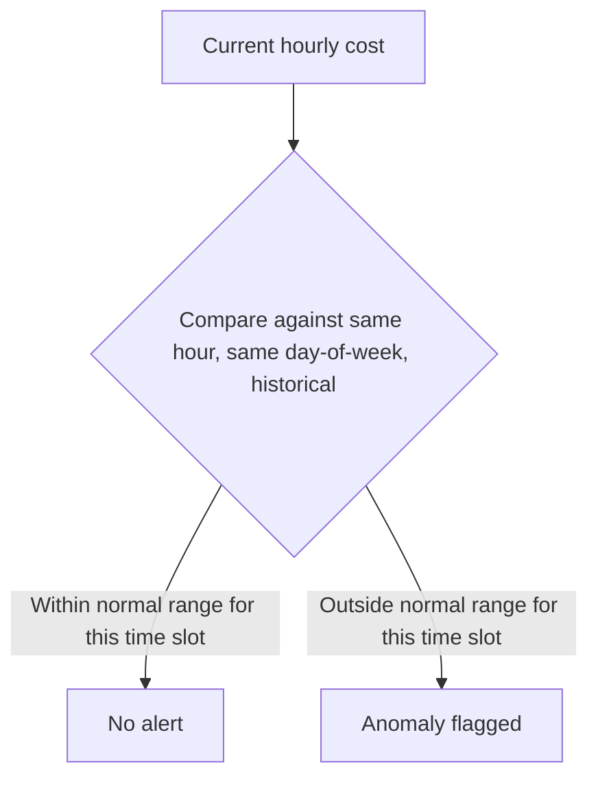

The dashboard from the previous post makes cost visible to anyone who checks it — and a genuine spike often happens outside anyone's routine check-in cadence, at 2am, over a weekend, during a period when nobody's specifically looking. Automated anomaly detection, alerting rather than waiting to be noticed, closes that gap.

## What "Anomalous" Actually Means for LLM Spend

```python
def detect_cost_anomaly(current_hourly_cost: float, historical_hourly: list[float], sensitivity: float = 3.0) -> dict:
    mean = statistics.mean(historical_hourly)
    stdev = statistics.stdev(historical_hourly)
    z_score = (current_hourly_cost - mean) / stdev if stdev > 0 else 0
    return {
        "is_anomaly": abs(z_score) > sensitivity,
        "z_score": z_score,
        "current": current_hourly_cost,
        "expected_range": (mean - sensitivity * stdev, mean + sensitivity * stdev),
    }
```

A naive threshold-based alert ("cost exceeded $X/hour") produces false alarms during genuinely legitimate high-traffic periods and misses genuine anomalies during genuinely low-traffic periods where a smaller absolute spike is still a large relative one. Comparing against the system's own recent historical pattern — accounting for normal daily/weekly cyclicality — catches both directions of anomaly more reliably than a fixed number.

## Account for Known Cyclical Patterns Before Flagging



Comparing against a flat historical average across all hours produces false positives during legitimately busy periods (a Monday morning traffic pattern looking anomalous against an average that includes quiet weekend hours) — comparing against the same hour and day-of-week historically accounts for known cyclicality and meaningfully reduces noisy false alerts, which matters because an alert that cries wolf gets ignored the same way an under-designed guardrail's false positives erode trust in the system.

## Correlate the Anomaly With a Likely Cause Automatically

```python
def enrich_anomaly_with_probable_cause(anomaly: dict, time_window: dict) -> dict:
    recent_deploys = get_deploy_events(time_range=time_window)
    traffic_change = get_traffic_volume_change(time_range=time_window)
    return {
        **anomaly,
        "recent_deploys_in_window": recent_deploys,
        "traffic_volume_change_pct": traffic_change,
        "probable_cause": infer_probable_cause(recent_deploys, traffic_change),
    }
```

An alert saying "cost is anomalously high" requires the on-call engineer to start investigating from scratch. An alert that's already correlated the anomaly window against recent deploys and traffic changes gives them a starting hypothesis immediately — often the actual answer, since most cost anomalies trace back to either a recent change or a traffic shift, both of which are checkable automatically before a human even opens the alert.

## Route Anomaly Alerts by Severity, Like Any Other Incident

Not every cost anomaly needs to page someone at 2am — a moderate anomaly within a team's own budget tolerance can wait for business hours, while an anomaly threatening to significantly exceed a hard budget ceiling, or one correlated with a security-relevant traffic pattern (a potential abuse scenario), deserves the same urgency as a traditional production incident. Apply the same severity-to-response mapping discipline covered for red-team findings and general incidents elsewhere in this blog.

## Key Takeaways

1. **Compare against historical patterns for the same time slot, not a flat average** — accounts for known cyclicality and reduces false alerts
2. **A noisy anomaly detector erodes trust the same way a guardrail with high false positives does** — tune sensitivity deliberately
3. **Automatically correlate anomalies with recent deploys and traffic changes** — gives the responder a starting hypothesis instead of a blank investigation
4. **Route anomaly severity to an appropriate response**, not a uniform page-immediately policy for every detected anomaly

---

*Part of the [Scaling AI Engineering series](/tags/scaling-ai-series/) — running agentic systems responsibly once they're past the prototype stage.*
