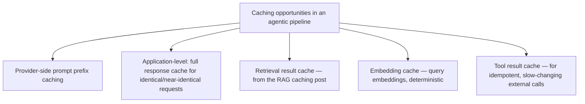

The earlier [prompt caching post](/posts/prompt-caching-strategies-cost/) covered provider-side prefix caching specifically. That's one layer among several in a full agentic pipeline where caching can meaningfully reduce token spend — surveying them together clarifies which layers are safe defaults and which carry the staleness risk covered in the earlier [RAG caching post](/posts/caching-retrieved-context-stale-answers/).

## The Full Set of Cacheable Layers



Each layer has a different risk profile. Prompt prefix caching and embedding caching are essentially risk-free — both are deterministic given identical input, with no staleness concern at all. Full-response caching and tool-result caching carry real staleness risk and need the fingerprinting discipline from earlier posts, not a naive fixed-TTL approach.

## Full-Response Caching: Higher Risk, Higher Reward

```python
def cacheable_response(request: dict) -> dict | None:
    cache_key = compute_semantic_cache_key(request)  # not exact-match — near-duplicate detection
    cached = response_cache.get(cache_key)
    if cached and not is_stale(cached, request):
        return cached
    return None

def compute_semantic_cache_key(request: dict) -> str:
    # Near-duplicate queries should hit the same cache entry —
    # exact-string matching alone misses most real-world repeat traffic
    normalized = normalize_and_embed(request["query"])
    return find_or_create_cache_bucket(normalized, similarity_threshold=0.95)
```

Exact-string-match caching catches surprisingly little real traffic, since users rarely phrase requests identically. Semantic near-duplicate caching (bucketing similar queries together) catches meaningfully more repeat traffic — at the cost of needing careful staleness handling, since two "near-duplicate" queries might actually need different, current answers if the underlying data changed between them.

## Tool Result Caching Needs Explicit Per-Tool Policy

```python
TOOL_CACHE_POLICY = {
    "get_product_catalog": {"cacheable": True, "ttl_seconds": 3600},   # slow-changing
    "get_account_balance": {"cacheable": False},                       # must always be current
    "search_documentation": {"cacheable": True, "ttl_seconds": 86400}, # very slow-changing
}

def call_tool_with_cache_policy(tool_name: str, args: dict):
    policy = TOOL_CACHE_POLICY.get(tool_name, {"cacheable": False})
    if policy["cacheable"]:
        cached = tool_cache.get(tool_name, args)
        if cached:
            return cached
    result = execute_tool(tool_name, args)
    if policy["cacheable"]:
        tool_cache.set(tool_name, args, result, ttl=policy["ttl_seconds"])
    return result
```

The explicit per-tool policy matters because caching a genuinely time-sensitive tool result (an account balance, a real-time inventory count) is a correctness bug disguised as a cost optimization — the savings from caching are never worth serving a customer stale financial or availability data, and this needs to be a deliberate, reviewed decision per tool, not a blanket caching layer applied uniformly.

## Measure Savings Per Layer, Not Just in Aggregate

The same attribution discipline from the cost-attribution post applies to caching itself — knowing which specific caching layer is actually driving savings (and which is adding complexity for marginal benefit) requires measuring cache hit rate and dollar savings per layer separately, not just observing that total spend went down after adding several caching layers simultaneously.

## Key Takeaways

1. **Deterministic layers (prompt prefix, embeddings) are essentially risk-free to cache** — always safe defaults
2. **Full-response and tool-result caching carry real staleness risk** and need the same fingerprinting/policy discipline as RAG context caching
3. **Semantic near-duplicate caching catches meaningfully more traffic than exact-string matching**, at the cost of needing more careful staleness handling
4. **Set explicit per-tool cache policy** — caching a genuinely time-sensitive tool result trades cost savings for a correctness bug

---

*Part of the [Scaling AI Engineering series](/tags/scaling-ai-series/) — running agentic systems responsibly once they're past the prototype stage.*
