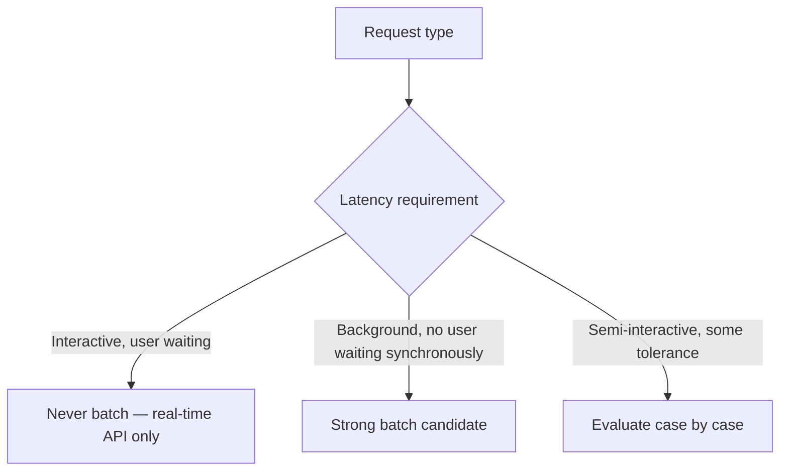
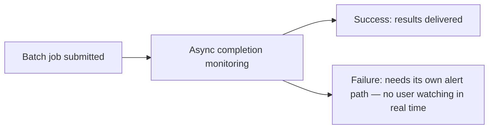

Most major LLM providers offer batch processing endpoints at a meaningful discount (often 50%) relative to real-time API calls, in exchange for relaxed latency guarantees — a batch job might complete in minutes to hours rather than seconds. This is a substantial, straightforward cost lever, and applying it indiscriminately, including to latency-sensitive interactive requests, is an equally straightforward way to regress user experience for a cost saving those requests were never designed to tolerate.

## Sorting Request Types by Batch Eligibility



Clear batch candidates: nightly report generation, bulk document summarization, periodic content classification, eval suite runs (referenced from the evaluation cost post earlier in this blog — the tiered eval frequency pattern pairs naturally with batch processing for the less time-sensitive tiers). Clear non-candidates: anything in a live chat interface, anything blocking a user-facing action from completing.

## Implementing the Split

```python
def route_request(request: dict) -> str:
    if request["latency_class"] == "interactive":
        return "realtime_api"
    if request["latency_class"] == "background" and request.get("can_wait_hours", False):
        return "batch_api"
    return "realtime_api"  # default to real-time when uncertain — cost saving isn't worth an unexpected latency regression

async def process_via_batch(requests: list[dict]) -> list[dict]:
    batch_job = llm_provider.batch.create(requests=[format_for_batch(r) for r in requests])
    # Poll or webhook-based completion — this is now an async job, not a synchronous call
    return await wait_for_batch_completion(batch_job.id)
```

The default-to-real-time-when-uncertain choice matters — misclassifying a request as batch-eligible when it actually needed a fast response is a much worse failure than missing a cost-saving opportunity on a request that could have tolerated batching but got processed in real-time instead.

## Batching Changes the Failure Mode, Not Just the Latency

A batch job that fails partway through needs different handling than a failed real-time call — there's no user actively waiting to see an immediate error and retry manually. Batch job failures need their own monitoring and alerting path, distinct from real-time API error monitoring, since a silently-failed batch job (nightly report generation that quietly didn't run) can go unnoticed for much longer than a real-time failure would.



## Aggregate Enough Requests to Make Batching Worth the Complexity

Batching a single request provides the cost discount and none of the throughput benefit the batch API model was actually designed around — it's most valuable when genuinely aggregating many requests together (a nightly job processing thousands of documents), where the discount applies at real scale. For a background task with genuinely low volume, the discount may not be worth the added complexity of managing an async job lifecycle versus a simple synchronous call.

## Key Takeaways

1. **Batch APIs offer a real, substantial cost discount in exchange for relaxed latency** — never apply this tradeoff to interactive, user-waiting requests
2. **Default to real-time processing when a request's latency tolerance is uncertain** — misclassification risk is asymmetric
3. **Batch job failures need their own monitoring path** — there's no user actively watching to notice and retry a failed background job
4. **Batching is most worthwhile at genuine scale** — for low-volume background tasks, the discount may not offset the added async-job complexity

---

*Part of the [Scaling AI Engineering series](/tags/scaling-ai-series/) — running agentic systems responsibly once they're past the prototype stage.*
