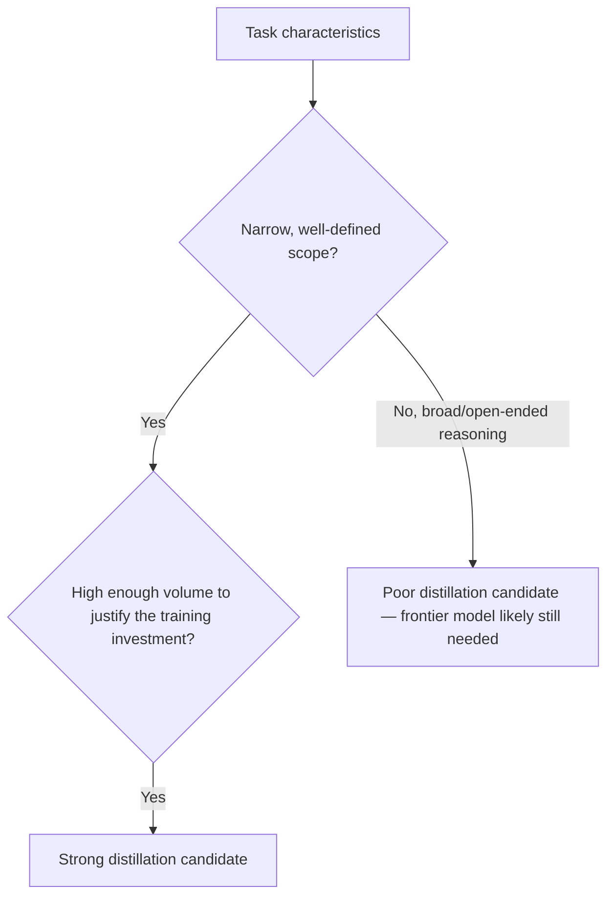

For a narrow, well-defined, high-volume task — classification, extraction, a specific structured-output format — a small model fine-tuned or distilled from a frontier model's outputs can match that frontier model's quality on the *specific task* at a fraction of the inference cost. This is genuinely one of the highest-leverage cost optimizations available, and it's frequently misapplied outside its actual sweet spot: broad, open-ended tasks where a small model simply can't match frontier reasoning, regardless of how it was trained.

## Where Distillation Genuinely Works



The training investment (curating examples, running the distillation/fine-tuning process, ongoing evaluation) only pays off at meaningful volume — a task run a handful of times a day doesn't generate enough savings to offset the setup cost, while a task run thousands of times a day can see that investment pay back within weeks.

## The Practical Process

```python
def build_distillation_dataset(task_examples: list[dict], frontier_model) -> list[dict]:
    dataset = []
    for example in task_examples:
        frontier_output = frontier_model.invoke(example["input"])
        dataset.append({
            "input": example["input"],
            "target_output": frontier_output,  # frontier model's output becomes the training target
        })
    return dataset

# Fine-tune a smaller model on frontier-generated examples
# (using the fine-tuning API of your chosen small model provider)
```

The dataset quality matters as much as the training process itself — the same golden-dataset curation discipline from the earlier evaluation posts applies directly here, since a distillation dataset built from a narrow, unrepresentative slice of real task variety produces a small model that performs well on that slice and poorly on everything else the production task actually needs to handle.

## Evaluate the Distilled Model Against the Same Bar as the Frontier Model

```python
def compare_distilled_vs_frontier(eval_set: list[dict], distilled_model, frontier_model) -> dict:
    distilled_scores = run_eval(distilled_model, eval_set)
    frontier_scores = run_eval(frontier_model, eval_set)
    return {
        "distilled": distilled_scores,
        "frontier": frontier_scores,
        "quality_gap": frontier_scores["avg"] - distilled_scores["avg"],
        "cost_ratio": get_model_cost(distilled_model) / get_model_cost(frontier_model),
    }
```

This connects directly to the [evaluating cheaper models](/posts/evaluating-cheaper-models-without-losing-quality/) post — the distilled model needs to clear the same eval bar the frontier model would, on the *actual production task distribution*, not just on the training examples it was distilled from, which would be evaluating the model on data it's already seen and tell you very little about real-world performance.

## Distillation Needs Ongoing Maintenance, Not a One-Time Project

A distilled model's performance is tied to the task distribution at the time it was trained — as the production task's actual input distribution shifts over time (the same drift concern from earlier posts on eval sets and specs), the distilled model's accuracy can degrade even though nothing about the model itself changed. Periodic re-evaluation against fresh production samples, with re-distillation when the gap widens, keeps this a sustainable cost optimization rather than a one-time win that quietly erodes.

## Key Takeaways

1. **Distillation works well for narrow, high-volume, well-defined tasks**, and poorly for broad, open-ended reasoning tasks regardless of training quality
2. **The training investment only pays off at meaningful volume** — low-volume tasks don't generate enough savings to offset setup cost
3. **Dataset quality determines distilled model quality** — the same golden-dataset curation discipline from evaluation posts applies directly
4. **Evaluate against the same bar as the frontier model on real production distribution**, and re-evaluate periodically as that distribution drifts over time

---

*Part of the [Scaling AI Engineering series](/tags/scaling-ai-series/) — running agentic systems responsibly once they're past the prototype stage.*
