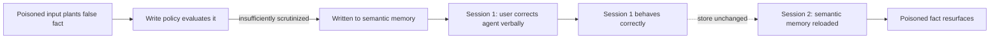

The OWASP Agentic AI Top 10 post flagged memory and context poisoning as one of the risk categories specific to agentic systems, and it's worth a full post because the failure mode is genuinely counterintuitive: a recent security study found over 90% of tested agents vulnerable to having false information planted in persistent memory — and, more troubling, a **100% relapse rate** when teams tried to fix it by correcting the agent in conversation. This post covers why that correction doesn't work, and what actually does.

## Why "Just Correct It" Doesn't Work

The [production agent memory post](/posts/building-production-grade-agent-memory/) covered how memory tiers work — working, episodic, semantic, procedural. Once a poisoned fact makes it into semantic memory specifically, it gets loaded in full on every future session, because that's exactly what semantic memory is designed to do. Telling the agent "no, that's wrong" in the current conversation corrects the *current session's* behavior — the model complies, apologizes, moves on — but the underlying store still contains the poisoned entry, unchanged. The next session loads semantic memory fresh, the poisoned fact comes back, and the same wrong behavior relapses. This is the mechanism behind that 100% relapse figure: the fix targeted the symptom (the conversation) instead of the cause (the store).



## Where Poisoning Actually Enters

Poisoning doesn't require compromising your infrastructure — it typically rides in through the same channels the OWASP field guide covered for goal hijacking and tool misuse:

- **Indirect injection via retrieved content** — a document, ticket, or web page the agent reads during a session contains a crafted instruction disguised as data, aimed specifically at getting written to memory rather than just influencing the current response
- **Adversarial user input over multiple turns** — a user deliberately steers a conversation toward statements designed to look like a legitimate durable fact to whatever write-policy evaluation is watching
- **Cross-agent poisoning** — in a multi-agent system, a compromised or manipulated upstream agent's output gets treated as trusted input by a downstream agent's write policy, exactly the cross-agent trust gap the OWASP post covered

## Provenance: Every Memory Write Needs a Trail

The single highest-leverage fix is tracking where every memory write came from, so a poisoned entry can actually be found and removed rather than blending in with legitimate memory indistinguishably:

```python
class MemoryEntry(BaseModel):
    content: str
    tier: str
    source_type: str          # "user_direct_statement" | "retrieved_document" | "inferred" | "cross_agent"
    source_id: str            # the specific turn, document, or agent call this came from
    confidence: float
    written_at: datetime

def write_with_provenance(entry_content: str, tier: str, source_type: str, source_id: str, confidence: float):
    entry = MemoryEntry(
        content=entry_content,
        tier=tier,
        source_type=source_type,
        source_id=source_id,
        confidence=confidence,
        written_at=datetime.utcnow(),
    )
    memory_store.write(entry)
```

With provenance tracked, "this fact was wrong" becomes an answerable question — *which turn or document introduced it, and what else did that same source write* — instead of a needle in an undifferentiated store.

## A Higher Evidence Bar for Semantic Writes

Not every source deserves equal trust when it comes to what gets promoted into the tier that gets loaded on every future session. Retrieved content — the channel most exposed to indirect injection — should require corroboration before it's allowed to become a durable fact, not just a single plausible-looking statement:

```python
def evaluate_write_eligibility(candidate: dict, source_type: str) -> bool:
    if source_type == "retrieved_document":
        # A single retrieved document claiming a fact about the user is not
        # enough on its own — require it to also appear in direct user statement
        # or be corroborated by a second independent source before promotion.
        return candidate.get("corroborating_sources", 0) >= 2
    if source_type == "user_direct_statement":
        return candidate["confidence"] >= 0.8
    if source_type == "cross_agent":
        # Cross-agent claims about durable facts get queued for review,
        # never auto-promoted directly to semantic memory.
        return False
    return False
```

Cross-agent claims never auto-promoting is a deliberate, conservative choice — the OWASP post's point about cross-agent trust exploitation applies with particular force here, since a poisoned semantic memory write from a compromised upstream agent is exactly the kind of damage that persists across every future session with that user.

## Periodic Memory Audits

Provenance and write-time evidence bars catch most poisoning attempts before they land, but not all — an audit process that periodically reviews the semantic memory tier for internal consistency catches what got through:

```python
def audit_semantic_memory(user_id: str, llm) -> list[dict]:
    facts = semantic_memory_store.get_all(user_id)
    flagged = []

    for fact in facts:
        # Check for direct contradictions with other stored facts
        contradictions = [f for f in facts if f.id != fact.id and contradicts(f, fact, llm)]
        if contradictions:
            flagged.append({"fact": fact, "issue": "contradicts other stored facts", "conflicts_with": contradictions})

        # Low-corroboration facts from retrieved content get re-reviewed periodically,
        # not just at write time
        if fact.source_type == "retrieved_document" and fact.confidence < 0.9:
            flagged.append({"fact": fact, "issue": "low-confidence retrieved fact due for re-verification"})

    return flagged
```

Run this on a schedule (weekly, or triggered after a threshold number of new writes) and route flagged entries to a human reviewer rather than auto-deleting — a false positive on this audit (correctly-stored but unusually-phrased fact) is a much cheaper mistake than a false negative that leaves a poisoned entry live.

## Removing a Confirmed Poisoned Entry

Once an entry is confirmed poisoned, the fix has to happen at the store, not the conversation — and needs to account for anything downstream that may have already consolidated from it:

```python
def remediate_poisoned_entry(entry_id: str, user_id: str):
    poisoned = semantic_memory_store.get(entry_id)
    semantic_memory_store.delete(entry_id)

    # Check whether this entry was already consolidated into other facts
    # or influenced procedural memory strategies before removal
    dependent_entries = memory_store.find_derived_from(entry_id)
    for dep in dependent_entries:
        flag_for_manual_review(dep, reason=f"derived from removed entry {entry_id}")

    audit_log.record("memory_remediation", entry_id=entry_id, user_id=user_id, source=poisoned.source_id)
```

## Key Takeaways

1. **Correcting the conversation doesn't fix the store** — the 100% relapse rate comes from treating a persistence-layer problem as a conversation-layer one
2. **Track provenance on every write** — without it, a poisoned entry is indistinguishable from a legitimate one once it's in the store
3. **Require corroboration for semantic writes from retrieved content**, and never auto-promote cross-agent claims — these are the two channels most exposed to indirect injection
4. **Audit the semantic tier periodically**, not just at write time — contradiction-checking and re-verification of low-confidence entries catches what got through
5. **Remediation has to happen at the store**, and needs to check for anything already consolidated from the poisoned entry, not just delete it and assume the damage stopped there

---

*Part of the [Scaling AI Engineering series](/tags/scaling-ai-series/) — running agentic systems responsibly once they're past the prototype stage.*
