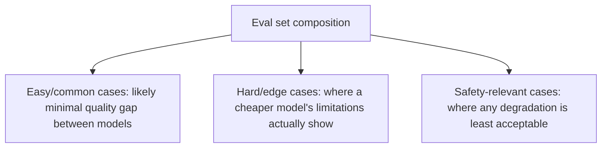

The obvious way to evaluate whether a cheaper model is "good enough" — switch, watch the error rate — catches only the failures dramatic enough to actually error out or get flagged by existing guardrails. A cheaper model's quality degradation is often subtler than that: slightly less nuanced responses, slightly worse instruction-following on edge cases, slightly higher hallucination rate on ambiguous questions — none of which necessarily trip an error or a guardrail, and all of which erode the actual user experience without appearing anywhere in error-rate monitoring.

## Run the Full Eval Suite, Not Just the Smoke Test

The golden dataset and eval infrastructure from earlier in this blog is exactly what's needed here, run comprehensively rather than spot-checked:

```python
def evaluate_model_swap_candidate(candidate_model, current_model, golden_dataset: list) -> dict:
    candidate_scores = run_eval(candidate_model, golden_dataset)
    current_scores = run_eval(current_model, golden_dataset)
    return {
        "overall_delta": candidate_scores["avg"] - current_scores["avg"],
        "per_category_delta": {
            cat: candidate_scores[cat] - current_scores[cat]
            for cat in candidate_scores["categories"]
        },
        "regressions": find_regressions(current_scores, candidate_scores),
        "cost_savings_pct": 1 - (get_model_cost(candidate_model) / get_model_cost(current_model)),
    }
```

The per-category breakdown matters more than the overall average here specifically — a cheaper model might match or even exceed the current model on straightforward requests while degrading meaningfully on the harder tail, and an aggregate average can mask that entirely if straightforward requests dominate the eval set's volume.

## Weight the Eval Toward Where a Downgrade Actually Bites



If the eval set is dominated by easy cases where any reasonable model performs well, the aggregate delta will understate the actual risk of a downgrade on the cases that matter most. Deliberately over-weighting hard and safety-relevant cases in the model-swap evaluation specifically — even if that's not the natural distribution of production traffic — gives a more honest signal about where the real risk of switching lies.

## Human Review for the Ambiguous Middle

The automated eval will produce clear wins, clear regressions, and a middle band of cases that are hard to score definitively as better or worse — exactly where the human-in-the-loop evaluation discipline from earlier in this blog earns its cost, sampling that ambiguous middle band specifically rather than the full traffic volume.

## Don't Treat the Decision as Permanent

Model landscape shifts fast enough that a "not ready yet" conclusion today may not hold in a few months as candidate models improve — treat model-swap evaluation as a recurring check, re-run periodically against updated model versions and an updated golden dataset, rather than a one-time decision that's revisited only when someone happens to remember to reconsider it.

```python
MODEL_EVAL_SCHEDULE = {"cadence": "quarterly", "trigger_on": ["new_candidate_model_release", "golden_dataset_update"]}
```

## Key Takeaways

1. **Error-rate monitoring alone misses subtle quality degradation** from a model downgrade — it needs the full eval suite, not a smoke test
2. **Check per-category delta, not just the aggregate average** — a downgrade's real cost often concentrates in the harder tail, masked by an overall average
3. **Deliberately over-weight hard and safety-relevant cases in the swap-specific evaluation**, even beyond their natural traffic proportion
4. **Re-run model-swap evaluation periodically**, not as a one-time decision — the model landscape shifts fast enough to change the calculus

---

*Part of the [Scaling AI Engineering series](/tags/scaling-ai-series/) — running agentic systems responsibly once they're past the prototype stage.*
