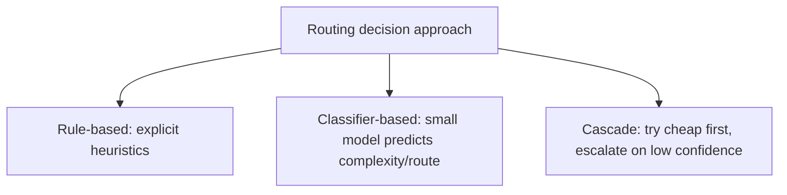

"Route simple requests to a cheap model, complex ones to an expensive one" is a cost-optimization idea nobody disagrees with in principle. The actual engineering work is in the routing decision itself — determining "simple" or "complex" reliably, cheaply, and fast enough that the routing step itself doesn't eat the savings it's supposed to produce.

## Three Approaches to the Routing Decision



**Rule-based routing** — explicit heuristics (request length, presence of certain keywords, task type tags from the caller) — is fast, free, and interpretable, and its accuracy ceiling is limited by how well simple rules can actually capture "complexity," which for many real request distributions isn't very well.

```python
def rule_based_route(request: dict) -> str:
    if request.get("task_type") in SIMPLE_TASK_TYPES:
        return "cheap_model"
    if len(request["input"]) < SHORT_INPUT_THRESHOLD and not requires_multi_step_reasoning(request):
        return "cheap_model"
    return "frontier_model"
```

**Classifier-based routing** — a small, cheap model trained specifically to predict which downstream model a request needs — captures nuance rule-based routing misses, at the cost of needing its own training data and its own evaluation (a routing classifier that misroutes is itself a quality bug, and needs monitoring like any other model in the pipeline).

**Cascade routing** — try the cheap model first, and only escalate to the expensive model if the cheap model's own confidence is low or its output fails a quality check — avoids needing to predict complexity upfront at all, at the cost of the cheap model's attempt being "wasted" work on requests that do end up escalating.

```python
def cascade_route(request: dict, cheap_model, frontier_model, confidence_threshold: float = 0.75) -> dict:
    cheap_result = cheap_model.invoke(request, return_confidence=True)
    if cheap_result.confidence >= confidence_threshold:
        return cheap_result
    return frontier_model.invoke(request)  # escalate
```

## The Cascade's Hidden Cost

The cascade approach's "wasted" cheap-model attempt on requests that escalate anyway means the cascade's total cost for those specific requests is *higher* than routing directly to the frontier model would have been — cheap-model cost plus frontier-model cost, not frontier-model cost alone. This is a real tradeoff, not free: cascade routing only wins overall if the fraction of requests that escalate is low enough that the savings on the majority (correctly handled by the cheap model alone) outweigh the doubled cost on the escalating minority.

```python
def estimate_cascade_savings(escalation_rate: float, cheap_cost: float, frontier_cost: float) -> float:
    direct_frontier_cost = frontier_cost
    cascade_cost = cheap_cost + (escalation_rate * frontier_cost)
    return 1 - (cascade_cost / direct_frontier_cost)
    # Negative result means cascade costs MORE than routing directly to frontier
```

## Combine Approaches Rather Than Picking One

A practical routing system often layers these: rule-based routing for the clearest cases (handles the bulk of volume cheaply, with no model call needed for the decision itself), a classifier for the ambiguous middle, and cascade behavior as a safety net catching cases where even the classifier's chosen route turns out wrong, via low confidence or a failed quality check on the cheap path.

## Key Takeaways

1. **Rule-based routing is fast and free but limited by how well simple heuristics capture actual complexity**
2. **Classifier-based routing captures more nuance, at the cost of needing its own training and ongoing evaluation as a model in its own right**
3. **Cascade routing avoids upfront complexity prediction, but only saves money if the escalation rate is low enough** — do the math explicitly, since a high escalation rate makes cascading more expensive than direct routing
4. **Layering rule-based, classifier-based, and cascade approaches together often outperforms committing to just one**

---

*Part of the [Scaling AI Engineering series](/tags/scaling-ai-series/) — running agentic systems responsibly once they're past the prototype stage.*
