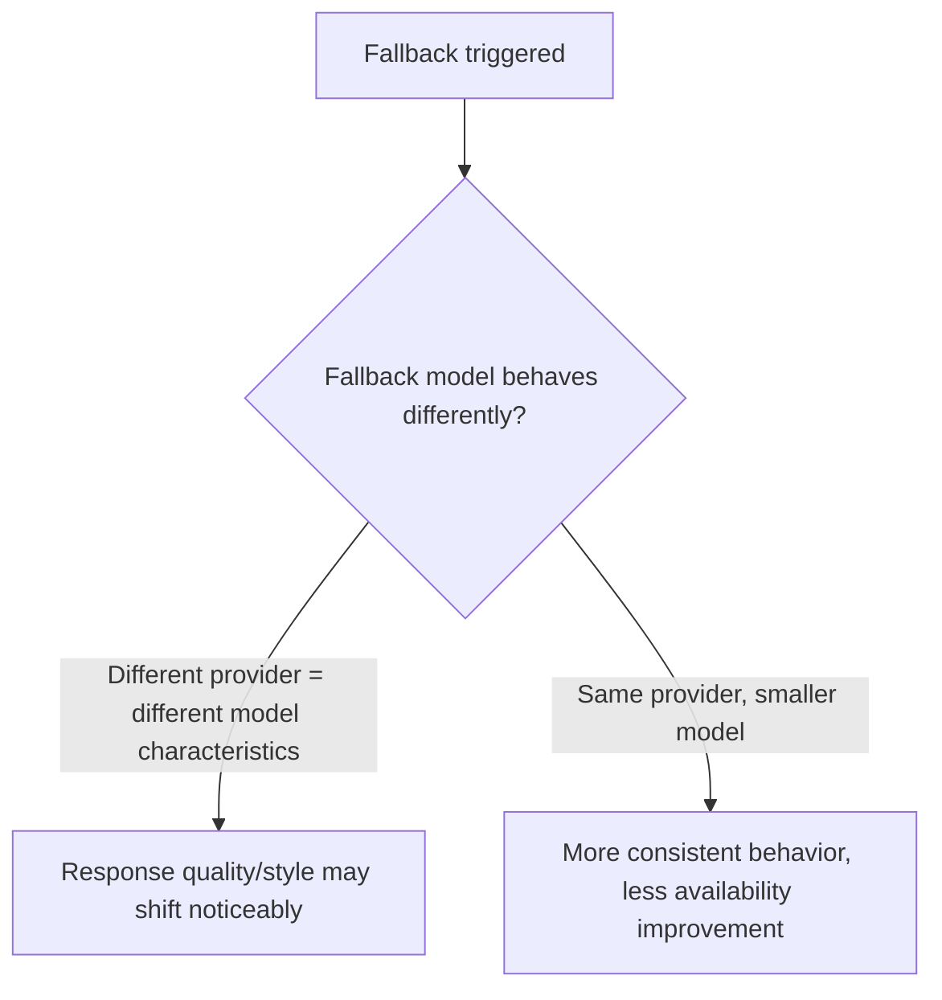
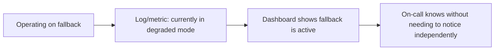

An LLM provider outage — not hypothetical; every major provider has had real incidents — is entirely outside your control, and a single-provider architecture inherits that outage directly as your own system's outage, with no path to route around it. A fallback chain, routing to an alternate provider or model when the primary is unavailable, is the direct mitigation, and it comes with real design tradeoffs worth being deliberate about rather than bolting on reactively during the first actual outage.

## The Basic Pattern

```python
FALLBACK_CHAIN = [
    {"provider": "primary", "model": "frontier-model-a"},
    {"provider": "secondary", "model": "frontier-model-b"},   # different provider entirely
    {"provider": "primary", "model": "smaller-model-a"},       # same provider, different model, in case only one model is affected
]

async def invoke_with_fallback(request: dict) -> dict:
    for option in FALLBACK_CHAIN:
        try:
            return await invoke_model(option["provider"], option["model"], request, timeout=REASONABLE_TIMEOUT)
        except (ProviderOutageError, TimeoutError) as e:
            logger.warning(f"Fallback triggered: {option} failed with {e}")
            continue
    raise AllProvidersUnavailableError()
```

## The Tradeoff: Quality/Behavior Consistency vs Availability



A fallback to a genuinely different provider's model maximizes availability improvement (independent infrastructure, independent failure modes) and also means the fallback response may look and behave noticeably differently — different phrasing style, possibly different accuracy characteristics on specific task types, which is itself worth surfacing rather than hiding, since a user or downstream system receiving a fallback response deserves to know quality characteristics may differ during a degraded period.

## Cross-Provider Prompt Portability Is Not Automatic

A prompt carefully tuned for one provider's model doesn't necessarily produce equivalent quality on another provider's model without adjustment — different models respond differently to the same instructions, formatting conventions, and few-shot examples. A fallback chain that's never actually been tested end-to-end against its fallback options discovers this gap during a real outage, which is the worst possible time to discover it. Test the fallback path proactively, not just the primary path.

```python
def test_fallback_path_quality(fallback_chain: list, eval_set: list) -> dict:
    return {
        option["model"]: run_eval(option, eval_set)
        for option in fallback_chain
    }
```

## Surface Degraded-Mode Status, Don't Hide It



A fallback that silently and successfully masks a primary provider outage feels like a win in the moment and creates a real risk: if nobody's actively monitoring fallback activation state, an extended primary outage can go unnoticed by the team even while users experience degraded (if still functional) service, because the system is quietly absorbing the problem rather than surfacing it.

## Key Takeaways

1. **A single-provider architecture inherits that provider's outages directly** — a fallback chain is the direct mitigation
2. **Cross-provider fallback maximizes availability improvement and risks a noticeable behavior/quality shift** — surface this rather than hiding it
3. **Prompt tuning doesn't transfer automatically across providers** — test the fallback path's actual quality proactively, not for the first time during a real outage
4. **Make fallback activation visible in monitoring** — a silently-successful fallback can mask an extended primary outage from the team that should know about it

---

*Part of the [Scaling AI Engineering series](/tags/scaling-ai-series/) — running agentic systems responsibly once they're past the prototype stage.*
