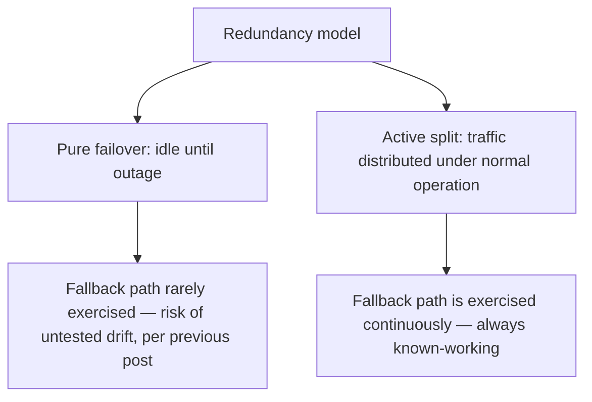

The previous post's fallback chain activates a secondary provider only during an outage — most of the time, that secondary capacity sits completely idle, paid for in the sense of engineering investment but not in ongoing compute spend, since fallback-only usage means no cost until it's actually needed. Active multi-provider redundancy — genuinely splitting traffic across providers under normal operation, not just failover — is a different model with a different cost question: how much of the "always split" benefit can you get without paying for genuinely duplicated capacity you don't actually need most of the time.

## Why Active Splitting Beats Pure Failover for Some Systems



The previous post noted the risk of a fallback path that's never actually exercised until a real outage, discovering gaps at the worst time. Active splitting — routing some meaningful fraction of normal traffic to the secondary provider continuously, not just during outages — keeps the fallback path genuinely proven and current, since it's handling real production traffic all the time rather than sitting dormant.

## A Practical Split That Doesn't Double Cost

```python
def active_split_route(request: dict, primary_weight: float = 0.9) -> str:
    # Most traffic to primary (presumably the better-negotiated rate or
    # better-performing option), a meaningful minority continuously to
    # secondary — keeps it proven without doubling overall spend
    return "primary" if random.random() < primary_weight else "secondary"
```

This isn't full duplication — it's a weighted split where the secondary provider handles a real but minority share, keeping overall cost close to what a single-provider approach would cost (since you're still only paying for one response per request, just distributed across two providers) while gaining the continuous-proof benefit over pure failover.

## Negotiate Volume Commitments Around the Split

Provider pricing is often volume-tiered — splitting traffic can mean neither provider individually reaches the volume tier that would unlock the best negotiated rate, a real cost consideration that pure single-provider or pure-failover models don't face in the same way. This is worth modeling explicitly against the reliability benefit before committing to an active-split ratio, rather than discovering the pricing tier impact after the fact.

```python
def evaluate_split_cost_impact(primary_volume: int, secondary_volume: int, pricing_tiers: dict) -> dict:
    primary_rate = get_tier_rate(primary_volume, pricing_tiers["primary"])
    secondary_rate = get_tier_rate(secondary_volume, pricing_tiers["secondary"])
    single_provider_rate = get_tier_rate(primary_volume + secondary_volume, pricing_tiers["primary"])
    split_total_cost = primary_volume * primary_rate + secondary_volume * secondary_rate
    single_total_cost = (primary_volume + secondary_volume) * single_provider_rate
    return {"split_cost": split_total_cost, "single_provider_cost": single_total_cost}
```

## Behavior Consistency Monitoring Matters More Here Than in Pure Failover

Since active splitting means both providers are handling real traffic continuously, not just during an outage, the quality/behavior consistency question from the previous post needs ongoing monitoring rather than a one-time proactive test — comparing output quality between the primary and secondary paths on an ongoing basis, using the same eval infrastructure from earlier posts, catches a quality divergence emerging over time rather than assuming the initial proactive test remains valid indefinitely.

## Key Takeaways

1. **Active splitting keeps the fallback path continuously exercised and proven**, avoiding the untested-fallback risk from pure failover
2. **A minority-share split keeps overall cost close to single-provider spend**, not full duplication — you're paying for one response per request either way
3. **Volume-tiered pricing means a split can push both providers out of the best rate tier** — model this explicitly against the reliability benefit
4. **Monitor quality consistency between providers on an ongoing basis**, not just as a one-time proactive test, since active splitting is a continuous comparison, not an occasional one

---

*Part of the [Scaling AI Engineering series](/tags/scaling-ai-series/) — running agentic systems responsibly once they're past the prototype stage.*
