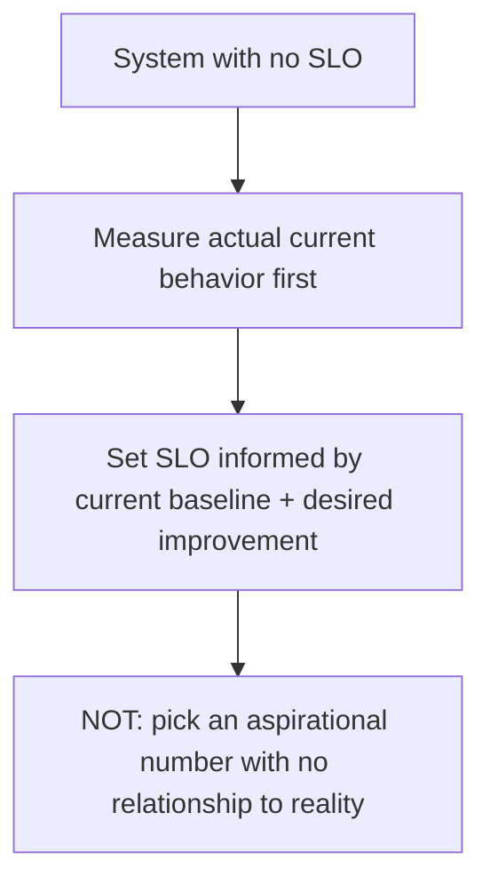
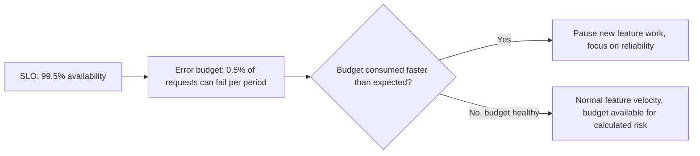

The [earlier SLA post](/posts/setting-slas-agentic-system/) covered external commitments made to other teams or customers. SLOs (Service Level Objectives) are the internal version — targets a team holds itself to, informing its own prioritization, often existing before or independent of any formal external SLA. Setting them for a system that's been running without any defined target is a distinct challenge from the SLA post's framing, because there's no existing commitment to formalize — just whatever behavior the system has been exhibiting, unmeasured against any explicit bar.

## Start From Measurement, Not From an Aspirational Target



The tempting mistake is picking an SLO target that sounds appropriately ambitious (99.9% availability, sub-second p99 latency) without first knowing what the system is actually achieving today. If current p99 latency is 4 seconds and the newly-set SLO target is 1 second, that SLO is immediately and permanently missed, which trains the team to ignore SLO dashboards as noise rather than using them as the actionable signal they're meant to be. Measure first, then set a target that's a meaningful stretch from the actual baseline, not disconnected from it.

## The Same Availability/Quality Split From the SLA Post Applies to SLOs

```python
CURRENT_BASELINE = measure_current_slo_candidates(lookback_days=30)
# e.g. {"p99_latency_ms": 4200, "availability_pct": 99.2, "quality_score_avg": 0.81}

PROPOSED_SLOS = {
    "p99_latency_ms": {"target": 3000, "current": 4200, "rationale": "meaningful improvement, achievable within a quarter"},
    "availability_pct": {"target": 99.5, "current": 99.2, "rationale": "incremental, informed by known recent incident causes"},
    "quality_score_avg": {"target": 0.85, "current": 0.81, "rationale": "requires the eval-coverage expansion already planned"},
}
```

Each target's rationale should reference something concrete — a planned improvement, a known fixable cause of the current gap — rather than being an arbitrary round number. An SLO with no credible path to being met is functionally the same as having no SLO at all, just with extra dashboard noise.

## Error Budgets Make the SLO Actionable



An SLO without an error budget policy is just a number to watch — the error budget is what turns it into an actual decision-making tool, giving the team an explicit, pre-agreed answer to "should we slow down feature work to address reliability" rather than that being a fresh, contentious debate every time reliability concerns come up.

## Revisit SLOs as the System Matures

An SLO set when a system is new and still stabilizing should be revisited as the system matures — both tightening targets that were set conservatively during an early, uncertain period, and potentially loosening or restructuring targets that turned out to be measuring the wrong thing once more operational experience accumulated. Treat the SLO set itself as something with its own periodic review, not a one-time decision.

## Key Takeaways

1. **Measure actual current behavior before setting an SLO target** — an aspirational number disconnected from baseline trains the team to ignore it
2. **Each SLO target needs a credible rationale**, not an arbitrary round number — a target with no path to being met is functionally no SLO at all
3. **Pair SLOs with an error budget policy** — that's what turns a number on a dashboard into an actual, pre-agreed decision-making tool
4. **Revisit the SLO set periodically as the system matures**, rather than treating initial targets as permanent

---

*Part of the [Scaling AI Engineering series](/tags/scaling-ai-series/) — running agentic systems responsibly once they're past the prototype stage.*
