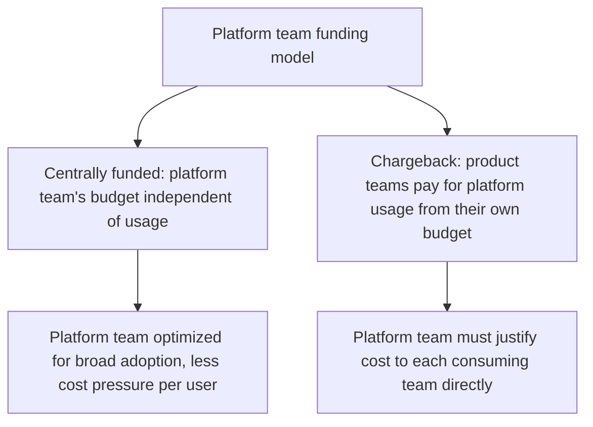
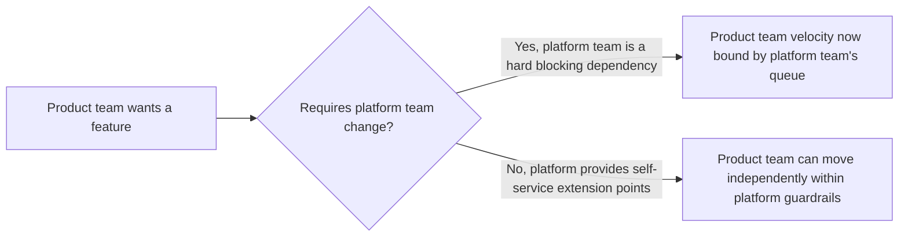

The [earlier post on building an internal agent platform team](/posts/building-internal-agent-platform-team/) covered scope and the build-the-second-consumer-first principle. Org design — where the team reports, how it's funded, how its roadmap gets prioritized relative to product teams' own priorities — is a separate set of decisions that determines whether a well-scoped platform team actually gets adopted, or gets quietly routed around by product teams building their own parallel infrastructure anyway.

## The Funding Model Shapes Behavior More Than the Org Chart Does



Centrally-funded platform teams have more freedom to invest in broad capability without needing to justify each investment to a specific paying consumer, and they can drift toward building what the platform team believes is valuable rather than what product teams are actually asking for, absent a market-like feedback signal. Chargeback models force the platform team to stay closely tied to what consuming teams actually value enough to pay for, at the cost of potentially underinvesting in genuinely valuable infrastructure that's hard to attribute cost-benefit to any single team upfront. Most organizations land on a hybrid: core infrastructure centrally funded, optional advanced features chargeback-funded.

## Reporting Structure and Roadmap Authority

A platform team reporting into the same organization as its primary consumers has an easier time getting roadmap alignment and can be subject to that org's own short-term pressures overriding platform-quality investment. A platform team reporting more independently (its own engineering org, reporting to a CTO-level function) has more roadmap independence and risks becoming disconnected from what consuming teams actually need, absent a strong mechanism (the funding model, or a formal consumer advisory input) keeping it grounded.

```python
def platform_org_health_check() -> dict:
    return {
        "time_since_last_product_team_feature_request_addressed": get_metric(),
        "pct_roadmap_driven_by_consumer_requests_vs_platform_initiative": get_metric(),
        "consumer_satisfaction_score": get_metric(),  # direct feedback from teams using the platform
    }
```

## Avoid the Structural Trap of Becoming a Blocking Dependency



The org-design goal that matters most in practice: structure the platform's actual interfaces (not just the org chart) so most product-team needs can be met through self-service extension within the platform's guardrails, reserving genuine platform-team involvement for the subset of requests that actually need new shared capability. A platform team that becomes a mandatory approval gate for routine work becomes exactly the kind of blocking dependency that motivates product teams to quietly build around it — the opposite of the adoption the team exists to earn.

## Key Takeaways

1. **The funding model shapes platform team behavior more directly than the org chart does** — centrally-funded and chargeback models create different incentive structures, and most organizations need a hybrid
2. **Reporting structure trades roadmap independence against staying grounded in actual consumer need** — neither extreme is free of risk
3. **Design self-service extension points so most needs don't require direct platform-team involvement** — becoming a mandatory blocking gate motivates the exact circumvention a platform team exists to prevent
4. **Track consumer-driven roadmap share and satisfaction explicitly** — org design choices should be evaluated against whether they're actually producing adoption, not assumed to work from structure alone

---

*Part of the [Scaling AI Engineering series](/tags/scaling-ai-series/) — running agentic systems responsibly once they're past the prototype stage.*
