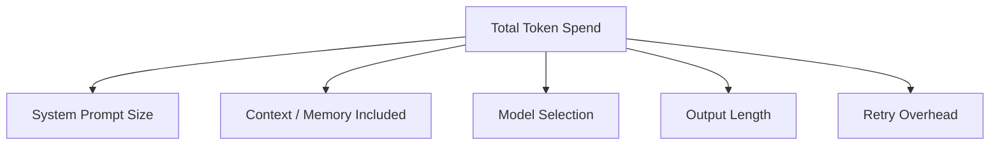

Security is the first thing that breaks when agentic systems scale past a prototype. Cost is the second — and it breaks quietly, because a runaway agent loop or an unbudgeted context window doesn't throw an error, it just shows up as a number on next month's invoice that's much bigger than anyone expected. **TokenOps** is the name the industry has settled on for applying FinOps discipline — visibility, allocation, optimization — specifically to LLM and agent token consumption, and it's the natural next topic after security in this series on scaling AI engineering.

## The Five Layers of Token Spend

Token cost isn't one number to optimize — it's five, and they compound multiplicatively, not additively:



- **System prompt size** — grows every time someone adds "and also handle this case," rarely gets pruned
- **Context and memory included** — the [context engineering post](/posts/context-engineering-replacing-prompt-engineering/) from the infrastructure series covers this directly; every unbudgeted token here is a recurring cost, not a one-time one
- **Model selection** — the gap between the cheapest usable model and the most capable one runs into the hundreds of times, not a small multiplier
- **Output length** — verbose responses cost more per call and compound across every retry
- **Retry overhead** — a validation failure that triggers a retry (from the structured outputs post) doubles the cost of that call, and a system with a high retry rate is paying that tax on a meaningful fraction of all its calls

Optimizing model selection alone while ignoring the other four layers is a common mistake — a cheaper model with a bloated, unbudgeted context and a high retry rate can easily cost more per resolved task than a pricier model used carefully.

## Cost Attribution: Know Where the Money Goes

The organizations that manage this well treat cost visibility as a first-class engineering concern, not an afterthought discovered on the monthly bill. That starts with attributing every call to something specific — a feature, a team, a customer tier — not just tracking an aggregate spend number:

```python
import time

def track_llm_call(feature: str, team: str, model: str, fn, *args, **kwargs):
    start = time.monotonic()
    result = fn(*args, **kwargs)
    elapsed = time.monotonic() - start

    cost = estimate_cost(model, result.usage.input_tokens, result.usage.output_tokens)

    cost_ledger.record({
        "feature": feature,
        "team": team,
        "model": model,
        "input_tokens": result.usage.input_tokens,
        "output_tokens": result.usage.output_tokens,
        "cost_usd": cost,
        "latency_s": elapsed,
        "timestamp": time.time(),
    })
    return result
```

With this in place, "why did our AI bill jump 40% this month" becomes a query against the ledger — which feature, which team, which model — rather than a forensic investigation starting from a single aggregate number.

## Budgets and Alerts, Not Just Dashboards

A dashboard someone checks occasionally catches a cost problem days after it started. A budget with an alert catches it within the hour:

```python
DAILY_BUDGETS = {
    "customer_support_agent": 500.00,
    "sales_research_agent": 200.00,
}

def check_budget_and_alert(feature: str):
    today_spend = cost_ledger.sum_today(feature)
    budget = DAILY_BUDGETS.get(feature)
    if budget and today_spend > budget * 0.8:
        send_alert(
            channel="#ai-cost-alerts",
            message=f"{feature} at {today_spend:.2f} of {budget:.2f} daily budget ({today_spend/budget:.0%})",
        )
    if budget and today_spend > budget:
        # Hard circuit breaker — degrade to a cheaper model or a reduced feature set
        # rather than let spend run unbounded past the budget
        activate_cost_circuit_breaker(feature)
```

The circuit breaker matters as much as the alert. An alert that fires while spend keeps climbing unchecked is a notification, not a control — pairing the budget with an automatic fallback (a cheaper model, a reduced context window, or a temporary feature throttle) is what actually caps the damage from a runaway loop or an unexpected traffic spike.

## The Retry Tax Specifically

Retry overhead deserves its own line of visibility because it's the layer most likely to be invisible until measured directly — a system can have a perfectly reasonable per-call cost and still be burning 20-30% more than necessary because of a high validation failure rate:

```python
def track_retry_overhead(feature: str):
    total_calls = cost_ledger.count_calls(feature, window_days=7)
    retried_calls = cost_ledger.count_retries(feature, window_days=7)
    retry_rate = retried_calls / max(total_calls, 1)

    if retry_rate > 0.15:
        flag_for_review(feature, reason=f"retry rate {retry_rate:.0%} — check schema validation and prompt clarity")
```

A retry rate above roughly 15% is usually a signal that a tool schema is ambiguous or a prompt is under-specifying the expected format — the fix is in the structured outputs contract, and it's cheaper than paying the retry tax indefinitely.

## Ownership Is the Part Most Teams Skip

The organizations getting real results here have a specific person or team who owns AI cost the way a platform team owns infrastructure cost — reviewing the ledger regularly, setting budgets per feature, and treating a cost regression with the same urgency as a latency regression. Without that ownership, cost visibility tooling exists but nobody's job depends on acting on what it shows, and the dashboard becomes decoration.

## Key Takeaways

1. **Token cost is five layers, not one** — system prompt, context, model selection, output length, and retry overhead all compound together
2. **Attribute every call to a feature and team**, not just an aggregate spend number — that's what turns "the bill went up" into an answerable question
3. **Pair budgets with automatic circuit breakers**, not just alerts — a notification that fires while spend keeps climbing isn't a control
4. **Watch retry rate as its own metric** — a rate above ~15% usually points at an ambiguous tool schema, not an unavoidable cost
5. **Cost needs an owner**, the same way infrastructure cost has one — visibility tooling without accountability becomes decoration

The next post covers the highest-leverage lever for actually reducing that spend without sacrificing quality — model routing and cascades.

---

*Part of the [Scaling AI Engineering series](/tags/scaling-ai-series/) — running agentic systems responsibly once they're past the prototype stage.*
