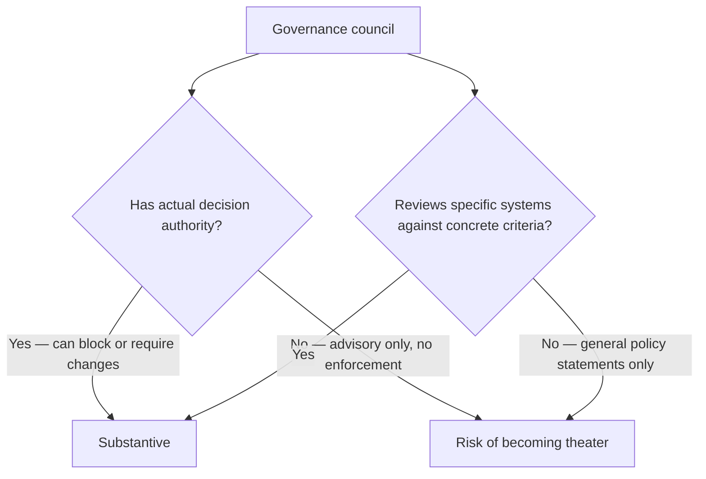
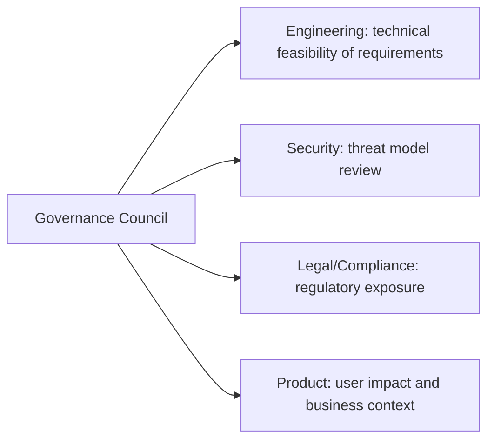

Once an organization has enough independent agentic systems in production — each making its own decisions about acceptable risk, model selection, and guardrail rigor — inconsistency between them becomes its own risk: one team's lower risk tolerance for a similar decision than another's isn't necessarily wrong for either team individually, and in aggregate it means the organization's actual risk posture is whatever the least careful team decided, not a deliberate collective choice. A governance council is the structure meant to address this — and it's also an easy thing to stand up as theater, checking a compliance box without actually changing any decisions.

## What Makes Governance Substantive vs Theater



The two structural choices that determine which side a council lands on: does it have actual authority (can it require a system not launch until a specific gap is addressed, not just recommend), and does it review against concrete, checkable criteria (the threat-modeling worksheet, the production-readiness checklist, and the compliance behavior-documentation format from earlier in this blog) rather than general, unenforceable principles.

## A Practical Review Gate

```markdown
## Agent Governance Review: [System Name]
### Threat Model
- [ ] Threat model exists and covers agent-specific categories (from the
      threat modeling post)
- [ ] Residual risk explicitly stated for each identified threat

### Production Readiness
- [ ] Checklist from the production-readiness post completed, scoped
      appropriately to this system's actual stakes

### Cost and SLO
- [ ] Cost attribution wired up
- [ ] SLOs defined, informed by measured baseline, not aspirational guessing

### Compliance (where applicable)
- [ ] Behavior documentation exists for regulated-industry-relevant claims
```

A council reviewing against this kind of concrete checklist produces a specific, actionable outcome (these three items are missing, address before launch) rather than a vague "looks reasonable" sign-off that provides no real check on anything.

## Composition: Cross-Functional, Not Just Engineering



A council composed entirely of engineers tends to under-weight legal and compliance risk; a council without engineering representation tends to set requirements that are technically infeasible or miscalibrated relative to actual risk. Cross-functional composition, with each function actually represented rather than consulted occasionally, produces reviews that are both grounded in real constraints and genuinely comprehensive across risk types.

## Avoid Becoming a Bottleneck the Same Way a Platform Team Can

The same structural risk from the previous post applies here directly — a governance council that reviews every single agentic system change, however minor, becomes a blocking dependency teams route around. Tiered review (lightweight self-attestation against the checklist for low-stakes systems, full council review for high-stakes ones) keeps the council's actual attention focused on where it matters, rather than spread thin across reviews that don't need that level of scrutiny.

## Key Takeaways

1. **Governance authority and concrete review criteria are what separate substantive governance from theater**
2. **Review against specific, checkable criteria** — a threat model, a production-readiness checklist, cost/SLO wiring — not vague general principles
3. **Cross-functional composition (engineering, security, legal, product) produces reviews grounded in real constraints and comprehensive across risk types**
4. **Tier review rigor to actual stakes** — a council reviewing everything at full depth becomes exactly the kind of blocking dependency teams learn to route around

---

*Part of the [Scaling AI Engineering series](/tags/scaling-ai-series/) — running agentic systems responsibly once they're past the prototype stage.*
