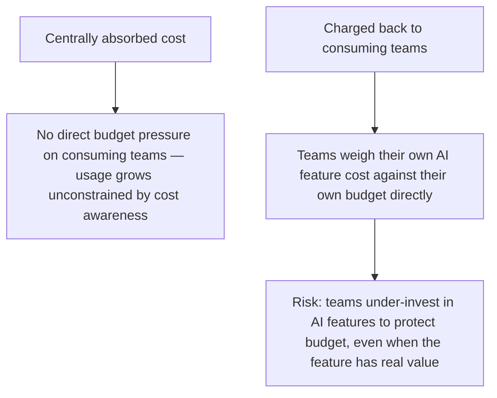
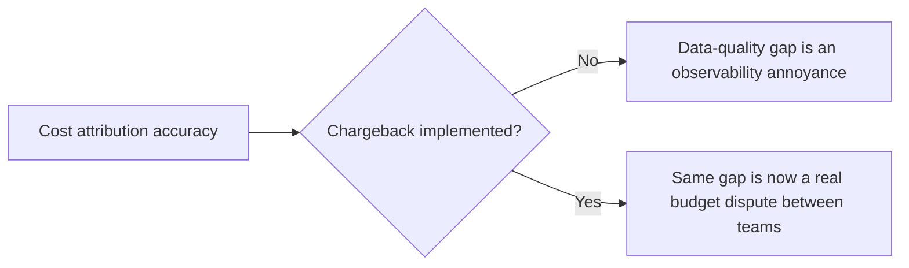

The cost attribution infrastructure covered earlier in this blog — per-team, per-feature token spend tracking — is a prerequisite for chargeback, not chargeback itself. Chargeback is the organizational decision to actually move that attributed cost onto consuming teams' own budgets, rather than absorbing it centrally, and that decision changes behavior in ways worth designing deliberately rather than discovering as side effects after the fact.

## What Chargeback Actually Changes



Chargeback's benefit is real — teams that bear the cost of their own usage make more cost-conscious decisions about caching, model selection, and request volume, applying the discipline from earlier cost-optimization posts because it now directly affects their own numbers. Its risk is also real: a team facing budget pressure may under-invest in a genuinely valuable AI feature specifically because its cost is now visible and attributed to them in a way it wasn't when centrally absorbed, even though the org-wide value case for the feature hasn't changed at all.

## Designing the Chargeback Rate to Avoid Perverse Incentives

```python
def compute_chargeback_rate(actual_cost: float, platform_overhead_allocation: float, subsidize_pct: float = 0.0) -> float:
    """
    subsidize_pct: intentional discount to encourage adoption of new/strategic
    capabilities without teams bearing full cost during an early adoption period
    """
    full_rate = actual_cost + platform_overhead_allocation
    return full_rate * (1 - subsidize_pct)
```

A deliberate, time-bounded subsidy for new or strategically important capabilities (chargeback at less than full cost during an initial adoption window, stepping up to full rate over a defined period) avoids the perverse outcome where chargeback discourages exactly the adoption an organization wants to encourage for something genuinely valuable but not yet proven at the individual team level.

## Chargeback Needs the Same Attribution Rigor as the Underlying Cost Data

If the underlying cost attribution (from earlier posts) has gaps — untagged calls, imprecise team/feature mapping — chargeback bills based on that imprecise data directly affect real team budgets, turning a data-quality gap into a real financial dispute rather than just an observability annoyance. This raises the bar on attribution accuracy considerably once chargeback is actually implemented, compared to when the same data was purely informational.



## Provide an Appeals/Dispute Process

Given that chargeback directly affects team budgets, a team disputing a specific charge (attribution error, a shared cost allocated unfairly) needs a defined process to raise and resolve that dispute — without one, disputes either go unaddressed (eroding trust in the chargeback system entirely) or get resolved informally and inconsistently, which is its own fairness problem across teams.

## Key Takeaways

1. **Chargeback changes team behavior in both an intended direction (cost-consciousness) and a real risk direction (under-investment in valuable-but-newly-visible-cost features)**
2. **A deliberate, time-bounded subsidy for strategic new capabilities avoids discouraging adoption you actually want**
3. **Chargeback demands higher attribution accuracy than purely informational cost tracking** — the same data-quality gap becomes a real financial dispute, not just an annoyance
4. **Provide a defined dispute process** — without one, chargeback disputes erode trust in the system or get resolved inconsistently

---

*Part of the [Scaling AI Engineering series](/tags/scaling-ai-series/) — running agentic systems responsibly once they're past the prototype stage.*
