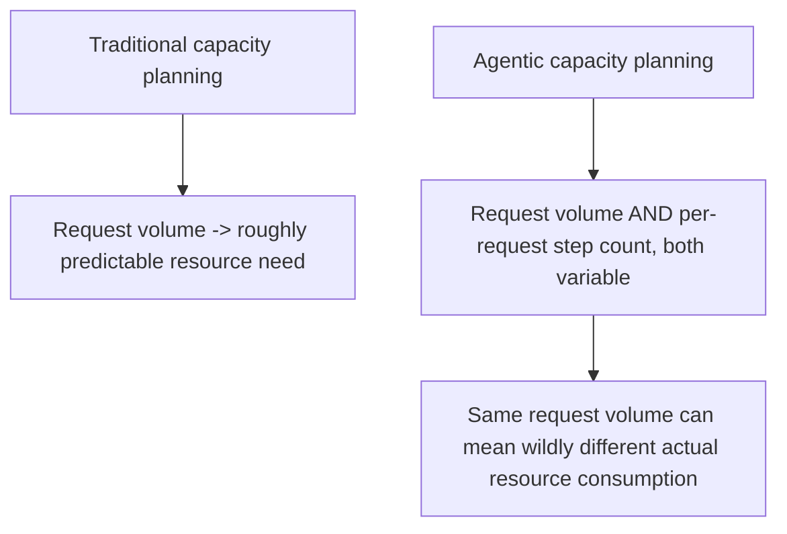
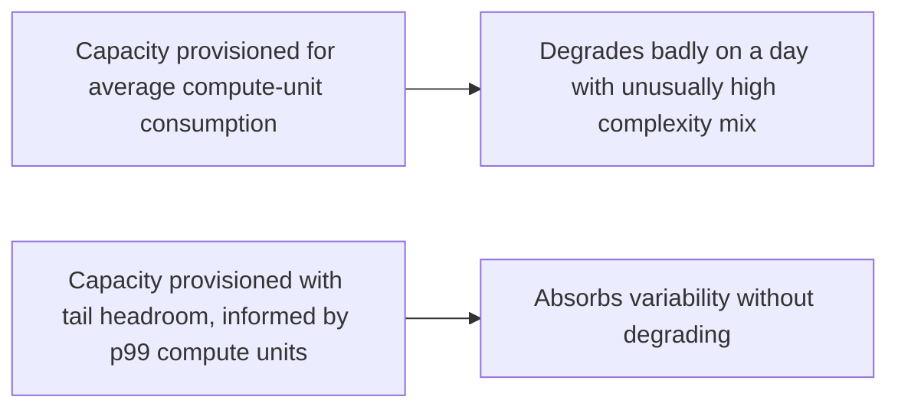

Traditional capacity planning for a web service mostly reduces to one variable: request volume, reasonably predictable from historical trends and known seasonal patterns. An agentic system's actual resource consumption depends on a second variable that's much harder to predict: how many steps, tool calls, and tokens a given request ends up requiring — which varies enormously based on task complexity in ways that aren't knowable from the request alone, before the agent starts working on it.

## Why Request Count Alone Undersells the Planning Problem



Two days with identical request volume can have very different actual compute and cost consumption if one day's request mix happens to include more multi-hop, multi-tool-call tasks than the other — a pattern traditional request-count-based capacity planning has no way to anticipate, since the variability lives inside each request's execution, not in how many requests arrive.

## Model Capacity in Terms of Compute-Equivalent Units, Not Raw Requests

```python
def estimate_capacity_need(historical_requests: list[dict]) -> dict:
    # Weight by actual resource consumption, not just count
    compute_units = sum(
        r["tool_call_count"] * TOOL_CALL_WEIGHT + r["token_count"] * TOKEN_WEIGHT
        for r in historical_requests
    )
    return {
        "total_compute_units": compute_units,
        "compute_units_per_request_p50": statistics.median(
            r["tool_call_count"] * TOOL_CALL_WEIGHT + r["token_count"] * TOKEN_WEIGHT
            for r in historical_requests
        ),
        "compute_units_per_request_p99": percentile(
            [r["tool_call_count"] * TOOL_CALL_WEIGHT + r["token_count"] * TOKEN_WEIGHT for r in historical_requests], 99
        ),
    }
```

Planning against a compute-equivalent unit that accounts for actual per-request resource consumption, rather than raw request count, is a more honest basis for capacity decisions — and the p50-vs-p99 gap on that metric tells you directly how much headroom is needed above the median case to handle the request-mix variability itself, not just volume variability.

## Rate Limiting and Circuit Breaking Are Also Capacity Tools

The rate limiting and circuit breaker infrastructure from earlier posts in this series double as capacity protection, not just fairness and reliability tools — a fair-share limiter prevents one team's unusually complex request mix on a given day from consuming capacity that degrades every other team's experience, which is exactly a capacity-planning concern wearing a fairness-mechanism hat.

## Plan for the Tail, Not Just the Average



Given how much variance exists in per-request resource consumption for agentic workloads specifically, provisioning to the average case leaves a system exposed to real degradation on any day where the request mix skews complex — which, unlike traditional traffic spikes, doesn't correlate cleanly with any external signal (time of day, marketing campaign) that would let you anticipate it in advance. Provisioning with genuine tail headroom, informed by measured p99 compute-unit consumption rather than average, is what actually protects against this.

## Key Takeaways

1. **Agentic workloads have a second, harder-to-predict variable (per-request step count) that traditional capacity planning doesn't account for**
2. **Model capacity in compute-equivalent units weighted by actual resource consumption**, not raw request count
3. **Rate limiting and circuit breaking, covered as fairness/reliability tools earlier in this blog, double as capacity protection**
4. **Provision for the tail (p99 compute-unit consumption), not the average** — request-mix complexity spikes don't correlate with predictable external signals the way traffic volume spikes often do

---

*Part of the [Scaling AI Engineering series](/tags/scaling-ai-series/) — running agentic systems responsibly once they're past the prototype stage.*
