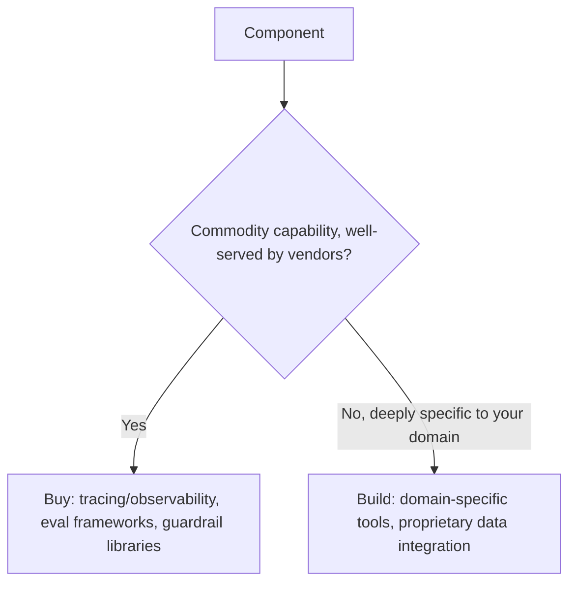
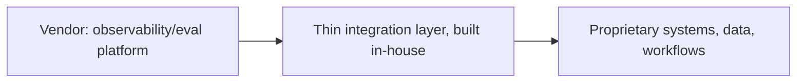

The earlier platform-team posts in this series discussed building shared agent infrastructure in-house, largely assuming that was the right call. It's worth making that assumption explicit and questioning it directly — the vendor landscape for agentic tooling (observability, evaluation, guardrails, orchestration frameworks) has matured enough over the past year that "build everything ourselves" is no longer the obvious default it might have been earlier, and the buy-vs-build decision deserves the same rigor as any other significant infrastructure investment.

## Where Buying Usually Wins



Observability and tracing (the LangSmith-style tooling from earlier in this blog), general-purpose evaluation frameworks, and off-the-shelf guardrail libraries for common threat categories are increasingly commodity capabilities — building these in-house means investing significant engineering time replicating what a mature vendor product already does well, for a component that isn't actually a source of competitive differentiation for your specific business.

## Where Building Usually Wins

Domain-specific tools tightly coupled to proprietary data or workflows (an internal MCP server exposing your specific business systems, a memory system reflecting your specific product's actual user model) have no vendor equivalent, because they're specific to your business by definition — there's no market for a vendor to serve, and building is the only option that actually fits.

## The Decision Framework

```python
def buy_vs_build_score(component: dict) -> str:
    factors = {
        "is_commodity_capability": component["is_commodity"],
        "vendor_options_mature": component["vendor_maturity_score"] > 0.7,
        "deeply_coupled_to_proprietary_systems": component["proprietary_coupling"],
        "differentiates_our_product": component["competitive_differentiation"],
    }
    if factors["is_commodity_capability"] and factors["vendor_options_mature"] and not factors["differentiates_our_product"]:
        return "buy"
    if factors["deeply_coupled_to_proprietary_systems"] or factors["differentiates_our_product"]:
        return "build"
    return "evaluate_case_by_case"
```

## The Hybrid Reality: Buy the Commodity Layer, Build the Integration

Most organizations don't face a clean binary — the practical pattern is buying commodity capability (observability platform, eval framework) and building the thin integration layer connecting it to proprietary systems and workflows. This gets much of buying's time-to-value benefit while still producing the proprietary-system integration that no vendor could provide off the shelf.



## Revisit the Decision as the Vendor Landscape Matures

A "build" decision made a year ago, when vendor options for a given capability were immature, may no longer be the right call as that vendor landscape matures — the earlier post on evaluating cheaper models argued for periodic re-evaluation as the model landscape shifts; the same discipline applies to buy-vs-build decisions for tooling, which shouldn't be treated as permanent just because they were reasonable at the time they were made.

## Key Takeaways

1. **Commodity capabilities (observability, general eval frameworks, common guardrails) increasingly favor buying** — building them in-house means replicating mature vendor products for non-differentiating work
2. **Domain-specific, proprietary-system-coupled components have no vendor equivalent** — building is often the only real option
3. **Most organizations land on a hybrid**: buy the commodity layer, build the thin integration connecting it to proprietary systems
4. **Revisit buy-vs-build periodically as the vendor landscape matures** — a build decision that made sense a year ago may not still be the right call

---

*Part of the [Scaling AI Engineering series](/tags/scaling-ai-series/) — running agentic systems responsibly once they're past the prototype stage.*
